# 🧠 Module 01 — Database Theory

<p align="center">
  
  
  
</p>

---

## 📌 Table of Contents

- [Why Database Theory Matters](#-why-database-theory-matters)
- [1. What Is Data?](#1-what-is-data)
- [2. What Is a Database?](#2-what-is-a-database)
- [3. What Is a DBMS?](#3-what-is-a-dbms)
- [4. File System vs DBMS](#4-file-system-vs-dbms)
- [5. Data Models](#5-data-models)
- [6. The Relational Model](#6-the-relational-model)
- [7. Keys in RDBMS](#7-keys-in-rdbms)
- [8. Entity-Relationship (ER) Model](#8-entity-relationship-er-model)
- [9. Normalization](#9-normalization)
- [10. Relational Algebra](#10-relational-algebra)
- [11. ACID Properties](#11-acid-properties)
- [12. Database Architecture](#12-database-architecture)
- [Interview Questions](#-interview-questions)
- [Common Mistakes](#-common-mistakes)
- [FAQs](#-faqs)
- [Revision Notes](#-revision-notes)
- [Cheat Sheet](#-cheat-sheet)

---

## 🎯 Why Database Theory Matters

> *"You can't build a skyscraper on a shaky foundation."*

Before writing a single SQL query, you need to understand **why databases exist**, **how data is modeled**, and **what rules govern relational systems**. Database theory is the foundation that separates a developer who *uses* databases from one who **masters** them.

**In interviews, theory questions test whether you:**
- Understand *why* things are designed the way they are
- Can reason about data integrity, redundancy, and performance
- Know the mathematical foundations behind SQL

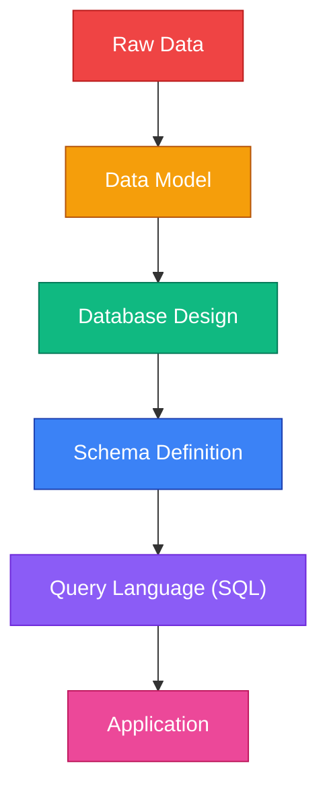

---

## 1. What Is Data?

### First Principles

**Data** is raw, unprocessed facts — numbers, text, dates, images — that have no inherent meaning on their own.

| Term | Definition | Example |
|------|-----------|---------|
| **Data** | Raw facts without context | `42`, `"Satya"`, `2025-01-15` |
| **Information** | Data with context and meaning | "Satya placed order #42 on Jan 15, 2025" |
| **Knowledge** | Information applied to make decisions | "Satya orders monthly — send a loyalty coupon" |

### The DIKW Pyramid

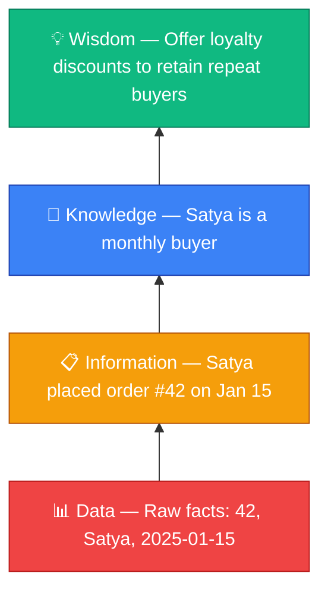

### Real-World Analogy

Think of a library:
- **Data** = Individual books scattered on the floor.
- **Database** = Books organized on shelves, cataloged by author, title, genre.
- **DBMS** = The librarian + the cataloging system that helps you find, add, or remove books.

---

## 2. What Is a Database?

### Definition

A **database** is an organized collection of structured data, stored electronically, designed for efficient retrieval, insertion, updating, and deletion.

### Types of Databases

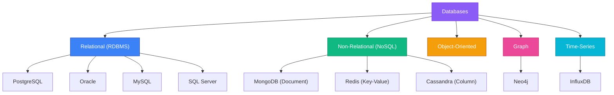

| Type | Data Structure | Best For | Example |
|------|---------------|----------|---------|
| **Relational** | Tables (rows & columns) | Structured data, transactions | Banking, ERP |
| **Document** | JSON/BSON documents | Semi-structured, flexible schemas | Content management |
| **Key-Value** | Key → Value pairs | Caching, sessions | Redis for session storage |
| **Column-Family** | Column families | Write-heavy, time-series | IoT sensor data |
| **Graph** | Nodes + Edges | Relationships, networks | Social networks, fraud detection |
| **Time-Series** | Timestamped data points | Metrics, monitoring | Server monitoring |

---

## 3. What Is a DBMS?

### Definition

A **Database Management System (DBMS)** is software that provides an interface between the database and its users/applications. It handles storage, retrieval, security, concurrency, backup, and integrity of data.

### Why Do We Need a DBMS?

Without a DBMS, every application would need to:
1. Implement its own file storage format
2. Handle concurrent access manually
3. Build its own security layer
4. Manage data integrity on its own
5. Create its own backup/recovery system

A DBMS centralizes all of this into one robust system.

### DBMS Architecture

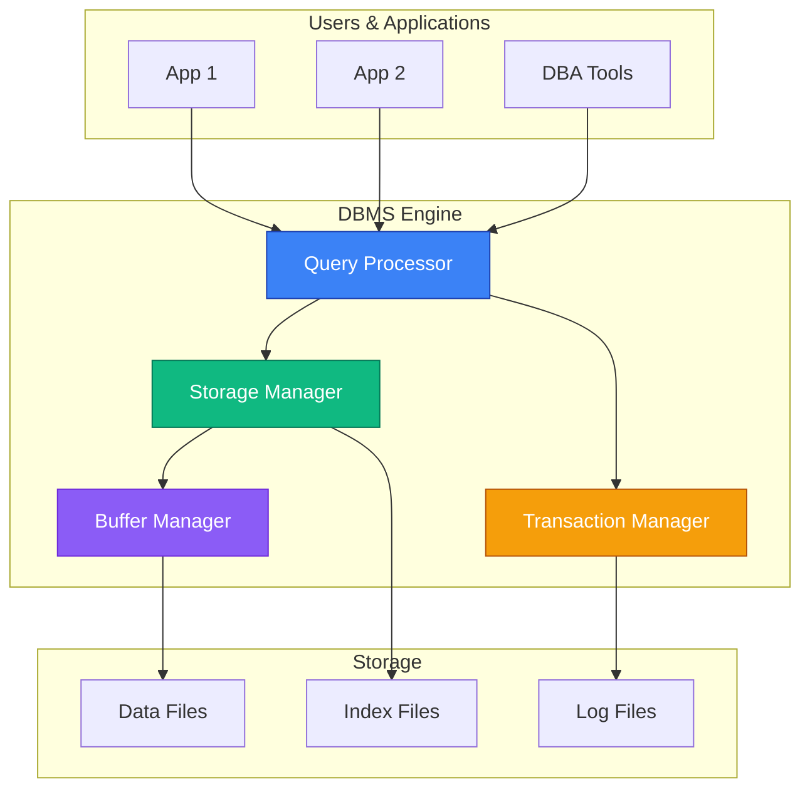

### DBMS vs RDBMS

| Feature | DBMS | RDBMS |
|---------|------|-------|
| **Data Storage** | Files (hierarchical, network) | Tables (relations) |
| **Relationships** | Limited or manual | Foreign keys, joins |
| **Normalization** | Not enforced | Supported and encouraged |
| **ACID Compliance** | Partial or none | Full ACID support |
| **SQL Support** | May not support SQL | SQL is the standard interface |
| **Examples** | File systems, XML stores | PostgreSQL, Oracle, MySQL |

---

## 4. File System vs DBMS

### Why Not Just Use Files?

This is one of the **most asked beginner interview questions**. Here's the complete comparison:

| Problem | File System | DBMS Solution |
|---------|------------|---------------|
| **Data Redundancy** | Same data copied across files | Normalization eliminates redundancy |
| **Data Inconsistency** | Updates in one file, stale in another | Single source of truth |
| **Concurrent Access** | File locking, race conditions | Transaction management, MVCC |
| **Data Integrity** | No constraints enforcement | CHECK, UNIQUE, FK constraints |
| **Security** | OS-level file permissions only | Fine-grained GRANT/REVOKE per table/column |
| **Querying** | Write custom parsing code | SQL — declarative, powerful |
| **Backup & Recovery** | Manual file copies | WAL, point-in-time recovery |
| **Data Independence** | Application tightly coupled to file format | Schema changes don't break applications |

### Real-World Example

**Scenario**: An e-commerce company stores orders in CSV files.

```
# orders.csv
order_id, customer_name, customer_email, product, price
1, Alice, alice@mail.com, Laptop, 999.99
2, Alice, alice@email.com, Mouse, 29.99    ← Email inconsistency!
3, Bob, bob@mail.com, Laptop, 999.99
```

**Problems:**
1. Alice's email is different in rows 1 and 2 (inconsistency).
2. "Laptop" and its price are repeated (redundancy).
3. If Alice changes her email, you must update every file she appears in.

**DBMS Solution:** Separate into `customers`, `products`, and `orders` tables — update email in one place.

---

## 5. Data Models

### What Is a Data Model?

A **data model** defines how data is structured, stored, and accessed. It is the blueprint for your database, just like an architect's blueprint for a building.

### Types of Data Models

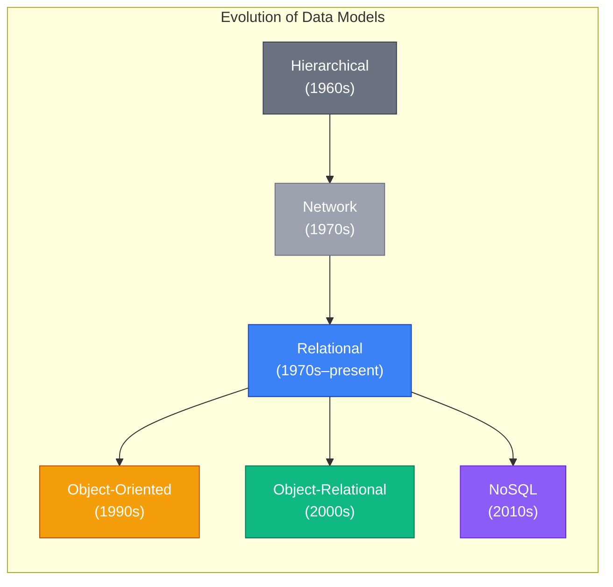

| Model | Structure | Navigation | Example | Era |
|-------|-----------|------------|---------|-----|
| **Hierarchical** | Tree (parent-child) | Top-down traversal | IBM IMS | 1960s |
| **Network** | Graph (many-to-many) | Pointer-based traversal | CODASYL | 1970s |
| **Relational** | Tables (relations) | SQL queries | PostgreSQL, Oracle | 1970s–now |
| **Object-Oriented** | Objects with methods | Object references | db4o | 1990s |
| **Document** | JSON/BSON documents | Document queries | MongoDB | 2010s |
| **Graph** | Nodes + edges | Graph traversal | Neo4j | 2010s |

### The Three Schema Architecture (ANSI/SPARC)

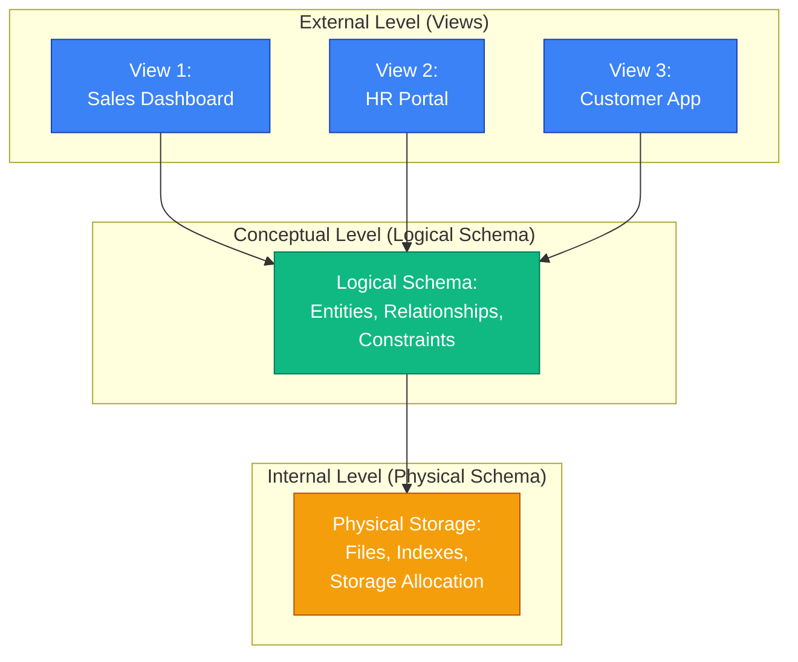

**Why 3 levels?** To achieve **data independence**:
- **Logical Data Independence**: Change the conceptual schema without affecting external views.
- **Physical Data Independence**: Change storage structure without affecting the logical schema.

---

## 6. The Relational Model

### First Principles: Why Relational?

In 1970, **Edgar F. Codd** at IBM published *"A Relational Model of Data for Large Shared Data Banks"*. His revolutionary idea: represent data as **mathematical relations** (tables), eliminating the need for pointer-based navigation.

### Core Terminology

| Formal Term | Informal Term | Meaning |
|------------|---------------|---------|
| **Relation** | Table | A set of tuples with the same attributes |
| **Tuple** | Row / Record | A single data entry |
| **Attribute** | Column / Field | A named property of a relation |
| **Domain** | Data Type | Set of allowed values for an attribute |
| **Degree** | # of Columns | Number of attributes in a relation |
| **Cardinality** | # of Rows | Number of tuples in a relation |
| **Relation Schema** | Table Definition | Name + list of attributes with domains |
| **Relation Instance** | Table Data | Current set of tuples at a point in time |

### Example: A Relation

**Relation Schema**: `Employee(emp_id: INT, name: VARCHAR, dept: VARCHAR, salary: DECIMAL)`

| emp_id | name | dept | salary |
|--------|------|------|--------|
| 101 | Alice | Engineering | 95000 |
| 102 | Bob | Marketing | 72000 |
| 103 | Carol | Engineering | 98000 |

- **Degree** = 4 (four columns)
- **Cardinality** = 3 (three rows)

### Properties of a Relation

1. **No duplicate tuples** — Each row is unique (enforced by primary key).
2. **Tuples are unordered** — There's no "first" or "last" row.
3. **Attributes are unordered** — Column order doesn't matter.
4. **Attribute values are atomic** — No multi-valued or composite attributes (1NF).

### Codd's 12 Rules

Edgar Codd defined 12 rules (actually 13, numbered 0–12) that a DBMS must satisfy to be considered truly relational:

| # | Rule | Description |
|---|------|-------------|
| 0 | Foundation Rule | Must use relational facilities for management |
| 1 | Information Rule | All information represented as values in tables |
| 2 | Guaranteed Access | Every value accessible by table + primary key + column |
| 3 | Null Values | Systematic support for NULL (missing/inapplicable) |
| 4 | Active Catalog | Database description stored in tables (metadata) |
| 5 | Comprehensive Language | At least one language (SQL) for all operations |
| 6 | View Updatability | All theoretically updatable views are updatable |
| 7 | Set-Level Operations | Insert, update, delete on sets — not just single rows |
| 8 | Physical Independence | Physical storage changes don't affect applications |
| 9 | Logical Independence | Logical changes don't affect applications |
| 10 | Integrity Independence | Integrity constraints stored in catalog, not in application |
| 11 | Distribution Independence | Works regardless of data distribution |
| 12 | Non-Subversion Rule | No bypass for integrity constraints |

---

## 7. Keys in RDBMS

### Why Do We Need Keys?

Keys uniquely identify records and establish relationships between tables. They are the **backbone of data integrity** in relational databases.

### Types of Keys

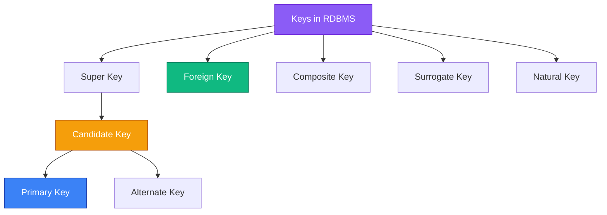

| Key Type | Definition | Example |
|----------|-----------|---------|
| **Super Key** | Any set of attributes that uniquely identifies a tuple | `{emp_id}`, `{emp_id, name}`, `{email}` |
| **Candidate Key** | Minimal super key (no subset is a super key) | `{emp_id}`, `{email}` |
| **Primary Key** | The chosen candidate key for a table | `emp_id` chosen as PK |
| **Alternate Key** | Candidate keys not chosen as primary key | `email` (if `emp_id` is PK) |
| **Foreign Key** | Attribute that references a primary key in another table | `dept_id` in Employee → `id` in Department |
| **Composite Key** | Primary key made of 2+ attributes | `{student_id, course_id}` in Enrollment |
| **Surrogate Key** | System-generated key with no business meaning | Auto-increment `id`, UUID |
| **Natural Key** | Key derived from real-world data | Social Security Number, ISBN |

### Primary Key vs Foreign Key

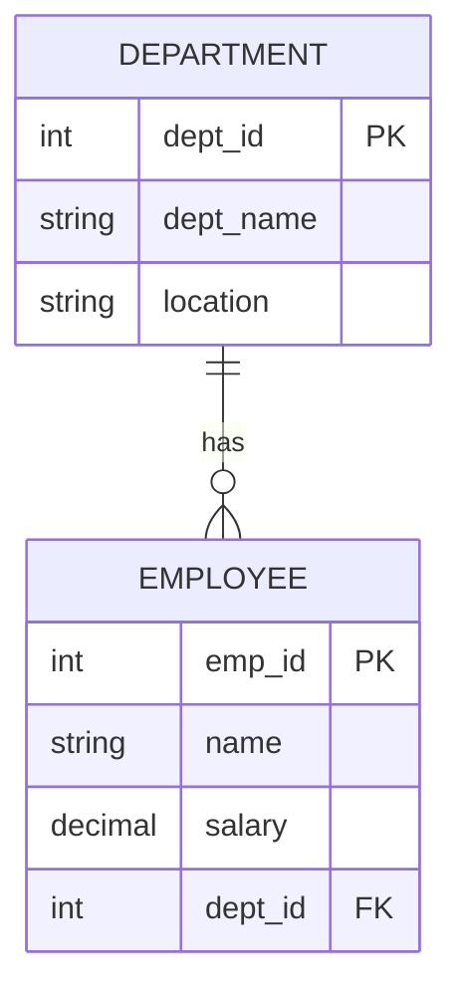

### Surrogate Key vs Natural Key — When to Use Which?

| Aspect | Surrogate Key | Natural Key |
|--------|--------------|-------------|
| **Stability** | Never changes | May change (e.g., email) |
| **Size** | Small (integer, UUID) | Can be large (SSN, ISBN) |
| **Readability** | Meaningless (`id = 42`) | Meaningful (`isbn = 978-0-13-468599-1`) |
| **Performance** | Faster joins (small key) | Slower joins if key is large |
| **Uniqueness** | Guaranteed by system | Must be validated |
| **Best For** | Most tables | Lookup/reference tables |

> **Best Practice**: Use surrogate keys as primary keys and enforce natural keys with UNIQUE constraints.

---

## 8. Entity-Relationship (ER) Model

### First Principles: What Is the ER Model?

The **Entity-Relationship Model**, proposed by **Peter Chen** in 1976, is a high-level conceptual data model used to design database schemas before implementation. It answers: *"What entities exist in my system, and how are they related?"*

### Core Components

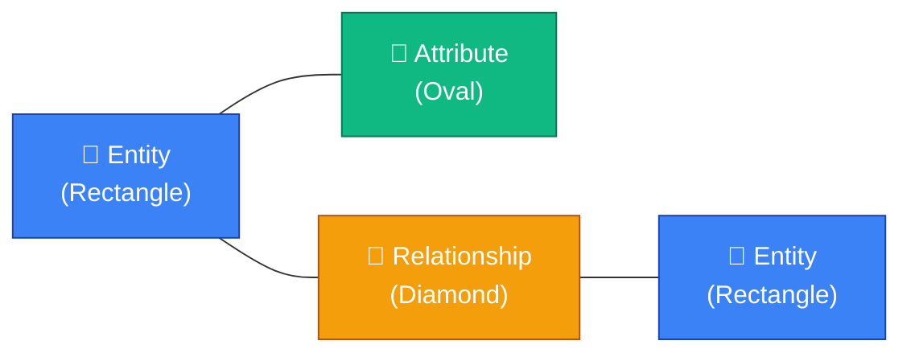

| Component | Symbol | Description | Example |
|-----------|--------|-------------|---------|
| **Entity** | Rectangle | A real-world object | Student, Course, Order |
| **Attribute** | Oval | A property of an entity | name, email, price |
| **Relationship** | Diamond | An association between entities | "enrolls_in", "places" |
| **Primary Key Attribute** | Underlined oval | Uniquely identifies entity | <u>student_id</u> |
| **Derived Attribute** | Dashed oval | Computed from other attributes | age (from DOB) |
| **Multi-valued Attribute** | Double oval | Can have multiple values | phone_numbers |
| **Composite Attribute** | Oval with sub-ovals | Made of sub-attributes | address → (street, city, zip) |
| **Weak Entity** | Double rectangle | Cannot exist without owner entity | OrderItem (needs Order) |

### Relationship Cardinalities

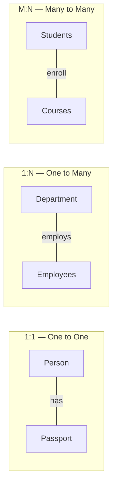

| Cardinality | Meaning | Example | Implementation |
|-------------|---------|---------|----------------|
| **1:1** | One entity → One entity | Person → Passport | FK in either table |
| **1:N** | One entity → Many entities | Department → Employees | FK in the "many" side |
| **M:N** | Many entities → Many entities | Students ↔ Courses | Junction/bridge table |

### Participation Constraints

| Type | Meaning | Example | ER Notation |
|------|---------|---------|-------------|
| **Total** | Every entity MUST participate | Every employee MUST belong to a department | Double line |
| **Partial** | An entity MAY participate | A professor MAY advise a thesis | Single line |

### Complete ER Diagram Example: University System

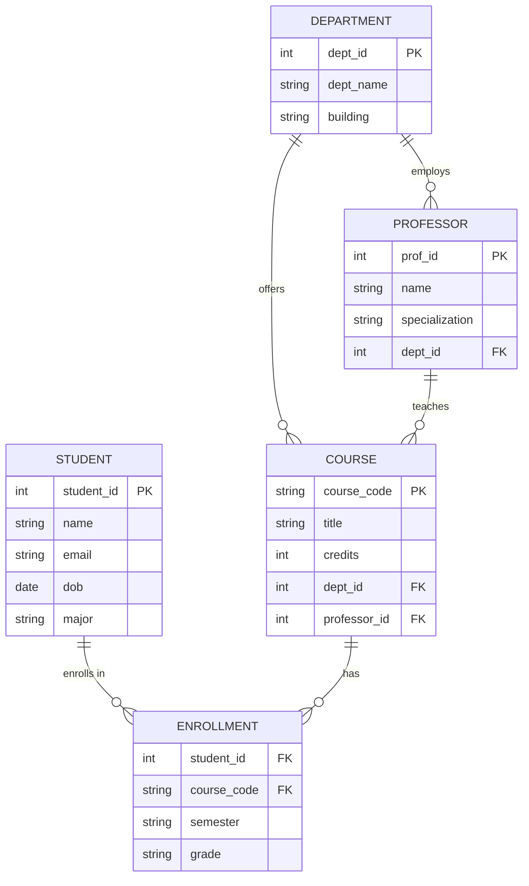

### ER to Relational Mapping Rules

| ER Concept | Relational Mapping |
|-----------|-------------------|
| Strong Entity | Create a table, PK = entity's key |
| Weak Entity | Create a table, PK = owner's PK + partial key |
| 1:1 Relationship | FK in either table (prefer total participation side) |
| 1:N Relationship | FK in the "many" side table |
| M:N Relationship | Create a new junction table with composite PK |
| Multi-valued Attribute | Create a separate table |
| Composite Attribute | Flatten into individual columns |
| Derived Attribute | Don't store; compute in queries (or store for performance) |

---

## 9. Normalization

### First Principles: Why Normalize?

**Normalization** is the process of organizing data to **minimize redundancy** and **prevent anomalies** (insertion, update, deletion anomalies). It's based on the mathematical concept of **functional dependencies**.

### The Problem: Anomalies

Consider this **unnormalized** table:

| student_id | student_name | course_code | course_name | instructor | dept |
|-----------|-------------|-------------|-------------|------------|------|
| 1 | Alice | CS101 | Intro to CS | Dr. Smith | CS |
| 1 | Alice | MATH201 | Linear Algebra | Dr. Jones | Math |
| 2 | Bob | CS101 | Intro to CS | Dr. Smith | CS |

**Problems:**
1. **Insertion Anomaly**: Can't add a new course until a student enrolls.
2. **Update Anomaly**: If Dr. Smith's name changes, must update multiple rows.
3. **Deletion Anomaly**: If Alice drops all courses, we lose her student info.

### Functional Dependencies

A **functional dependency** X → Y means: *"If two tuples have the same value of X, they must have the same value of Y."*

- `student_id → student_name` ✅ (A student ID determines the name)
- `course_code → course_name, instructor` ✅
- `student_name → student_id` ❌ (Two students can share a name)

### Normal Forms Progression


### 1NF — First Normal Form

**Rule**: Every attribute must contain **atomic (indivisible) values**. No repeating groups, no arrays.

❌ **Violates 1NF:**

| student_id | name | phone_numbers |
|-----------|------|---------------|
| 1 | Alice | 555-0101, 555-0102 |

✅ **In 1NF:**

| student_id | name | phone_number |
|-----------|------|--------------|
| 1 | Alice | 555-0101 |
| 1 | Alice | 555-0102 |

Or better — create a separate `student_phones` table.

### 2NF — Second Normal Form

**Rule**: Must be in 1NF + **no partial dependency** (non-key attribute must depend on the *entire* primary key, not just part of it).

> ⚠️ Only relevant when the primary key is **composite**.

❌ **Violates 2NF** (PK = `{student_id, course_id}`):

| student_id | course_id | student_name | grade |
|-----------|----------|-------------|-------|
| 1 | CS101 | Alice | A |
| 2 | CS101 | Bob | B |

- `student_name` depends only on `student_id`, not on `{student_id, course_id}`. This is a **partial dependency**.

✅ **In 2NF:** Split into:

**Students Table:**

| student_id | student_name |
|-----------|-------------|
| 1 | Alice |
| 2 | Bob |

**Enrollments Table:**

| student_id | course_id | grade |
|-----------|----------|-------|
| 1 | CS101 | A |
| 2 | CS101 | B |

### 3NF — Third Normal Form

**Rule**: Must be in 2NF + **no transitive dependency** (non-key attribute must not depend on another non-key attribute).

❌ **Violates 3NF:**

| emp_id | emp_name | dept_id | dept_name |
|--------|---------|---------|-----------|
| 101 | Alice | D1 | Engineering |
| 102 | Bob | D1 | Engineering |

- `dept_name` depends on `dept_id`, which depends on `emp_id`. Transitive: `emp_id → dept_id → dept_name`.

✅ **In 3NF:** Split into:

**Employees:** `emp_id`, `emp_name`, `dept_id`
**Departments:** `dept_id`, `dept_name`

> **Interview Tip**: Most databases are designed to 3NF. This is the sweet spot between normalization and performance.

### BCNF — Boyce-Codd Normal Form

**Rule**: Must be in 3NF + for every functional dependency X → Y, X must be a **super key**.

3NF allows non-key → part-of-candidate-key dependencies. BCNF does not.

**Example violating 3NF but not BCNF:**

| student | subject | professor |
|---------|---------|-----------|
| Alice | DB | Dr. Smith |
| Bob | DB | Dr. Smith |
| Alice | OS | Dr. Jones |

- FD: `professor → subject` (each professor teaches one subject)
- FD: `{student, subject} → professor`
- `professor` is not a super key, but `professor → subject` exists → violates BCNF.

✅ **In BCNF:** Split into:

**Teaches:** `professor`, `subject`
**Enrollment:** `student`, `professor`

### 4NF and 5NF (Brief Overview)

| Normal Form | Handles | Example |
|-------------|---------|---------|
| **4NF** | Multi-valued dependencies | A person can have multiple skills AND multiple hobbies (independent) |
| **5NF** | Join dependencies | Decomposition that can only be reconstructed by joining 3+ tables |

### Normalization vs Denormalization

| Aspect | Normalization | Denormalization |
|--------|--------------|-----------------|
| **Goal** | Eliminate redundancy | Improve read performance |
| **Redundancy** | Minimal | Intentional duplication |
| **Write Performance** | Better (fewer updates) | Worse (must update copies) |
| **Read Performance** | May need many joins | Fewer joins, faster reads |
| **Data Integrity** | Higher | Risk of inconsistency |
| **Use Case** | OLTP (transactional systems) | OLAP (analytics, data warehouses) |

> **Real-World Insight**: Production systems often use 3NF for write-heavy tables and denormalize for read-heavy reporting tables.

---

## 10. Relational Algebra

### First Principles: Why Relational Algebra?

**Relational Algebra** is the theoretical foundation of SQL. It defines a set of operations on relations (tables) that produce new relations. Understanding it helps you understand what SQL *actually does* under the hood.

### Operations

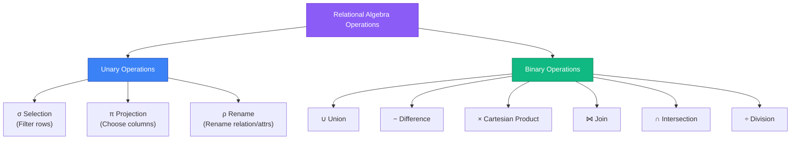

### Operations Reference Table

| Operation | Symbol | SQL Equivalent | Example |
|-----------|--------|----------------|---------|
| **Selection** | σ | `WHERE` | σ<sub>salary > 50000</sub>(Employee) |
| **Projection** | π | `SELECT columns` | π<sub>name, salary</sub>(Employee) |
| **Union** | ∪ | `UNION` | R ∪ S |
| **Difference** | − | `EXCEPT` | R − S |
| **Cartesian Product** | × | `CROSS JOIN` | R × S |
| **Rename** | ρ | `AS` | ρ<sub>E</sub>(Employee) |
| **Intersection** | ∩ | `INTERSECT` | R ∩ S |
| **Natural Join** | ⋈ | `NATURAL JOIN` | R ⋈ S |
| **Theta Join** | ⋈<sub>θ</sub> | `JOIN ON condition` | R ⋈<sub>R.a > S.b</sub> S |
| **Division** | ÷ | Nested `NOT EXISTS` | R ÷ S |

### Example Walkthrough

**Given**: `Employee(emp_id, name, dept, salary)`

1. **Select employees with salary > 50000:**
   - Relational Algebra: σ<sub>salary > 50000</sub>(Employee)
   - SQL: `SELECT * FROM Employee WHERE salary > 50000;`

2. **Get names of employees in Engineering:**
   - Relational Algebra: π<sub>name</sub>(σ<sub>dept = 'Engineering'</sub>(Employee))
   - SQL: `SELECT name FROM Employee WHERE dept = 'Engineering';`

3. **Join Employee with Department:**
   - Relational Algebra: Employee ⋈<sub>Employee.dept_id = Department.dept_id</sub> Department
   - SQL: `SELECT * FROM Employee JOIN Department ON Employee.dept_id = Department.dept_id;`

---

## 11. ACID Properties

### First Principles: Why ACID?

Databases serve multiple users simultaneously. Without rules, chaos ensues — partial updates, lost writes, corrupted data. **ACID properties** are the guarantee that database transactions are reliable.

### The Four Properties

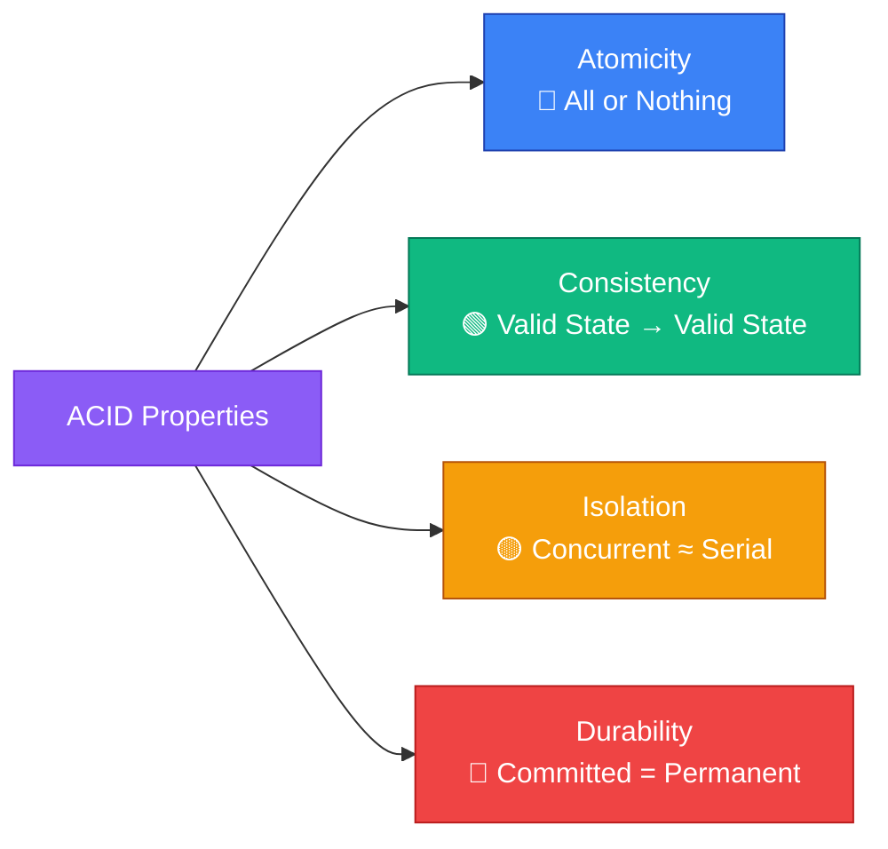

### Detailed Breakdown

| Property | Definition | Real-World Analogy | What Happens If Violated |
|----------|-----------|-------------------|-------------------------|
| **Atomicity** | A transaction either completes entirely or not at all | Bank transfer: debit AND credit, or neither | Partial transfer — money disappears |
| **Consistency** | Transaction takes DB from one valid state to another | Account balance can't go negative (if constrained) | Negative balance, orphaned records |
| **Isolation** | Concurrent transactions don't interfere with each other | Two people editing a doc — each sees a consistent version | Dirty reads, lost updates |
| **Durability** | Once committed, data survives crashes | Saving a document — it's there after a power failure | Data loss after commit |

### Real-World Example: Bank Transfer

```
BEGIN TRANSACTION;
    UPDATE accounts SET balance = balance - 500 WHERE id = 'A';  -- Debit Alice
    UPDATE accounts SET balance = balance + 500 WHERE id = 'B';  -- Credit Bob
COMMIT;
```

| Property | How It Applies |
|----------|---------------|
| **Atomicity** | If the debit succeeds but the credit fails → ROLLBACK both |
| **Consistency** | Total money in the system remains the same |
| **Isolation** | Another transaction reading balances sees either the old state or the new state, never a mix |
| **Durability** | After COMMIT, even if the server crashes, the transfer is permanent |

### Isolation Levels

| Level | Dirty Read | Non-Repeatable Read | Phantom Read | Performance |
|-------|-----------|-------------------|-------------|-------------|
| **Read Uncommitted** | ✅ Possible | ✅ Possible | ✅ Possible | Fastest |
| **Read Committed** | ❌ Prevented | ✅ Possible | ✅ Possible | Fast |
| **Repeatable Read** | ❌ Prevented | ❌ Prevented | ✅ Possible | Moderate |
| **Serializable** | ❌ Prevented | ❌ Prevented | ❌ Prevented | Slowest |

> **PostgreSQL default**: Read Committed
> **Oracle default**: Read Committed
> **MySQL InnoDB default**: Repeatable Read

---

## 12. Database Architecture

### Two-Tier vs Three-Tier Architecture

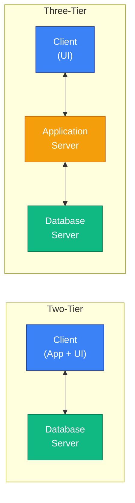

| Architecture | Layers | Example | Pros | Cons |
|-------------|--------|---------|------|------|
| **Two-Tier** | Client + DB Server | Desktop app + PostgreSQL | Simple, fast for small apps | Poor scalability, tight coupling |
| **Three-Tier** | Client + App Server + DB | Web app + Node.js + PostgreSQL | Scalable, maintainable, secure | More complex |

### Data Independence

| Type | Definition | Example |
|------|-----------|---------|
| **Logical Data Independence** | Change conceptual schema without affecting external schema | Add a column — views still work |
| **Physical Data Independence** | Change internal schema without affecting conceptual schema | Move to SSD — queries unchanged |

---

## ❓ Interview Questions

### 🟢 Beginner

1. **What is a database? How is it different from a spreadsheet?**
   > A database is an organized collection of structured data managed by a DBMS, supporting concurrent access, integrity constraints, and security. A spreadsheet is a single-user file with no built-in concurrency, integrity, or security mechanisms.

2. **What is a DBMS? Name four advantages over a file system.**
   > A DBMS is software that manages databases. Advantages: (1) Data independence, (2) Reduced redundancy via normalization, (3) Concurrent access with transactions, (4) Built-in security with GRANT/REVOKE.

3. **What are the ACID properties? Explain each with an example.**
   > See [ACID Properties section](#11-acid-properties). Key example: bank transfer — atomicity ensures both debit and credit happen or neither does.

4. **What is a primary key? Can it be NULL?**
   > A primary key uniquely identifies each row in a table. It cannot be NULL (entity integrity constraint) and must be unique.

5. **What is the difference between a primary key and a unique key?**
   > Primary key: cannot be NULL, only one per table. Unique key: can have one NULL (varies by RDBMS), multiple per table. Both enforce uniqueness.

6. **What is a foreign key? What problem does it solve?**
   > A foreign key references a primary key in another table, enforcing referential integrity. It prevents orphaned records (e.g., an order referencing a non-existent customer).

7. **What is an ER diagram? Name its three main components.**
   > An ER diagram is a visual representation of entities, their attributes, and relationships. Components: Entities (rectangles), Attributes (ovals), Relationships (diamonds).

8. **What is the difference between a candidate key and a super key?**
   > A super key is any set of attributes that uniquely identifies a row. A candidate key is a *minimal* super key — no attribute can be removed without losing uniqueness.

9. **What is data redundancy and why is it bad?**
   > Data redundancy is the unnecessary duplication of data. It wastes storage, causes update anomalies (inconsistent copies), and makes maintenance harder.

10. **What is a schema? What is an instance?**
    > A schema is the structure/design of a database (table definitions, constraints). An instance is the actual data at a specific point in time.

### 🟡 Intermediate

11. **Explain normalization. Walk through 1NF, 2NF, and 3NF with examples.**
    > See [Normalization section](#9-normalization). Key: 1NF = atomic values, 2NF = no partial dependencies, 3NF = no transitive dependencies.

12. **What is BCNF? How does it differ from 3NF?**
    > BCNF requires that for every functional dependency X → Y, X must be a super key. 3NF allows X to not be a super key if Y is part of a candidate key.

13. **Explain the three schema architecture (ANSI/SPARC).**
    > External level (views), Conceptual level (logical schema), Internal level (physical storage). Purpose: data independence — change one level without affecting others.

14. **What is a functional dependency? Give examples.**
    > X → Y means knowing X determines Y. Example: `employee_id → employee_name` (knowing the ID tells you the name). Counter-example: `department → employee_name` is NOT a FD (a department has many employees).

15. **What are insertion, update, and deletion anomalies? How does normalization prevent them?**
    > Insertion: can't add data without unrelated data. Update: must change data in multiple places. Deletion: removing one fact removes another. Normalization separates concerns into different tables.

16. **Explain the difference between logical and physical data independence.**
    > Logical: change schema without changing views/apps. Physical: change storage without changing schema. The three-schema architecture enables both.

17. **What is a weak entity? Give an example.**
    > A weak entity cannot be uniquely identified by its own attributes. It depends on a strong (owner) entity. Example: `OrderItem` depends on `Order` — item #1 is meaningless without knowing which order.

18. **How do you convert an M:N relationship to tables?**
    > Create a junction table with a composite primary key from the PKs of both entities. Example: `Enrollment(student_id, course_id, grade)` for Students ↔ Courses.

19. **What is the difference between total and partial participation in ER diagrams?**
    > Total: every entity MUST participate (double line). Example: every employee must belong to a department. Partial: an entity MAY participate (single line). Example: an employee may or may not manage a project.

20. **Explain Codd's 12 rules. Why were they important?**
    > They defined what makes a DBMS truly "relational." Key rules: information rule (all data in tables), guaranteed access (PK + table + column), and non-subversion (no backdoor to skip constraints). They set the standard that PostgreSQL and Oracle strive to meet.

### 🔴 Advanced

21. **Can a table be in 3NF but not BCNF? Construct an example.**
    > Yes. See the BCNF section example: `{student, subject, professor}` where `professor → subject` but `professor` is not a super key. It satisfies 3NF because `subject` is part of a candidate key `{student, subject}`.

22. **Explain 4NF and give a real-world scenario where it matters.**
    > 4NF handles multi-valued dependencies. Example: An employee can have multiple skills AND multiple languages. If stored in one table, you get spurious tuples. 4NF separates: `EmpSkills(emp_id, skill)` and `EmpLanguages(emp_id, language)`.

23. **When would you intentionally denormalize? What are the trade-offs?**
    > Denormalize for read-heavy OLAP workloads, reporting tables, materialized views, and caching layers. Trade-offs: faster reads but slower writes, data redundancy, risk of inconsistency, more complex update logic.

24. **How does the relational model handle NULL values? What are the philosophical debates?**
    > Codd proposed NULLs for missing/inapplicable data, creating three-valued logic (TRUE, FALSE, UNKNOWN). Debates: NULLs complicate joins (NULL ≠ NULL), aggregations (ignored by SUM/AVG), and indexing. Some advocate "no NULLs" designs with default values.

25. **Compare the relational model with the document model. When is each appropriate?**
    > Relational: structured data, complex joins, ACID transactions, strong consistency. Document: semi-structured data, flexible schemas, denormalized reads, eventual consistency. Use relational for banking, ERP. Use document for CMS, product catalogs with varying attributes.

26. **What is the closure of a set of functional dependencies? How do you compute it?**
    > The closure F⁺ is the set of all FDs derivable from F using Armstrong's axioms (reflexivity, augmentation, transitivity). To compute attribute closure X⁺: start with X, repeatedly add attributes determined by FDs in F until no more can be added.

27. **Explain Armstrong's Axioms. Why are they sound and complete?**
    > Reflexivity: if Y ⊆ X, then X → Y. Augmentation: if X → Y, then XZ → YZ. Transitivity: if X → Y and Y → Z, then X → Z. They are *sound* (never produce incorrect FDs) and *complete* (can derive ALL valid FDs).

28. **How do you determine all candidate keys from a set of functional dependencies?**
    > Find attributes that never appear on the right side of any FD — these MUST be in every key. Compute their closure. If it covers all attributes, that's the only key. Otherwise, add combinations of other attributes and check closure.

29. **What is lossless join decomposition? How do you verify it?**
    > A decomposition is lossless if joining the decomposed tables reconstructs the original without spurious tuples. Verify: for R split into R1 and R2, check if (R1 ∩ R2) → R1 or (R1 ∩ R2) → R2 (common attributes must be a key of at least one).

30. **Discuss the CAP theorem. How does it relate to ACID?**
    > CAP: a distributed system can guarantee at most 2 of Consistency, Availability, Partition tolerance. ACID systems (RDBMS) choose Consistency + Partition tolerance (CP). NoSQL systems often choose Availability + Partition tolerance (AP) with eventual consistency (BASE instead of ACID).

---

## ⚠️ Common Mistakes

| # | Mistake | Why It's Wrong | Correct Approach |
|---|---------|---------------|-----------------|
| 1 | Using a natural key (email) as primary key | Emails change; large string keys slow joins | Use surrogate key, UNIQUE constraint on email |
| 2 | Not normalizing to at least 3NF | Causes update/insert/delete anomalies | Normalize first, denormalize deliberately |
| 3 | Confusing 2NF with 3NF | 2NF = no partial deps (composite key), 3NF = no transitive deps | Remember: 2NF relates to key parts, 3NF to non-key chains |
| 4 | Saying "ACID guarantees no data loss" | Durability prevents loss after COMMIT; bugs in application logic can still corrupt data | ACID protects transaction integrity, not business logic |
| 5 | Treating NULL as a value | NULL = unknown/missing. NULL ≠ NULL, NULL ≠ 0, NULL ≠ '' | Use IS NULL, not = NULL |
| 6 | Forgetting weak entities need identifying relationships | A weak entity's PK includes the owner's PK | Always include the owner's PK in weak entity |
| 7 | Saying "3NF is always best" | For read-heavy analytics, denormalization is faster | Choose based on workload: OLTP → 3NF, OLAP → denormalize |
| 8 | Confusing DELETE anomaly with actual DELETE | Deletion anomaly is about losing *unrelated* data when deleting a row | It's a design problem, not an operation problem |

---

## 💬 FAQs

**Q1: Is normalization always good?**
> Not always. Over-normalization leads to too many joins, hurting read performance. The rule of thumb: normalize for writes (OLTP), denormalize for reads (OLAP/reporting). Most production systems use 3NF with selective denormalization.

**Q2: What's the difference between a database and a schema?**
> A database is the entire data store. A schema is a namespace within a database that groups related tables. In PostgreSQL, a database can have multiple schemas (e.g., `public`, `hr`, `sales`). In Oracle, each user has their own schema.

**Q3: Do all RDBMS systems fully support Codd's 12 Rules?**
> No commercial RDBMS fully satisfies all 13 rules. PostgreSQL comes closest. The rules are an ideal benchmark, not a strict requirement.

**Q4: What is the difference between DDL and DML?**
> DDL (Data Definition Language): `CREATE`, `ALTER`, `DROP` — defines structure. DML (Data Manipulation Language): `SELECT`, `INSERT`, `UPDATE`, `DELETE` — manipulates data.

**Q5: Can a foreign key reference a unique column that isn't a primary key?**
> Yes! A foreign key can reference any column (or set of columns) with a UNIQUE constraint. It doesn't have to be the primary key (though it usually is).

**Q6: What is the difference between OLTP and OLAP?**
> OLTP (Online Transaction Processing): many small, fast transactions (banking, e-commerce). OLAP (Online Analytical Processing): few complex, read-heavy queries (reporting, BI dashboards).

---

## 📝 Revision Notes

> **Quick recall list** — review before your interview.

1. **Data → Information → Knowledge → Wisdom** (DIKW pyramid)
2. **DBMS advantages over files**: independence, integrity, concurrency, security, redundancy control
3. **Three Schema Architecture**: External (views) → Conceptual (logical) → Internal (physical)
4. **Relational Model**: Tables = relations, Rows = tuples, Columns = attributes
5. **Keys hierarchy**: Super Key → Candidate Key → Primary Key / Alternate Key
6. **Foreign Key** enforces referential integrity between tables
7. **ER Model**: Entities (rectangles), Attributes (ovals), Relationships (diamonds)
8. **Cardinalities**: 1:1, 1:N, M:N — M:N needs a junction table
9. **Normalization**: 1NF (atomic) → 2NF (no partial deps) → 3NF (no transitive deps) → BCNF (all determinants are keys)
10. **ACID**: Atomicity (all-or-nothing), Consistency (valid state), Isolation (no interference), Durability (permanent after commit)
11. **Isolation Levels**: Read Uncommitted → Read Committed → Repeatable Read → Serializable
12. **Relational Algebra**: σ (select), π (project), ⋈ (join), ∪ (union), − (difference), × (cross product)
13. **Denormalize** for read-heavy OLAP; **Normalize** for write-heavy OLTP
14. **CAP Theorem**: Consistency, Availability, Partition tolerance — pick 2 for distributed systems

---

## 📋 Cheat Sheet

```
╔══════════════════════════════════════════════════════════════╗
║                  DATABASE THEORY CHEAT SHEET                ║
╠══════════════════════════════════════════════════════════════╣
║                                                              ║
║  KEYS:                                                       ║
║  ├── Super Key     → Any uniquely identifying set            ║
║  ├── Candidate Key → Minimal super key                       ║
║  ├── Primary Key   → Chosen candidate key (NOT NULL)         ║
║  ├── Alternate Key → Non-chosen candidate keys               ║
║  ├── Foreign Key   → References another table's PK/UNIQUE    ║
║  └── Surrogate Key → System-generated (auto-increment/UUID)  ║
║                                                              ║
║  NORMALIZATION:                                              ║
║  ├── 1NF  → Atomic values only                               ║
║  ├── 2NF  → 1NF + No partial dependency                     ║
║  ├── 3NF  → 2NF + No transitive dependency                  ║
║  ├── BCNF → 3NF + Every determinant is a super key          ║
║  ├── 4NF  → BCNF + No multi-valued dependencies             ║
║  └── 5NF  → 4NF + No join dependencies                      ║
║                                                              ║
║  ACID:                                                       ║
║  ├── Atomicity   → All or nothing                            ║
║  ├── Consistency → Valid state to valid state                 ║
║  ├── Isolation   → Concurrent txns don't interfere           ║
║  └── Durability  → Committed data survives crashes           ║
║                                                              ║
║  ER → RELATIONAL MAPPING:                                    ║
║  ├── Strong Entity → Table with PK                           ║
║  ├── Weak Entity   → Table with owner PK + partial key       ║
║  ├── 1:1 → FK in either table                                ║
║  ├── 1:N → FK in "many" side                                 ║
║  ├── M:N → Junction table with composite PK                  ║
║  └── Multi-valued attr → Separate table                      ║
║                                                              ║
║  RELATIONAL ALGEBRA:                                         ║
║  ├── σ (sigma)   → Selection (WHERE)                         ║
║  ├── π (pi)      → Projection (SELECT columns)              ║
║  ├── ⋈ (bowtie)  → Join                                     ║
║  ├── ∪ (union)   → Union                                     ║
║  ├── − (minus)   → Difference (EXCEPT)                       ║
║  ├── × (times)   → Cartesian Product (CROSS JOIN)            ║
║  └── ÷ (divide)  → Division                                  ║
║                                                              ║
║  ISOLATION LEVELS (weakest → strongest):                     ║
║  Read Uncommitted → Read Committed → Repeatable Read         ║
║  → Serializable                                              ║
║                                                              ║
╚══════════════════════════════════════════════════════════════╝
```

---

<p align="center">
  <b>📖 Next Module: <a href="../02_sql_fundamentals/README.md">SQL Fundamentals →</a></b>
</p>
