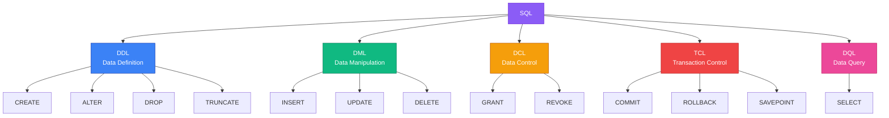
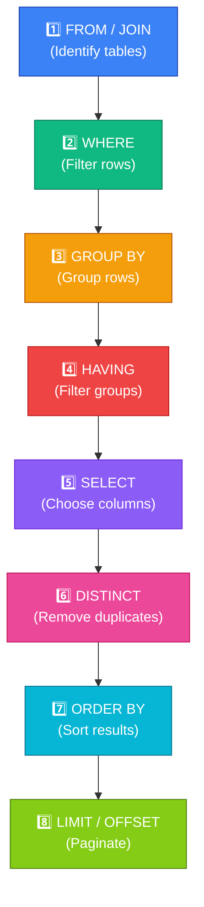
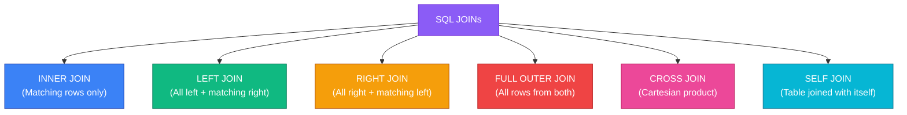
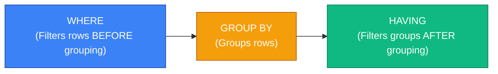
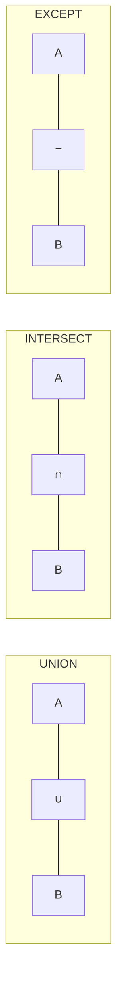
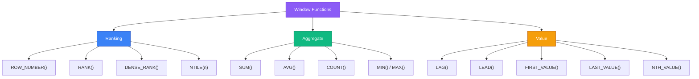

# 📝 Module 02 — SQL Fundamentals

<p align="center">
  
  
  
</p>

---

## 📌 Table of Contents

- [Why SQL Matters](#-why-sql-matters)
- [1. What Is SQL?](#1-what-is-sql)
- [2. SQL Sub-Languages](#2-sql-sub-languages)
- [3. DDL — Data Definition Language](#3-ddl--data-definition-language)
- [4. DML — Data Manipulation Language](#4-dml--data-manipulation-language)
- [5. SELECT — The Heart of SQL](#5-select--the-heart-of-sql)
- [6. Filtering with WHERE](#6-filtering-with-where)
- [7. JOINs — Combining Tables](#7-joins--combining-tables)
- [8. Aggregations and GROUP BY](#8-aggregations-and-group-by)
- [9. Subqueries](#9-subqueries)
- [10. Set Operations](#10-set-operations)
- [11. Window Functions](#11-window-functions)
- [12. Common Table Expressions (CTEs)](#12-common-table-expressions-ctes)
- [13. Views](#13-views)
- [14. Indexes (Intro)](#14-indexes-intro)
- [15. Constraints](#15-constraints)
- [16. Transactions in SQL](#16-transactions-in-sql)
- [Interview Questions](#-interview-questions)
- [Common Mistakes](#-common-mistakes)
- [FAQs](#-faqs)
- [Revision Notes](#-revision-notes)
- [Cheat Sheet](#-cheat-sheet)

---

## 🎯 Why SQL Matters

> *"SQL is the language of data. If data is the new oil, SQL is the refinery."*

**SQL (Structured Query Language)** is the standard language for interacting with relational databases. It has been the industry standard since the 1970s and shows no signs of disappearing.

**Why every developer needs SQL:**
- **Ubiquitous**: PostgreSQL, MySQL, Oracle, SQL Server, SQLite — all use SQL.
- **Declarative**: You say *what* you want, not *how* to get it.
- **Interviews**: SQL questions appear in 90%+ of backend/data engineer interviews.
- **Career**: From junior dev to CTO, SQL skills never become irrelevant.


---

## 1. What Is SQL?

### First Principles

SQL is a **declarative language** — you describe the result you want, and the database engine decides how to compute it.

| Paradigm | Example Language | How You Program |
|----------|-----------------|-----------------|
| **Imperative** | Python, Java | You write step-by-step instructions |
| **Declarative** | SQL, HTML | You describe what you want |

### Brief History

| Year | Milestone |
|------|-----------|
| 1970 | Codd publishes the relational model |
| 1974 | IBM creates SEQUEL (later SQL) |
| 1979 | Oracle releases first commercial SQL database |
| 1986 | SQL becomes ANSI/ISO standard (SQL-86) |
| 1992 | SQL-92 (major revision) |
| 1999 | SQL:1999 (CTEs, window functions, triggers) |
| 2003 | SQL:2003 (XML support, sequences) |
| 2011 | SQL:2011 (temporal databases) |
| 2016 | SQL:2016 (JSON support) |
| 2023 | SQL:2023 (graph queries, JSON enhancements) |

---

## 2. SQL Sub-Languages



| Sub-Language | Purpose | Key Commands | Auto-Commit? |
|-------------|---------|-------------|-------------|
| **DDL** | Define/modify schema | `CREATE`, `ALTER`, `DROP`, `TRUNCATE` | Yes (in most RDBMS) |
| **DML** | Manipulate data | `INSERT`, `UPDATE`, `DELETE` | No (needs COMMIT) |
| **DQL** | Query data | `SELECT` | N/A (read-only) |
| **DCL** | Control access | `GRANT`, `REVOKE` | Yes |
| **TCL** | Manage transactions | `COMMIT`, `ROLLBACK`, `SAVEPOINT` | N/A |

---

## 3. DDL — Data Definition Language

### CREATE TABLE

```sql
-- Basic table creation
CREATE TABLE employees (
    emp_id      SERIAL PRIMARY KEY,           -- Auto-incrementing PK (PostgreSQL)
    first_name  VARCHAR(50) NOT NULL,
    last_name   VARCHAR(50) NOT NULL,
    email       VARCHAR(100) UNIQUE NOT NULL,
    hire_date   DATE DEFAULT CURRENT_DATE,
    salary      DECIMAL(10,2) CHECK (salary > 0),
    dept_id     INT REFERENCES departments(dept_id)
);

CREATE TABLE departments (
    dept_id     SERIAL PRIMARY KEY,
    dept_name   VARCHAR(100) NOT NULL UNIQUE,
    location    VARCHAR(100),
    budget      DECIMAL(15,2) DEFAULT 0
);
```

### ALTER TABLE

```sql
-- Add a column
ALTER TABLE employees ADD COLUMN phone VARCHAR(20);

-- Modify a column (PostgreSQL syntax)
ALTER TABLE employees ALTER COLUMN phone TYPE VARCHAR(30);

-- Add a constraint
ALTER TABLE employees ADD CONSTRAINT chk_salary CHECK (salary >= 30000);

-- Drop a column
ALTER TABLE employees DROP COLUMN phone;

-- Rename a column
ALTER TABLE employees RENAME COLUMN first_name TO fname;
```

### DROP vs TRUNCATE vs DELETE

| Operation | What It Does | Rollback? | Resets Auto-Increment? | Speed |
|-----------|-------------|-----------|----------------------|-------|
| `DELETE FROM table` | Deletes rows (can use WHERE) | ✅ Yes | ❌ No | Slow (logged per row) |
| `TRUNCATE TABLE table` | Removes all rows | ❌ No (DDL) | ✅ Yes | Very fast |
| `DROP TABLE table` | Removes table entirely | ❌ No (DDL) | N/A | Instant |

```sql
-- Delete specific rows
DELETE FROM employees WHERE dept_id = 5;

-- Delete all rows (but keep table)
TRUNCATE TABLE temp_logs;

-- Delete the table itself
DROP TABLE IF EXISTS temp_logs;
```

---

## 4. DML — Data Manipulation Language

### INSERT

```sql
-- Single row insert
INSERT INTO employees (first_name, last_name, email, salary, dept_id)
VALUES ('Alice', 'Johnson', 'alice@company.com', 95000, 1);

-- Multi-row insert
INSERT INTO employees (first_name, last_name, email, salary, dept_id)
VALUES 
    ('Bob', 'Smith', 'bob@company.com', 72000, 2),
    ('Carol', 'Williams', 'carol@company.com', 88000, 1),
    ('Dave', 'Brown', 'dave@company.com', 65000, 3);

-- Insert from SELECT
INSERT INTO employee_archive (first_name, last_name, email, salary)
SELECT first_name, last_name, email, salary
FROM employees
WHERE hire_date < '2020-01-01';
```

### UPDATE

```sql
-- Update specific rows
UPDATE employees
SET salary = salary * 1.10     -- 10% raise
WHERE dept_id = 1;

-- Update with JOIN (PostgreSQL)
UPDATE employees e
SET salary = salary * 1.15
FROM departments d
WHERE e.dept_id = d.dept_id
AND d.dept_name = 'Engineering';
```

### DELETE

```sql
-- Delete specific rows
DELETE FROM employees
WHERE emp_id = 105;

-- Delete with subquery
DELETE FROM employees
WHERE dept_id IN (
    SELECT dept_id FROM departments WHERE location = 'Closed Office'
);
```

---

## 5. SELECT — The Heart of SQL

### SQL Query Execution Order

This is one of the **most important concepts** for interviews:



> ⚠️ **Key Insight**: `SELECT` is processed *after* `WHERE`, `GROUP BY`, and `HAVING`. This is why you can't use column aliases in `WHERE`!

### SELECT Syntax

```sql
SELECT [DISTINCT] column1, column2, expression AS alias
FROM table1
[JOIN table2 ON condition]
[WHERE filter_condition]
[GROUP BY grouping_columns]
[HAVING group_filter]
[ORDER BY sort_columns [ASC|DESC]]
[LIMIT n OFFSET m];
```

### Basic SELECT Examples

```sql
-- Select all columns
SELECT * FROM employees;

-- Select specific columns
SELECT first_name, last_name, salary FROM employees;

-- Aliases
SELECT 
    first_name AS "First Name",
    salary * 12 AS annual_salary
FROM employees;

-- Distinct values
SELECT DISTINCT dept_id FROM employees;

-- Sorting
SELECT first_name, salary 
FROM employees 
ORDER BY salary DESC, first_name ASC;

-- Pagination
SELECT * FROM employees 
ORDER BY emp_id 
LIMIT 10 OFFSET 20;  -- Page 3 (rows 21-30)
```

---

## 6. Filtering with WHERE

### Comparison Operators

| Operator | Meaning | Example |
|----------|---------|---------|
| `=` | Equal | `WHERE dept_id = 1` |
| `<>` or `!=` | Not equal | `WHERE status <> 'inactive'` |
| `<`, `>` | Less/Greater than | `WHERE salary > 50000` |
| `<=`, `>=` | Less/Greater or equal | `WHERE age >= 18` |
| `BETWEEN` | Range (inclusive) | `WHERE salary BETWEEN 50000 AND 100000` |
| `IN` | Set membership | `WHERE dept_id IN (1, 2, 3)` |
| `LIKE` | Pattern matching | `WHERE name LIKE 'A%'` |
| `ILIKE` | Case-insensitive LIKE (PG) | `WHERE name ILIKE '%john%'` |
| `IS NULL` | Check for NULL | `WHERE manager_id IS NULL` |
| `IS NOT NULL` | Check not NULL | `WHERE email IS NOT NULL` |

### Logical Operators

```sql
-- AND — both conditions must be true
SELECT * FROM employees
WHERE dept_id = 1 AND salary > 80000;

-- OR — at least one condition must be true
SELECT * FROM employees
WHERE dept_id = 1 OR dept_id = 2;

-- NOT — negates a condition
SELECT * FROM employees
WHERE NOT (dept_id = 3);

-- Complex conditions with parentheses
SELECT * FROM employees
WHERE (dept_id = 1 OR dept_id = 2) 
  AND salary > 70000
  AND hire_date >= '2020-01-01';
```

### LIKE Patterns

| Pattern | Meaning | Example Match |
|---------|---------|---------------|
| `'A%'` | Starts with A | Alice, Andrew |
| `'%son'` | Ends with son | Johnson, Wilson |
| `'%an%'` | Contains "an" | Anderson, Mani |
| `'_o%'` | Second char is 'o' | Bob, Tom |
| `'___'` | Exactly 3 characters | Bob, Tom, Amy |

---

## 7. JOINs — Combining Tables

### Why JOINs Exist

Because data is normalized into separate tables, we need JOINs to reassemble it. JOINs are the **most important SQL concept** for interviews.

### Types of JOINs — Visual Guide



### Sample Data

**employees:**

| emp_id | name | dept_id |
|--------|------|---------|
| 1 | Alice | 10 |
| 2 | Bob | 20 |
| 3 | Carol | 10 |
| 4 | Dave | NULL |

**departments:**

| dept_id | dept_name |
|---------|-----------|
| 10 | Engineering |
| 20 | Marketing |
| 30 | Finance |

### JOIN Results Comparison

#### INNER JOIN — Only matching rows

```sql
SELECT e.name, d.dept_name
FROM employees e
INNER JOIN departments d ON e.dept_id = d.dept_id;
```

| name | dept_name |
|------|-----------|
| Alice | Engineering |
| Bob | Marketing |
| Carol | Engineering |

> Dave (NULL dept_id) and Finance (no employees) are excluded.

#### LEFT JOIN — All left rows + matching right

```sql
SELECT e.name, d.dept_name
FROM employees e
LEFT JOIN departments d ON e.dept_id = d.dept_id;
```

| name | dept_name |
|------|-----------|
| Alice | Engineering |
| Bob | Marketing |
| Carol | Engineering |
| Dave | NULL |

> Dave appears with NULL dept_name. Finance is still excluded.

#### RIGHT JOIN — All right rows + matching left

```sql
SELECT e.name, d.dept_name
FROM employees e
RIGHT JOIN departments d ON e.dept_id = d.dept_id;
```

| name | dept_name |
|------|-----------|
| Alice | Engineering |
| Bob | Marketing |
| Carol | Engineering |
| NULL | Finance |

> Finance appears with NULL name. Dave is excluded.

#### FULL OUTER JOIN — All rows from both

```sql
SELECT e.name, d.dept_name
FROM employees e
FULL OUTER JOIN departments d ON e.dept_id = d.dept_id;
```

| name | dept_name |
|------|-----------|
| Alice | Engineering |
| Bob | Marketing |
| Carol | Engineering |
| Dave | NULL |
| NULL | Finance |

> Both Dave and Finance appear.

#### CROSS JOIN — Cartesian product

```sql
SELECT e.name, d.dept_name
FROM employees e
CROSS JOIN departments d;
```

> Result: 4 employees × 3 departments = **12 rows** (every combination).

#### SELF JOIN — Table joined with itself

```sql
-- Find employees and their managers
SELECT 
    e.name AS employee,
    m.name AS manager
FROM employees e
LEFT JOIN employees m ON e.manager_id = m.emp_id;
```

### JOIN Summary Table

| JOIN Type | Left Table Rows | Right Table Rows | Result |
|-----------|----------------|-----------------|--------|
| **INNER JOIN** | Only matched | Only matched | Intersection |
| **LEFT JOIN** | All | Only matched | All left + matched right |
| **RIGHT JOIN** | Only matched | All | Matched left + all right |
| **FULL OUTER JOIN** | All | All | Union of both |
| **CROSS JOIN** | All | All | Cartesian product |

### Multi-Table JOINs

```sql
-- Joining 3 tables
SELECT 
    e.first_name,
    d.dept_name,
    p.project_name
FROM employees e
JOIN departments d ON e.dept_id = d.dept_id
JOIN projects p ON e.emp_id = p.lead_id
WHERE d.location = 'New York';
```

---

## 8. Aggregations and GROUP BY

### Aggregate Functions

| Function | Description | Handles NULL? |
|----------|------------|--------------|
| `COUNT(*)` | Count all rows | Counts rows with NULL |
| `COUNT(column)` | Count non-NULL values | Ignores NULL |
| `SUM(column)` | Sum of values | Ignores NULL |
| `AVG(column)` | Average of values | Ignores NULL |
| `MIN(column)` | Minimum value | Ignores NULL |
| `MAX(column)` | Maximum value | Ignores NULL |
| `STRING_AGG(col, ',')` | Concatenate strings (PG) | Ignores NULL |
| `ARRAY_AGG(column)` | Collect into array (PG) | Includes NULL |

### GROUP BY

```sql
-- Count employees per department
SELECT dept_id, COUNT(*) AS employee_count
FROM employees
GROUP BY dept_id;

-- Average salary by department
SELECT 
    d.dept_name,
    COUNT(*) AS headcount,
    ROUND(AVG(e.salary), 2) AS avg_salary,
    MIN(e.salary) AS min_salary,
    MAX(e.salary) AS max_salary
FROM employees e
JOIN departments d ON e.dept_id = d.dept_id
GROUP BY d.dept_name
ORDER BY avg_salary DESC;
```

### HAVING — Filtering Groups

```sql
-- Departments with more than 5 employees
SELECT dept_id, COUNT(*) AS employee_count
FROM employees
GROUP BY dept_id
HAVING COUNT(*) > 5;

-- Departments where average salary exceeds 80K
SELECT 
    d.dept_name,
    ROUND(AVG(e.salary), 2) AS avg_salary
FROM employees e
JOIN departments d ON e.dept_id = d.dept_id
GROUP BY d.dept_name
HAVING AVG(e.salary) > 80000;
```

### WHERE vs HAVING

| Aspect | WHERE | HAVING |
|--------|-------|--------|
| **Filters** | Individual rows | Groups |
| **When** | Before GROUP BY | After GROUP BY |
| **Can use aggregates?** | ❌ No | ✅ Yes |
| **Can use column aliases?** | ❌ No | Depends on RDBMS |



---

## 9. Subqueries

### What Is a Subquery?

A **subquery** is a query nested inside another query. It runs first, and its result is used by the outer query.

### Types of Subqueries

| Type | Returns | Used In | Example |
|------|---------|---------|---------|
| **Scalar** | Single value | WHERE, SELECT | `(SELECT MAX(salary) FROM employees)` |
| **Row** | Single row | WHERE | `(SELECT * FROM employees WHERE emp_id = 1)` |
| **Table** | Multiple rows/columns | FROM, JOIN | `(SELECT dept_id, AVG(salary) FROM employees GROUP BY dept_id)` |
| **Correlated** | Depends on outer query | WHERE, SELECT | Runs once per outer row |

### Scalar Subquery

```sql
-- Find employees earning above average
SELECT name, salary
FROM employees
WHERE salary > (SELECT AVG(salary) FROM employees);
```

### IN Subquery

```sql
-- Employees in departments located in 'New York'
SELECT name, dept_id
FROM employees
WHERE dept_id IN (
    SELECT dept_id 
    FROM departments 
    WHERE location = 'New York'
);
```

### EXISTS Subquery

```sql
-- Departments that have at least one employee
SELECT dept_name
FROM departments d
WHERE EXISTS (
    SELECT 1 
    FROM employees e 
    WHERE e.dept_id = d.dept_id
);
```

### Correlated Subquery

```sql
-- Find employees who earn more than the average salary of their department
SELECT name, salary, dept_id
FROM employees e1
WHERE salary > (
    SELECT AVG(salary)
    FROM employees e2
    WHERE e2.dept_id = e1.dept_id  -- References outer query!
);
```

> ⚠️ **Performance Warning**: Correlated subqueries run once per outer row. For large tables, consider rewriting as a JOIN.

### Subquery in FROM (Derived Table)

```sql
-- Top department by average salary
SELECT dept_name, avg_sal
FROM (
    SELECT d.dept_name, AVG(e.salary) AS avg_sal
    FROM employees e
    JOIN departments d ON e.dept_id = d.dept_id
    GROUP BY d.dept_name
) AS dept_salaries
ORDER BY avg_sal DESC
LIMIT 1;
```

---

## 10. Set Operations

### What Are Set Operations?

Set operations combine results from two or more `SELECT` queries that have the same number and type of columns.



| Operation | Returns | Duplicates |
|-----------|---------|-----------|
| `UNION` | All rows from both queries | Removed |
| `UNION ALL` | All rows from both queries | Kept |
| `INTERSECT` | Rows present in both queries | Removed |
| `EXCEPT` | Rows in first query but not in second | Removed |

### Examples

```sql
-- All unique cities from customers and suppliers
SELECT city FROM customers
UNION
SELECT city FROM suppliers;

-- Cities that appear in BOTH customers and suppliers
SELECT city FROM customers
INTERSECT
SELECT city FROM suppliers;

-- Customer cities that are NOT supplier cities
SELECT city FROM customers
EXCEPT
SELECT city FROM suppliers;

-- UNION ALL (keeps duplicates — faster than UNION)
SELECT name, 'employee' AS type FROM employees
UNION ALL
SELECT name, 'contractor' AS type FROM contractors;
```

> **Performance Tip**: Use `UNION ALL` instead of `UNION` when you know there are no duplicates — it skips the deduplication step.

---

## 11. Window Functions

### First Principles: Why Window Functions?

Regular aggregate functions (`SUM`, `AVG`) collapse rows into groups. But what if you want to:
- **Rank** employees by salary without losing individual rows?
- **Running total** of sales over time?
- **Compare** each row to the group average?

**Window functions** perform calculations **across a set of rows related to the current row** without collapsing them.

### Syntax

```sql
function_name(expression) OVER (
    [PARTITION BY partition_columns]
    [ORDER BY sort_columns]
    [ROWS/RANGE frame_specification]
)
```

### Window Function Categories



### Ranking Functions Compared

Given data: Engineering dept salaries = 90000, 85000, 85000, 70000

| Function | 90000 | 85000 | 85000 | 70000 | Logic |
|----------|-------|-------|-------|-------|-------|
| `ROW_NUMBER()` | 1 | 2 | 3 | 4 | Unique sequential numbers |
| `RANK()` | 1 | 2 | 2 | 4 | Same rank for ties, gaps after |
| `DENSE_RANK()` | 1 | 2 | 2 | 3 | Same rank for ties, no gaps |
| `NTILE(2)` | 1 | 1 | 2 | 2 | Divide into N equal buckets |

### Ranking Examples

```sql
-- Rank employees by salary within each department
SELECT 
    name,
    dept_id,
    salary,
    ROW_NUMBER() OVER (PARTITION BY dept_id ORDER BY salary DESC) AS row_num,
    RANK()       OVER (PARTITION BY dept_id ORDER BY salary DESC) AS rank,
    DENSE_RANK() OVER (PARTITION BY dept_id ORDER BY salary DESC) AS dense_rank
FROM employees;
```

### LAG and LEAD

```sql
-- Compare each employee's salary to the previous one (ordered by hire date)
SELECT 
    name,
    hire_date,
    salary,
    LAG(salary, 1)  OVER (ORDER BY hire_date) AS prev_salary,
    LEAD(salary, 1) OVER (ORDER BY hire_date) AS next_salary,
    salary - LAG(salary, 1) OVER (ORDER BY hire_date) AS salary_diff
FROM employees;
```

### Running Totals and Moving Averages

```sql
-- Running total of sales by date
SELECT 
    sale_date,
    amount,
    SUM(amount) OVER (ORDER BY sale_date) AS running_total,
    AVG(amount) OVER (
        ORDER BY sale_date 
        ROWS BETWEEN 2 PRECEDING AND CURRENT ROW
    ) AS moving_avg_3day
FROM sales;
```

### Top-N Per Group (Classic Interview Question)

```sql
-- Top 3 highest-paid employees per department
SELECT * FROM (
    SELECT 
        name,
        dept_id,
        salary,
        DENSE_RANK() OVER (PARTITION BY dept_id ORDER BY salary DESC) AS rnk
    FROM employees
) ranked
WHERE rnk <= 3;
```

### Frame Specifications

| Frame | Meaning |
|-------|---------|
| `ROWS BETWEEN UNBOUNDED PRECEDING AND CURRENT ROW` | All rows from start to current (default for ORDER BY) |
| `ROWS BETWEEN 2 PRECEDING AND CURRENT ROW` | Current row + 2 previous rows |
| `ROWS BETWEEN CURRENT ROW AND UNBOUNDED FOLLOWING` | Current row to end |
| `ROWS BETWEEN 1 PRECEDING AND 1 FOLLOWING` | Previous, current, and next row |

---

## 12. Common Table Expressions (CTEs)

### What Is a CTE?

A **CTE** (Common Table Expression) is a temporary, named result set that you can reference within a `SELECT`, `INSERT`, `UPDATE`, or `DELETE` statement. Think of it as a named subquery that improves readability.

### Basic CTE

```sql
WITH dept_stats AS (
    SELECT 
        dept_id,
        COUNT(*) AS headcount,
        AVG(salary) AS avg_salary
    FROM employees
    GROUP BY dept_id
)
SELECT 
    e.name,
    e.salary,
    ds.avg_salary,
    e.salary - ds.avg_salary AS diff_from_avg
FROM employees e
JOIN dept_stats ds ON e.dept_id = ds.dept_id
WHERE e.salary > ds.avg_salary;
```

### Multiple CTEs

```sql
WITH 
high_earners AS (
    SELECT * FROM employees WHERE salary > 90000
),
engineering AS (
    SELECT * FROM departments WHERE dept_name = 'Engineering'
)
SELECT he.name, he.salary
FROM high_earners he
JOIN engineering eng ON he.dept_id = eng.dept_id;
```

### Recursive CTE

Recursive CTEs are used for hierarchical/tree data (org charts, categories, graphs).

```sql
-- Employee hierarchy (org chart)
WITH RECURSIVE org_chart AS (
    -- Base case: CEO (no manager)
    SELECT emp_id, name, manager_id, 1 AS level
    FROM employees
    WHERE manager_id IS NULL
    
    UNION ALL
    
    -- Recursive case: employees under previous level
    SELECT e.emp_id, e.name, e.manager_id, oc.level + 1
    FROM employees e
    JOIN org_chart oc ON e.manager_id = oc.emp_id
)
SELECT 
    REPEAT('  ', level - 1) || name AS org_tree,
    level
FROM org_chart
ORDER BY level, name;
```

```
Output:
org_tree          | level
------------------+------
CEO John          | 1
  VP Alice        | 2
  VP Bob          | 2
    Manager Carol | 3
    Manager Dave  | 3
      Eng Eve     | 4
```

### CTE vs Subquery vs Temp Table

| Feature | CTE | Subquery | Temp Table |
|---------|-----|----------|------------|
| **Readability** | ✅ Excellent | ❌ Nested, hard to read | ✅ Good |
| **Reusability** | ✅ In same query | ❌ Must repeat | ✅ Across queries |
| **Recursion** | ✅ Yes | ❌ No | ❌ No |
| **Performance** | Same as subquery (usually) | Same as CTE | Can be faster (materialized) |
| **Scope** | Single statement | Single statement | Session or transaction |

---

## 13. Views

### What Is a View?

A **view** is a named, saved SQL query that acts like a virtual table. It doesn't store data — it runs the query every time you access it.

```sql
-- Create a view
CREATE VIEW v_employee_details AS
SELECT 
    e.emp_id,
    e.first_name || ' ' || e.last_name AS full_name,
    e.salary,
    d.dept_name,
    d.location
FROM employees e
JOIN departments d ON e.dept_id = d.dept_id;

-- Use the view like a table
SELECT * FROM v_employee_details WHERE dept_name = 'Engineering';

-- Drop a view
DROP VIEW IF EXISTS v_employee_details;
```

### View vs Materialized View

| Feature | View | Materialized View |
|---------|------|------------------|
| **Stores data?** | ❌ No (virtual) | ✅ Yes (physical copy) |
| **Always up-to-date?** | ✅ Yes | ❌ No (stale until refreshed) |
| **Performance** | Same as base query | Faster (reads from cache) |
| **Refresh** | Automatic (runs query) | Manual (`REFRESH MATERIALIZED VIEW`) |
| **Use case** | Security, simplification | Expensive queries, reporting dashboards |

```sql
-- Materialized View (PostgreSQL)
CREATE MATERIALIZED VIEW mv_dept_stats AS
SELECT 
    dept_id,
    COUNT(*) AS headcount,
    AVG(salary) AS avg_salary
FROM employees
GROUP BY dept_id;

-- Refresh when underlying data changes
REFRESH MATERIALIZED VIEW mv_dept_stats;

-- Refresh concurrently (no lock, requires UNIQUE index)
REFRESH MATERIALIZED VIEW CONCURRENTLY mv_dept_stats;
```

---

## 14. Indexes (Intro)

### What Is an Index?

An **index** is a data structure (usually a B-tree) that speeds up data retrieval at the cost of slower writes and additional storage.

### Real-World Analogy

A database index works like a **book index** — instead of reading every page to find "normalization," you look in the index, get the page number, and jump directly there.

### Basic Index Operations

```sql
-- Create an index
CREATE INDEX idx_employees_dept ON employees(dept_id);

-- Create a unique index
CREATE UNIQUE INDEX idx_employees_email ON employees(email);

-- Create a composite index
CREATE INDEX idx_employees_dept_salary ON employees(dept_id, salary);

-- Drop an index
DROP INDEX IF EXISTS idx_employees_dept;
```

### When to Create Indexes

| ✅ Create Index When | ❌ Don't Create Index When |
|---------------------|--------------------------|
| Column frequently in WHERE | Table is very small |
| Column used in JOIN conditions | Column has low cardinality (few unique values) |
| Column used in ORDER BY | Table has heavy INSERT/UPDATE/DELETE |
| Column used in GROUP BY | Column rarely queried |

> **Deep Dive**: See [Module 05 — Advanced RDBMS Topics](../05_advanced_rdbms_topics/README.md) for B-tree internals, index types, and query optimization.

---

## 15. Constraints

### What Are Constraints?

Constraints enforce **rules on data** to maintain integrity.

| Constraint | Purpose | Example |
|-----------|---------|---------|
| `NOT NULL` | Column must have a value | `email VARCHAR(100) NOT NULL` |
| `UNIQUE` | All values must be different | `UNIQUE(email)` |
| `PRIMARY KEY` | NOT NULL + UNIQUE + identifies row | `emp_id INT PRIMARY KEY` |
| `FOREIGN KEY` | References PK/UNIQUE in another table | `REFERENCES departments(dept_id)` |
| `CHECK` | Custom validation rule | `CHECK (salary > 0)` |
| `DEFAULT` | Provides default value | `DEFAULT CURRENT_DATE` |
| `EXCLUSION` | Prevent overlapping ranges (PostgreSQL) | Scheduling conflicts |

### Foreign Key Actions

```sql
CREATE TABLE orders (
    order_id SERIAL PRIMARY KEY,
    customer_id INT REFERENCES customers(customer_id)
        ON DELETE CASCADE        -- Delete order if customer deleted
        ON UPDATE SET NULL       -- Set to NULL if customer ID changes
);
```

| Action | Meaning |
|--------|---------|
| `CASCADE` | Propagate the change to related rows |
| `SET NULL` | Set FK to NULL in related rows |
| `SET DEFAULT` | Set FK to default value |
| `RESTRICT` | Block the change if related rows exist |
| `NO ACTION` | Like RESTRICT but checked at end of transaction |

---

## 16. Transactions in SQL

### Transaction Syntax

```sql
-- Basic transaction
BEGIN;  -- or START TRANSACTION
    INSERT INTO accounts (id, balance) VALUES (1, 1000);
    UPDATE accounts SET balance = balance - 500 WHERE id = 1;
    UPDATE accounts SET balance = balance + 500 WHERE id = 2;
COMMIT;  -- Make changes permanent

-- Rollback on error
BEGIN;
    UPDATE accounts SET balance = balance - 500 WHERE id = 1;
    -- Something goes wrong...
ROLLBACK;  -- Undo all changes since BEGIN
```

### Savepoints

```sql
BEGIN;
    INSERT INTO orders (customer_id, total) VALUES (1, 100);
    SAVEPOINT after_order;
    
    INSERT INTO order_items (order_id, product_id) VALUES (1, 999);
    -- Product 999 doesn't exist — error!
    ROLLBACK TO SAVEPOINT after_order;
    
    -- Order is still inserted, only the item was rolled back
    INSERT INTO order_items (order_id, product_id) VALUES (1, 101);
COMMIT;
```

### Transaction Isolation Levels

```sql
-- Set isolation level for a transaction
SET TRANSACTION ISOLATION LEVEL SERIALIZABLE;
BEGIN;
    -- Your queries here
COMMIT;

-- Set for the session
SET SESSION CHARACTERISTICS AS TRANSACTION ISOLATION LEVEL READ COMMITTED;
```

---

## ❓ Interview Questions

### 🟢 Beginner

1. **What is the difference between WHERE and HAVING?**
   > WHERE filters individual rows BEFORE grouping. HAVING filters groups AFTER GROUP BY. WHERE cannot use aggregate functions; HAVING can.

2. **What are the different types of JOINs? Explain with examples.**
   > INNER (only matches), LEFT (all left + matches), RIGHT (all right + matches), FULL OUTER (all from both), CROSS (cartesian product), SELF (table with itself). See [JOINs section](#7-joins--combining-tables).

3. **What is the difference between DELETE, TRUNCATE, and DROP?**
   > DELETE: removes rows (can filter, logged, rollback-able). TRUNCATE: removes all rows (DDL, faster, no rollback). DROP: removes the entire table structure.

4. **What is a primary key constraint? Can a table have multiple?**
   > A PK uniquely identifies rows, is NOT NULL and UNIQUE. A table can have only ONE primary key but can have multiple UNIQUE constraints.

5. **What is the difference between UNION and UNION ALL?**
   > UNION removes duplicates (slower). UNION ALL keeps all rows including duplicates (faster). Use UNION ALL when duplicates are impossible or acceptable.

6. **What does GROUP BY do?**
   > GROUP BY groups rows with the same values in specified columns, allowing aggregate functions (COUNT, SUM, AVG) to be applied per group.

7. **What is a NULL in SQL? How does it behave?**
   > NULL represents missing/unknown data. NULL is not equal to anything, including itself (NULL = NULL → UNKNOWN). Use IS NULL / IS NOT NULL to check.

8. **What is a foreign key and what happens if you violate it?**
   > A foreign key references a PK/UNIQUE in another table. Violation (inserting a non-existent reference) raises a constraint error and rejects the operation.

9. **Explain the difference between CHAR and VARCHAR.**
   > CHAR(n) is fixed-length (padded with spaces). VARCHAR(n) is variable-length (stores only actual characters). Use VARCHAR for most cases; CHAR for fixed codes like country_code CHAR(2).

10. **What is an alias in SQL?**
    > An alias is a temporary name given to a table or column using AS. It improves readability. `SELECT salary * 12 AS annual_salary FROM employees e`.

### 🟡 Intermediate

11. **Explain the SQL query execution order.**
    > FROM → WHERE → GROUP BY → HAVING → SELECT → DISTINCT → ORDER BY → LIMIT. This is why column aliases from SELECT can't be used in WHERE.

12. **What are window functions? How are they different from aggregate functions?**
    > Window functions compute values across a set of rows related to the current row WITHOUT collapsing them. Aggregates reduce rows to one per group. Window functions preserve individual rows.

13. **Write a query to find the Nth highest salary.**
    ```sql
    -- Using DENSE_RANK (handles ties correctly)
    SELECT salary FROM (
        SELECT salary, DENSE_RANK() OVER (ORDER BY salary DESC) AS rnk
        FROM employees
    ) t WHERE rnk = 3; -- 3rd highest
    
    -- Using LIMIT/OFFSET (simpler, may miss ties)
    SELECT DISTINCT salary FROM employees ORDER BY salary DESC LIMIT 1 OFFSET 2;
    ```

14. **What is a correlated subquery? How does it differ from a regular subquery?**
    > A correlated subquery references the outer query and runs once per outer row. A regular subquery runs once and returns a fixed result. Correlated subqueries are slower for large datasets.

15. **Explain CTEs. When would you use a recursive CTE?**
    > CTEs are named temporary result sets for readability and reuse. Recursive CTEs handle hierarchical data: org charts, category trees, bill of materials.

16. **What is the difference between a view and a materialized view?**
    > A view is virtual (runs query on access). A materialized view stores results physically (faster reads, needs manual refresh). Use materialized views for expensive, rarely-changing queries.

17. **Write a query to find duplicate records.**
    ```sql
    SELECT email, COUNT(*) AS cnt
    FROM employees
    GROUP BY email
    HAVING COUNT(*) > 1;
    ```

18. **How do you implement pagination in SQL?**
    ```sql
    -- Offset-based (simple but slow for large offsets)
    SELECT * FROM products ORDER BY product_id LIMIT 20 OFFSET 40;  -- Page 3
    
    -- Keyset/cursor-based (fast, scales well)
    SELECT * FROM products WHERE product_id > 60 ORDER BY product_id LIMIT 20;
    ```

19. **What is the difference between EXISTS and IN?**
    > EXISTS returns TRUE/FALSE (short-circuits when first match found). IN compares to a full list. EXISTS is generally faster for large subqueries; IN is better for small lists.

20. **What are ACID properties in the context of SQL transactions?**
    > Atomicity (BEGIN/COMMIT/ROLLBACK), Consistency (constraints enforced), Isolation (concurrent transactions don't interfere), Durability (committed data persists). See [Module 01](../01_database_theory/README.md#11-acid-properties).

### 🔴 Advanced

21. **Explain the difference between ROW_NUMBER(), RANK(), and DENSE_RANK().**
    > ROW_NUMBER: unique sequential numbers (1,2,3,4). RANK: same rank for ties, gaps (1,2,2,4). DENSE_RANK: same rank for ties, no gaps (1,2,2,3). Choose based on whether ties and gaps matter.

22. **Write a query to find employees whose salary is above the average of their department — without a subquery.**
    ```sql
    SELECT e.name, e.salary, e.dept_id, dept_avg.avg_sal
    FROM employees e
    JOIN (
        SELECT dept_id, AVG(salary) AS avg_sal FROM employees GROUP BY dept_id
    ) dept_avg ON e.dept_id = dept_avg.dept_id
    WHERE e.salary > dept_avg.avg_sal;
    -- Alternatively with window function:
    SELECT * FROM (
        SELECT name, salary, dept_id,
               AVG(salary) OVER (PARTITION BY dept_id) AS avg_sal
        FROM employees
    ) t WHERE salary > avg_sal;
    ```

23. **How do you write a running total using window functions?**
    ```sql
    SELECT 
        transaction_date,
        amount,
        SUM(amount) OVER (ORDER BY transaction_date 
                          ROWS BETWEEN UNBOUNDED PRECEDING AND CURRENT ROW) AS running_total
    FROM transactions;
    ```

24. **Explain the performance difference between OFFSET pagination and keyset pagination.**
    > OFFSET must scan and skip N rows (O(n) per page). Keyset uses WHERE with an indexed column to start directly (O(log n)). For page 1000 with 20 items/page, OFFSET scans 20,000 rows; keyset scans ~20.

25. **Write a query to find gaps in a sequence.**
    ```sql
    SELECT 
        id + 1 AS gap_start,
        next_id - 1 AS gap_end
    FROM (
        SELECT id, LEAD(id) OVER (ORDER BY id) AS next_id
        FROM orders
    ) t
    WHERE next_id - id > 1;
    ```

26. **How would you pivot rows to columns in SQL?**
    ```sql
    -- Using CASE + aggregation (works in all RDBMS)
    SELECT 
        employee_id,
        MAX(CASE WHEN quarter = 'Q1' THEN sales END) AS q1_sales,
        MAX(CASE WHEN quarter = 'Q2' THEN sales END) AS q2_sales,
        MAX(CASE WHEN quarter = 'Q3' THEN sales END) AS q3_sales,
        MAX(CASE WHEN quarter = 'Q4' THEN sales END) AS q4_sales
    FROM quarterly_sales
    GROUP BY employee_id;
    
    -- Using crosstab in PostgreSQL (tablefunc extension)
    ```

27. **What is a window frame? Explain ROWS vs RANGE.**
    > A frame defines which rows the window function considers. ROWS counts physical rows (e.g., 3 preceding rows). RANGE considers logical ranges (all rows with values within a range). ROWS is deterministic; RANGE may include ties.

28. **Write a query to calculate month-over-month growth percentage.**
    ```sql
    SELECT 
        month,
        revenue,
        LAG(revenue) OVER (ORDER BY month) AS prev_month_revenue,
        ROUND(
            (revenue - LAG(revenue) OVER (ORDER BY month)) * 100.0 / 
            LAG(revenue) OVER (ORDER BY month), 
            2
        ) AS mom_growth_pct
    FROM monthly_revenue;
    ```

29. **How do you handle NULLs in JOINs, aggregations, and ordering?**
    > JOINs: NULL ≠ NULL, so rows with NULL join keys won't match. Aggregates: NULLs are ignored by SUM/AVG/COUNT(col) but COUNT(*) counts them. ORDER BY: NULLs come first (PostgreSQL) or last (Oracle). Use `NULLS FIRST` or `NULLS LAST` to control.

30. **Write a query to detect and remove exact duplicate rows (keeping one copy).**
    ```sql
    -- Using ctid (PostgreSQL row identifier)
    DELETE FROM employees
    WHERE ctid NOT IN (
        SELECT MIN(ctid)
        FROM employees
        GROUP BY first_name, last_name, email, salary, dept_id
    );
    
    -- Using ROW_NUMBER (more portable)
    WITH dupes AS (
        SELECT ctid, ROW_NUMBER() OVER (
            PARTITION BY first_name, last_name, email, salary, dept_id
            ORDER BY ctid
        ) AS rn
        FROM employees
    )
    DELETE FROM employees WHERE ctid IN (SELECT ctid FROM dupes WHERE rn > 1);
    ```

---

## ⚠️ Common Mistakes

| # | Mistake | Why It's Wrong | Correct Approach |
|---|---------|---------------|-----------------|
| 1 | Using `SELECT *` in production | Returns unnecessary columns, breaks if schema changes | List specific columns |
| 2 | Using `= NULL` instead of `IS NULL` | `= NULL` always evaluates to UNKNOWN | Always use `IS NULL` or `IS NOT NULL` |
| 3 | Using column alias in WHERE | WHERE is processed before SELECT | Use the original expression or a CTE |
| 4 | Not using LIMIT with ORDER BY | Without LIMIT, entire table is sorted | Always pair ORDER BY with LIMIT when possible |
| 5 | Using UNION instead of UNION ALL | UNION does an expensive dedup sort | Use UNION ALL if duplicates are impossible or acceptable |
| 6 | Not indexing JOIN columns | Joins on unindexed columns cause full table scans | Create indexes on FK columns |
| 7 | Using correlated subqueries for large datasets | Runs once per row — O(n²) | Rewrite as JOIN or window function |
| 8 | Confusing COUNT(*) and COUNT(column) | COUNT(*) counts all rows; COUNT(col) skips NULLs | Choose intentionally based on NULL handling |
| 9 | HAVING without GROUP BY | HAVING filters groups, not rows | Use WHERE for row-level filtering |
| 10 | Forgetting that DELETE is DML (not DDL) | DELETE can be rolled back; TRUNCATE cannot | Know the difference for interview answers |

---

## 💬 FAQs

**Q1: Is SQL case-sensitive?**
> SQL keywords are case-insensitive (`SELECT` = `select`). Identifiers (table/column names) depend on the RDBMS: PostgreSQL lowercases unquoted names, Oracle uppercases them. String comparisons are case-sensitive by default in most RDBMS.

**Q2: What is the difference between `INNER JOIN` and just `JOIN`?**
> They are identical. `JOIN` without a qualifier defaults to `INNER JOIN`. Always be explicit for readability.

**Q3: Can I use a column alias in ORDER BY?**
> Yes! ORDER BY is processed after SELECT, so aliases are available. But you cannot use them in WHERE or HAVING (in most RDBMS).

**Q4: Should I always use an ORM instead of raw SQL?**
> ORMs are great for CRUD operations but struggle with complex queries (window functions, CTEs, optimization). Use ORMs for simple queries, raw SQL for complex ones. Knowing SQL makes you a better ORM user.

**Q5: What's the difference between a subquery and a CTE?**
> Functionally similar. CTEs are named, reusable within the same query, and support recursion. Subqueries are inline and can be used in more positions (WHERE, SELECT, FROM). CTEs are more readable.

**Q6: How do I choose between EXISTS and IN?**
> Use EXISTS for large subqueries (short-circuits). Use IN for small lists or static values. EXISTS handles NULLs better. Benchmark for your specific case.

---

## 📝 Revision Notes

1. **SQL execution order**: FROM → WHERE → GROUP BY → HAVING → SELECT → DISTINCT → ORDER BY → LIMIT
2. **JOINs**: INNER (matches only), LEFT (all left), RIGHT (all right), FULL (all both), CROSS (cartesian)
3. **WHERE vs HAVING**: WHERE filters rows (before grouping); HAVING filters groups (after)
4. **Aggregates ignore NULLs** (except COUNT(*))
5. **Window functions** preserve rows; aggregates collapse them
6. **ROW_NUMBER** = unique; **RANK** = ties with gaps; **DENSE_RANK** = ties without gaps
7. **CTE syntax**: `WITH name AS (query) SELECT ...`
8. **Recursive CTE**: base case UNION ALL recursive case
9. **View** = virtual table (runs query); **Materialized View** = cached result (needs refresh)
10. **UNION** removes dupes; **UNION ALL** keeps all (faster)
11. **Indexes** speed up reads, slow down writes — create on JOIN/WHERE/ORDER BY columns
12. **FK actions**: CASCADE, SET NULL, SET DEFAULT, RESTRICT, NO ACTION
13. **DELETE** = DML (rollback-able); **TRUNCATE** = DDL (not rollback-able)
14. **Use keyset pagination** for large datasets (avoid OFFSET)

---

## 📋 Cheat Sheet

```
╔══════════════════════════════════════════════════════════════════╗
║                    SQL FUNDAMENTALS CHEAT SHEET                 ║
╠══════════════════════════════════════════════════════════════════╣
║                                                                  ║
║  QUERY EXECUTION ORDER:                                         ║
║  FROM → WHERE → GROUP BY → HAVING → SELECT → DISTINCT →        ║
║  ORDER BY → LIMIT                                               ║
║                                                                  ║
║  DDL:  CREATE | ALTER | DROP | TRUNCATE                         ║
║  DML:  INSERT | UPDATE | DELETE                                 ║
║  DQL:  SELECT                                                   ║
║  DCL:  GRANT | REVOKE                                           ║
║  TCL:  BEGIN | COMMIT | ROLLBACK | SAVEPOINT                   ║
║                                                                  ║
║  JOINS:                                                          ║
║  ├── INNER JOIN  → Only matching rows                           ║
║  ├── LEFT JOIN   → All left + matching right (NULL if none)     ║
║  ├── RIGHT JOIN  → All right + matching left (NULL if none)     ║
║  ├── FULL JOIN   → All from both sides                          ║
║  ├── CROSS JOIN  → Cartesian product (M × N rows)              ║
║  └── SELF JOIN   → Table joined with itself                     ║
║                                                                  ║
║  AGGREGATES: COUNT | SUM | AVG | MIN | MAX                     ║
║  → All ignore NULLs except COUNT(*)                             ║
║                                                                  ║
║  WINDOW FUNCTIONS:                                               ║
║  ├── Ranking:  ROW_NUMBER | RANK | DENSE_RANK | NTILE          ║
║  ├── Value:    LAG | LEAD | FIRST_VALUE | LAST_VALUE            ║
║  └── Aggregate: SUM/AVG/COUNT OVER (PARTITION BY ... ORDER BY)  ║
║                                                                  ║
║  SUBQUERIES:                                                     ║
║  ├── Scalar    → Returns single value                           ║
║  ├── Row       → Returns single row                             ║
║  ├── Table     → Returns multiple rows/columns                  ║
║  └── Correlated → References outer query (runs per row)         ║
║                                                                  ║
║  SET OPERATIONS: UNION | UNION ALL | INTERSECT | EXCEPT         ║
║                                                                  ║
║  NULL RULES:                                                     ║
║  ├── NULL = NULL → UNKNOWN (not TRUE)                           ║
║  ├── Use IS NULL / IS NOT NULL                                  ║
║  ├── COUNT(col) ignores NULLs                                   ║
║  └── NULLs sort first (PG) or last (Oracle) by default         ║
║                                                                  ║
║  CONSTRAINTS: PK | FK | UNIQUE | NOT NULL | CHECK | DEFAULT    ║
║  FK ACTIONS:  CASCADE | SET NULL | SET DEFAULT | RESTRICT       ║
║                                                                  ║
║  PAGINATION:                                                     ║
║  ├── Offset: LIMIT n OFFSET m (slow for large m)               ║
║  └── Keyset: WHERE id > last_id LIMIT n (fast, scalable)       ║
║                                                                  ║
╚══════════════════════════════════════════════════════════════════╝
```

---

<p align="center">
  <b>⬅️ <a href="../01_database_theory/README.md">Previous: Database Theory</a> · <a href="../03_postgresql_and_plpgsql/README.md">Next: PostgreSQL & PL/pgSQL →</a></b>
</p>
