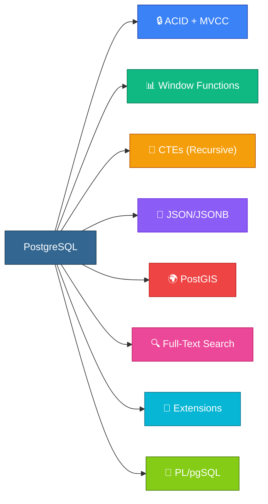
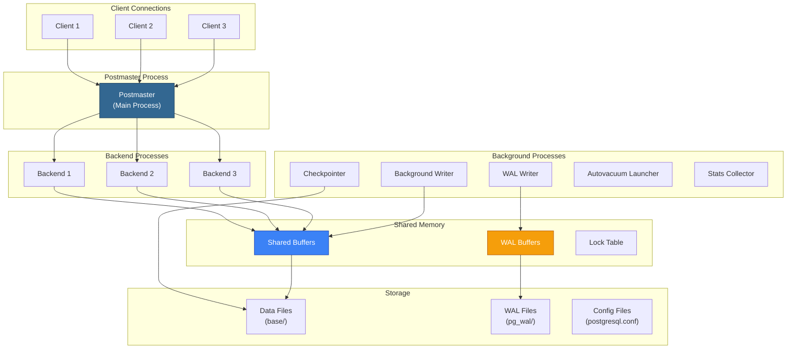
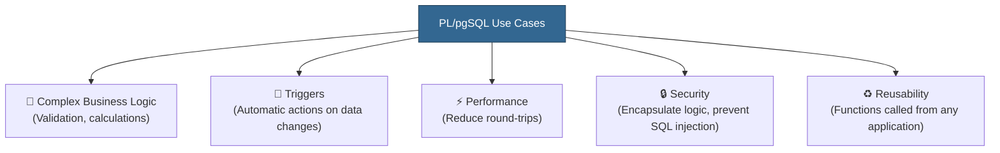
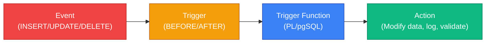
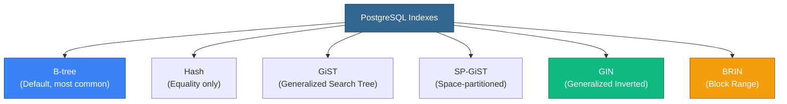
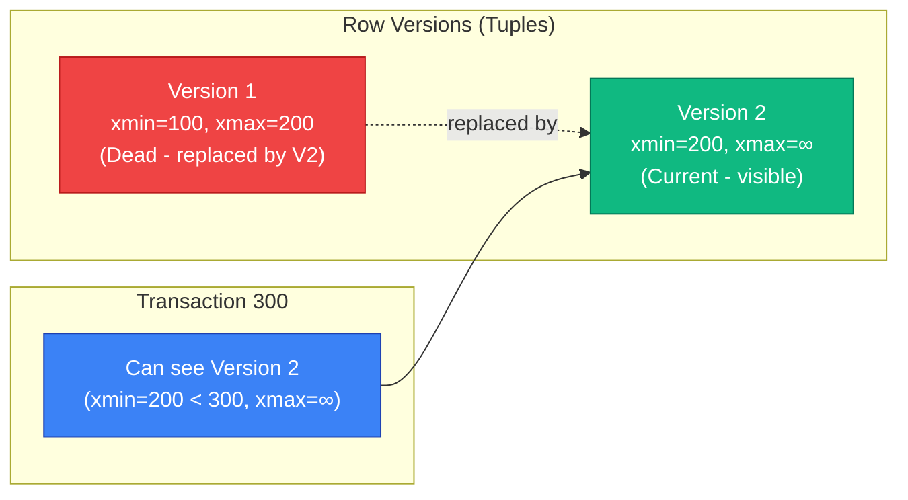

# 🐘 Module 03 — PostgreSQL & PL/pgSQL

<p align="center">
  
  
  
</p>

---

## 📌 Table of Contents

- [Why PostgreSQL?](#-why-postgresql)
- [1. PostgreSQL Architecture](#1-postgresql-architecture)
- [2. Data Types in PostgreSQL](#2-data-types-in-postgresql)
- [3. PostgreSQL-Specific SQL Features](#3-postgresql-specific-sql-features)
- [4. PL/pgSQL — Introduction](#4-plpgsql--introduction)
- [5. Variables and Data Types in PL/pgSQL](#5-variables-and-data-types-in-plpgsql)
- [6. Control Flow](#6-control-flow)
- [7. Functions](#7-functions)
- [8. Cursors](#8-cursors)
- [9. Triggers](#9-triggers)
- [10. Error Handling](#10-error-handling)
- [11. PostgreSQL Indexing Deep Dive](#11-postgresql-indexing-deep-dive)
- [12. MVCC — Multi-Version Concurrency Control](#12-mvcc--multi-version-concurrency-control)
- [13. Performance Tuning](#13-performance-tuning)
- [14. Extensions and Advanced Features](#14-extensions-and-advanced-features)
- [Interview Questions](#-interview-questions)
- [Common Mistakes](#-common-mistakes)
- [FAQs](#-faqs)
- [Revision Notes](#-revision-notes)
- [Cheat Sheet](#-cheat-sheet)

---

## 🎯 Why PostgreSQL?

> *"PostgreSQL: The world's most advanced open source relational database."*

PostgreSQL (often called "Postgres") is not just a database — it's a **platform**. It's the database of choice for companies like Apple, Instagram, Spotify, Reddit, and NASA.

**Why PostgreSQL dominates interviews:**
- **Open source** — No licensing costs, massive community
- **Standards compliant** — Closest to SQL standard
- **Extensible** — Custom types, operators, index methods, languages
- **ACID compliant** — Full transaction support with MVCC
- **Rich feature set** — JSON, full-text search, geospatial, CTEs, window functions



### PostgreSQL vs Other RDBMS

| Feature | PostgreSQL | MySQL | Oracle | SQL Server |
|---------|-----------|-------|--------|------------|
| **License** | Open Source (PostgreSQL License) | Open Source (GPL) / Commercial | Commercial | Commercial |
| **MVCC** | Full | InnoDB only | Yes | Yes (row versioning) |
| **JSON Support** | JSONB (binary, indexed) | JSON (text-based) | JSON | JSON |
| **Full-Text Search** | Built-in (tsvector/tsquery) | Built-in (basic) | Oracle Text | Full-text index |
| **Geospatial** | PostGIS (best in class) | Basic geometry | Oracle Spatial | Spatial index |
| **Custom Types** | ✅ Full support | ❌ Limited | ✅ Object types | ❌ No |
| **Procedural Language** | PL/pgSQL, PL/Python, PL/Perl | Stored procedures | PL/SQL | T-SQL |
| **Partitioning** | Declarative (10+) | Range, List, Hash | Advanced | Table partitioning |
| **Replication** | Streaming + Logical | Built-in | Data Guard | Always On |

---

## 1. PostgreSQL Architecture

### Process Architecture



### Key Components

| Component | Purpose | Key Setting |
|-----------|---------|-------------|
| **Postmaster** | Main process — spawns backend processes for each connection | `listen_addresses`, `port` |
| **Backend Process** | One per client connection — executes queries | `max_connections` |
| **Shared Buffers** | Cache for data pages in memory | `shared_buffers` (25% of RAM) |
| **WAL (Write-Ahead Log)** | Transaction log for crash recovery | `wal_level`, `max_wal_size` |
| **Background Writer** | Flushes dirty buffers to disk periodically | `bgwriter_delay` |
| **Checkpointer** | Writes all dirty buffers and creates recovery point | `checkpoint_timeout` |
| **Autovacuum** | Reclaims dead tuples from MVCC | `autovacuum_vacuum_threshold` |
| **WAL Writer** | Flushes WAL buffers to WAL files | `wal_writer_delay` |

### Storage Layout

```
$PGDATA/
├── base/              # Database files (one subdirectory per database)
│   ├── 1/             # template1
│   ├── 13395/         # postgres
│   └── 16384/         # your_database
├── global/            # Cluster-wide tables (pg_database, pg_auth)
├── pg_wal/            # Write-ahead log segments
├── pg_xact/           # Transaction commit status (formerly pg_clog)
├── pg_tblspc/         # Tablespace symlinks
├── postgresql.conf    # Main configuration
├── pg_hba.conf        # Client authentication
└── pg_ident.conf      # User name mapping
```

---

## 2. Data Types in PostgreSQL

### Core Data Types

| Category | Type | Size | Range / Description |
|----------|------|------|---------------------|
| **Integer** | `SMALLINT` | 2 bytes | -32,768 to 32,767 |
| | `INTEGER` / `INT` | 4 bytes | -2.1B to 2.1B |
| | `BIGINT` | 8 bytes | -9.2 quintillion to 9.2 quintillion |
| | `SERIAL` | 4 bytes | Auto-incrementing integer |
| | `BIGSERIAL` | 8 bytes | Auto-incrementing big integer |
| **Decimal** | `NUMERIC(p,s)` | Variable | Exact precision (money, finance) |
| | `REAL` | 4 bytes | 6 decimal digits precision |
| | `DOUBLE PRECISION` | 8 bytes | 15 decimal digits precision |
| **Character** | `CHAR(n)` | Fixed | Fixed-length, padded |
| | `VARCHAR(n)` | Variable | Variable-length, max n |
| | `TEXT` | Variable | Unlimited length |
| **Boolean** | `BOOLEAN` | 1 byte | TRUE / FALSE / NULL |
| **Date/Time** | `DATE` | 4 bytes | Date only |
| | `TIME` | 8 bytes | Time only |
| | `TIMESTAMP` | 8 bytes | Date + Time |
| | `TIMESTAMPTZ` | 8 bytes | Date + Time + Timezone |
| | `INTERVAL` | 16 bytes | Time span |
| **UUID** | `UUID` | 16 bytes | Universally unique identifier |
| **JSON** | `JSON` | Variable | Text-based JSON |
| | `JSONB` | Variable | Binary JSON (indexed, faster) |
| **Array** | `type[]` | Variable | Array of any type |
| **Network** | `INET` | 7/19 bytes | IPv4/IPv6 address |
| | `CIDR` | 7/19 bytes | Network address |
| | `MACADDR` | 6 bytes | MAC address |

### PostgreSQL-Specific Types

```sql
-- UUID
CREATE TABLE users (
    id UUID DEFAULT gen_random_uuid() PRIMARY KEY,
    name TEXT NOT NULL
);

-- JSONB
CREATE TABLE products (
    id SERIAL PRIMARY KEY,
    name TEXT NOT NULL,
    attributes JSONB  -- {"color": "red", "size": "L", "weight_kg": 2.5}
);

-- Array
CREATE TABLE tags (
    post_id INT,
    tag_list TEXT[]  -- {'sql', 'postgres', 'interview'}
);

-- Range
CREATE TABLE bookings (
    room_id INT,
    booked_during TSTZRANGE,
    EXCLUDE USING gist (room_id WITH =, booked_during WITH &&)
);
```

---

## 3. PostgreSQL-Specific SQL Features

### JSONB Operations

```sql
-- Insert JSONB
INSERT INTO products (name, attributes) 
VALUES ('Laptop', '{"brand": "Dell", "ram_gb": 16, "tags": ["portable", "work"]}');

-- Access JSONB fields
SELECT 
    name,
    attributes->>'brand' AS brand,            -- Text extraction
    attributes->'ram_gb' AS ram,              -- JSON extraction
    attributes#>'{tags,0}' AS first_tag       -- Path extraction
FROM products;

-- Filter by JSONB content
SELECT * FROM products 
WHERE attributes @> '{"brand": "Dell"}';      -- Contains

-- JSONB indexing (GIN)
CREATE INDEX idx_products_attrs ON products USING GIN (attributes);

-- Update nested JSONB
UPDATE products 
SET attributes = jsonb_set(attributes, '{ram_gb}', '32')
WHERE name = 'Laptop';
```

### JSONB Operators

| Operator | Description | Example |
|----------|------------|---------|
| `->` | Get JSON element (returns JSON) | `data->'key'` |
| `->>` | Get JSON element (returns TEXT) | `data->>'key'` |
| `#>` | Get by path (returns JSON) | `data#>'{a,b}'` |
| `#>>` | Get by path (returns TEXT) | `data#>>'{a,b}'` |
| `@>` | Contains | `data @> '{"key": "val"}'` |
| `<@` | Contained by | `'{"key": "val"}' <@ data` |
| `?` | Key exists | `data ? 'key'` |
| `?&` | All keys exist | `data ?& array['a','b']` |
| `?\|` | Any key exists | `data ?\| array['a','b']` |
| `\|\|` | Concatenate | `data \|\| '{"new": true}'` |

### Array Operations

```sql
-- Create and query arrays
SELECT * FROM posts WHERE 'sql' = ANY(tag_list);           -- Contains element
SELECT * FROM posts WHERE tag_list @> ARRAY['sql', 'db'];  -- Contains all
SELECT * FROM posts WHERE tag_list && ARRAY['sql', 'db'];  -- Overlaps (any match)

-- Array functions
SELECT 
    array_length(tag_list, 1) AS tag_count,
    array_to_string(tag_list, ', ') AS tags_string,
    unnest(tag_list) AS individual_tags  -- Expand array to rows
FROM posts;
```

### UPSERT (INSERT ... ON CONFLICT)

```sql
-- Insert or update on conflict
INSERT INTO products (sku, name, price)
VALUES ('ABC-123', 'Widget', 29.99)
ON CONFLICT (sku) 
DO UPDATE SET 
    price = EXCLUDED.price,
    updated_at = NOW();

-- Insert or do nothing
INSERT INTO products (sku, name, price)
VALUES ('ABC-123', 'Widget', 29.99)
ON CONFLICT (sku) DO NOTHING;
```

### RETURNING Clause

```sql
-- Get the inserted/updated/deleted rows
INSERT INTO employees (name, salary, dept_id)
VALUES ('Eve', 92000, 1)
RETURNING emp_id, name;

-- Get deleted rows
DELETE FROM old_logs WHERE created_at < '2024-01-01'
RETURNING *;

-- Get updated rows
UPDATE employees SET salary = salary * 1.10
WHERE dept_id = 1
RETURNING name, salary AS new_salary;
```

### LATERAL JOIN

```sql
-- Get top 3 orders per customer (correlated subquery as JOIN)
SELECT c.name, o.order_id, o.total
FROM customers c
CROSS JOIN LATERAL (
    SELECT order_id, total
    FROM orders
    WHERE customer_id = c.customer_id
    ORDER BY total DESC
    LIMIT 3
) o;
```

### GENERATE_SERIES

```sql
-- Generate a series of numbers
SELECT generate_series(1, 10);

-- Generate dates
SELECT generate_series(
    '2024-01-01'::date,
    '2024-12-31'::date,
    '1 month'::interval
) AS month;

-- Find dates with no orders (gap analysis)
SELECT d::date AS missing_date
FROM generate_series('2024-01-01', '2024-12-31', '1 day'::interval) d
LEFT JOIN orders o ON o.order_date = d::date
WHERE o.order_id IS NULL;
```

---

## 4. PL/pgSQL — Introduction

### What Is PL/pgSQL?

**PL/pgSQL** (Procedural Language/PostgreSQL) is PostgreSQL's built-in procedural language. It extends SQL with variables, control flow, loops, and error handling — enabling you to write complex business logic directly in the database.

### Why Use PL/pgSQL?



| Scenario | Use PL/pgSQL? | Why |
|----------|--------------|-----|
| Simple CRUD | ❌ No | Plain SQL is sufficient |
| Complex validation | ✅ Yes | Multiple checks, conditional logic |
| Triggers | ✅ Yes | Only way to create trigger functions |
| Batch processing | ✅ Yes | Loop through records, accumulate results |
| Application logic | ⚠️ Maybe | Some prefer application-layer logic |

### Basic Structure

```sql
DO $$
DECLARE
    -- Variable declarations
    v_count INTEGER;
    v_name TEXT := 'Hello';
BEGIN
    -- Executable statements
    SELECT COUNT(*) INTO v_count FROM employees;
    RAISE NOTICE 'Employee count: %', v_count;
EXCEPTION
    WHEN OTHERS THEN
        RAISE NOTICE 'Error: %', SQLERRM;
END;
$$;
```

---

## 5. Variables and Data Types in PL/pgSQL

### Variable Declaration

```sql
DECLARE
    -- Basic types
    v_id        INTEGER := 0;
    v_name      VARCHAR(100);
    v_salary    NUMERIC(10,2) := 50000.00;
    v_is_active BOOLEAN := TRUE;
    v_hire_date DATE := CURRENT_DATE;
    
    -- Anchored types (match column type)
    v_emp_name  employees.name%TYPE;           -- Same type as employees.name
    v_emp_row   employees%ROWTYPE;             -- Entire row of employees
    
    -- Record type (dynamic row)
    v_record    RECORD;
    
    -- Constants
    c_tax_rate  CONSTANT NUMERIC := 0.30;
    
    -- Array
    v_tags      TEXT[] := ARRAY['sql', 'plpgsql'];
```

### %TYPE and %ROWTYPE

```sql
-- %TYPE — Inherit the type of a column
DECLARE
    v_salary employees.salary%TYPE;  -- If column type changes, variable changes too
BEGIN
    SELECT salary INTO v_salary FROM employees WHERE emp_id = 101;
    RAISE NOTICE 'Salary: %', v_salary;
END;

-- %ROWTYPE — Inherit the entire row structure
DECLARE
    v_emp employees%ROWTYPE;
BEGIN
    SELECT * INTO v_emp FROM employees WHERE emp_id = 101;
    RAISE NOTICE 'Name: %, Salary: %', v_emp.name, v_emp.salary;
END;
```

---

## 6. Control Flow

### IF-THEN-ELSE

```sql
DECLARE
    v_salary NUMERIC := 75000;
    v_grade TEXT;
BEGIN
    IF v_salary > 100000 THEN
        v_grade := 'Senior';
    ELSIF v_salary > 70000 THEN
        v_grade := 'Mid-Level';
    ELSIF v_salary > 40000 THEN
        v_grade := 'Junior';
    ELSE
        v_grade := 'Intern';
    END IF;
    
    RAISE NOTICE 'Grade: %', v_grade;
END;
```

### CASE

```sql
DECLARE
    v_dept_id INTEGER := 1;
    v_dept_name TEXT;
BEGIN
    v_dept_name := CASE v_dept_id
        WHEN 1 THEN 'Engineering'
        WHEN 2 THEN 'Marketing'
        WHEN 3 THEN 'Finance'
        ELSE 'Unknown'
    END;
    
    RAISE NOTICE 'Department: %', v_dept_name;
END;
```

### Loops

```sql
-- Simple loop
DECLARE
    v_counter INTEGER := 0;
BEGIN
    LOOP
        v_counter := v_counter + 1;
        EXIT WHEN v_counter >= 10;  -- Break condition
    END LOOP;
END;

-- WHILE loop
DECLARE
    v_counter INTEGER := 0;
BEGIN
    WHILE v_counter < 10 LOOP
        v_counter := v_counter + 1;
    END LOOP;
END;

-- FOR loop (numeric)
BEGIN
    FOR i IN 1..10 LOOP
        RAISE NOTICE 'Iteration: %', i;
    END LOOP;
    
    -- Reverse
    FOR i IN REVERSE 10..1 LOOP
        RAISE NOTICE 'Countdown: %', i;
    END LOOP;
END;

-- FOR loop (query result)
DECLARE
    v_emp RECORD;
BEGIN
    FOR v_emp IN SELECT name, salary FROM employees WHERE dept_id = 1 LOOP
        RAISE NOTICE 'Employee: % earns %', v_emp.name, v_emp.salary;
    END LOOP;
END;

-- FOREACH (array)
DECLARE
    v_tags TEXT[] := ARRAY['sql', 'plpgsql', 'postgres'];
    v_tag TEXT;
BEGIN
    FOREACH v_tag IN ARRAY v_tags LOOP
        RAISE NOTICE 'Tag: %', v_tag;
    END LOOP;
END;
```

---

## 7. Functions

### Creating Functions

```sql
-- Simple function: Calculate annual salary
CREATE OR REPLACE FUNCTION calc_annual_salary(monthly_salary NUMERIC)
RETURNS NUMERIC
LANGUAGE plpgsql
AS $$
BEGIN
    RETURN monthly_salary * 12;
END;
$$;

-- Usage
SELECT calc_annual_salary(8000);  -- Returns 96000
```

### Function with Table Query

```sql
-- Get employee count by department
CREATE OR REPLACE FUNCTION get_dept_headcount(p_dept_id INTEGER)
RETURNS INTEGER
LANGUAGE plpgsql
AS $$
DECLARE
    v_count INTEGER;
BEGIN
    SELECT COUNT(*) INTO v_count
    FROM employees
    WHERE dept_id = p_dept_id;
    
    RETURN v_count;
END;
$$;
```

### Function Returning a Table

```sql
-- Return a set of rows
CREATE OR REPLACE FUNCTION get_high_earners(min_salary NUMERIC)
RETURNS TABLE (
    emp_name TEXT,
    emp_salary NUMERIC,
    emp_dept TEXT
)
LANGUAGE plpgsql
AS $$
BEGIN
    RETURN QUERY
    SELECT e.name, e.salary, d.dept_name
    FROM employees e
    JOIN departments d ON e.dept_id = d.dept_id
    WHERE e.salary >= min_salary
    ORDER BY e.salary DESC;
END;
$$;

-- Usage
SELECT * FROM get_high_earners(80000);
```

### Function Volatility

| Volatility | Meaning | Example | Optimization |
|-----------|---------|---------|-------------|
| `VOLATILE` (default) | May return different results each call | `random()`, `now()` | No caching |
| `STABLE` | Same result within a single query | Current user, session settings | Can be optimized in queries |
| `IMMUTABLE` | Same result forever for same inputs | `abs()`, `lower()` | Can be used in indexes |

```sql
CREATE FUNCTION calc_tax(amount NUMERIC)
RETURNS NUMERIC
LANGUAGE plpgsql
IMMUTABLE  -- Same input always gives same output
AS $$
BEGIN
    RETURN amount * 0.18;
END;
$$;
```

### Procedures (PostgreSQL 11+)

```sql
-- Procedures can manage transactions (COMMIT/ROLLBACK)
CREATE OR REPLACE PROCEDURE transfer_funds(
    p_from_id INTEGER,
    p_to_id INTEGER,
    p_amount NUMERIC
)
LANGUAGE plpgsql
AS $$
BEGIN
    -- Debit
    UPDATE accounts SET balance = balance - p_amount WHERE id = p_from_id;
    
    -- Credit
    UPDATE accounts SET balance = balance + p_amount WHERE id = p_to_id;
    
    COMMIT;
END;
$$;

-- Usage
CALL transfer_funds(1, 2, 500.00);
```

### Function vs Procedure

| Feature | Function | Procedure |
|---------|----------|-----------|
| **Returns value** | ✅ Yes (mandatory) | ❌ No (OUT params only) |
| **Called with** | `SELECT func()` | `CALL proc()` |
| **Transaction control** | ❌ Cannot COMMIT/ROLLBACK | ✅ Can COMMIT/ROLLBACK |
| **Used in SQL** | ✅ Yes (in SELECT, WHERE) | ❌ No |
| **Available since** | Always | PostgreSQL 11+ |

---

## 8. Cursors

### What Is a Cursor?

A **cursor** provides row-by-row processing of query results, as opposed to set-based processing. Use cursors when you need to process rows individually (though set-based operations are generally preferred).

```sql
DECLARE
    v_cursor CURSOR FOR 
        SELECT emp_id, name, salary FROM employees WHERE dept_id = 1;
    v_emp RECORD;
BEGIN
    OPEN v_cursor;
    
    LOOP
        FETCH v_cursor INTO v_emp;
        EXIT WHEN NOT FOUND;
        
        -- Process each row
        IF v_emp.salary < 50000 THEN
            UPDATE employees SET salary = salary * 1.10 WHERE emp_id = v_emp.emp_id;
            RAISE NOTICE 'Raised salary for %', v_emp.name;
        END IF;
    END LOOP;
    
    CLOSE v_cursor;
END;
```

### Cursor vs FOR Loop

| Feature | Explicit Cursor | FOR Loop |
|---------|----------------|----------|
| **Code verbosity** | More code (OPEN/FETCH/CLOSE) | Less code (automatic) |
| **Control** | Full control (FETCH direction, position) | Forward-only |
| **Memory** | Row-by-row (low memory) | Row-by-row (same) |
| **Use case** | Complex cursor operations | Simple row iteration |

> **Best Practice**: Prefer `FOR rec IN query LOOP` for simplicity. Use explicit cursors only when you need scroll cursors or dynamic control.

---

## 9. Triggers

### What Is a Trigger?

A **trigger** automatically executes a function when a specified event occurs on a table (INSERT, UPDATE, DELETE, TRUNCATE).

### Trigger Architecture



### Trigger Timing

| Timing | When It Fires | Can Modify Data? | Use Case |
|--------|--------------|-----------------|----------|
| `BEFORE` | Before the operation | ✅ Yes (via NEW) | Validation, data transformation |
| `AFTER` | After the operation | ❌ No (data committed) | Logging, auditing, cascading |
| `INSTEAD OF` | Replaces the operation | ✅ Yes | Updatable views |

### Creating Triggers

```sql
-- Step 1: Create the trigger function (must return TRIGGER)
CREATE OR REPLACE FUNCTION trg_update_timestamp()
RETURNS TRIGGER
LANGUAGE plpgsql
AS $$
BEGIN
    NEW.updated_at := NOW();
    RETURN NEW;  -- BEFORE trigger must return NEW (or NULL to cancel)
END;
$$;

-- Step 2: Attach the trigger to a table
CREATE TRIGGER employees_update_timestamp
    BEFORE UPDATE ON employees
    FOR EACH ROW
    EXECUTE FUNCTION trg_update_timestamp();
```

### Audit Trail Trigger

```sql
-- Audit table
CREATE TABLE audit_log (
    id SERIAL PRIMARY KEY,
    table_name TEXT,
    operation TEXT,
    old_data JSONB,
    new_data JSONB,
    changed_by TEXT DEFAULT current_user,
    changed_at TIMESTAMPTZ DEFAULT NOW()
);

-- Generic audit trigger function
CREATE OR REPLACE FUNCTION trg_audit_log()
RETURNS TRIGGER
LANGUAGE plpgsql
AS $$
BEGIN
    IF TG_OP = 'INSERT' THEN
        INSERT INTO audit_log (table_name, operation, new_data)
        VALUES (TG_TABLE_NAME, 'INSERT', to_jsonb(NEW));
        RETURN NEW;
    ELSIF TG_OP = 'UPDATE' THEN
        INSERT INTO audit_log (table_name, operation, old_data, new_data)
        VALUES (TG_TABLE_NAME, 'UPDATE', to_jsonb(OLD), to_jsonb(NEW));
        RETURN NEW;
    ELSIF TG_OP = 'DELETE' THEN
        INSERT INTO audit_log (table_name, operation, old_data)
        VALUES (TG_TABLE_NAME, 'DELETE', to_jsonb(OLD));
        RETURN OLD;
    END IF;
END;
$$;

-- Attach to tables
CREATE TRIGGER employees_audit
    AFTER INSERT OR UPDATE OR DELETE ON employees
    FOR EACH ROW EXECUTE FUNCTION trg_audit_log();
```

### Special Trigger Variables

| Variable | Description |
|----------|------------|
| `NEW` | New row (INSERT/UPDATE) |
| `OLD` | Old row (UPDATE/DELETE) |
| `TG_OP` | Operation: 'INSERT', 'UPDATE', 'DELETE', 'TRUNCATE' |
| `TG_TABLE_NAME` | Name of the table that fired the trigger |
| `TG_WHEN` | 'BEFORE', 'AFTER', or 'INSTEAD OF' |
| `TG_LEVEL` | 'ROW' or 'STATEMENT' |

---

## 10. Error Handling

### EXCEPTION Block

```sql
DECLARE
    v_result NUMERIC;
BEGIN
    -- Try to divide
    v_result := 100 / 0;  -- Will cause division by zero
    
EXCEPTION
    WHEN division_by_zero THEN
        RAISE NOTICE 'Cannot divide by zero!';
        v_result := 0;
    
    WHEN no_data_found THEN
        RAISE NOTICE 'No data found!';
    
    WHEN unique_violation THEN
        RAISE NOTICE 'Duplicate key!';
    
    WHEN OTHERS THEN
        RAISE NOTICE 'Unexpected error: % - %', SQLSTATE, SQLERRM;
        RAISE;  -- Re-raise the exception
END;
```

### Common Error Codes

| Error Code | Name | Cause |
|-----------|------|-------|
| `23505` | `unique_violation` | Duplicate value in unique column |
| `23503` | `foreign_key_violation` | FK reference doesn't exist |
| `23502` | `not_null_violation` | NULL in NOT NULL column |
| `22012` | `division_by_zero` | Division by zero |
| `P0002` | `no_data_found` | Query returned no rows (with STRICT) |
| `42P01` | `undefined_table` | Table doesn't exist |

### Custom Exceptions

```sql
CREATE OR REPLACE FUNCTION withdraw(p_account_id INT, p_amount NUMERIC)
RETURNS VOID
LANGUAGE plpgsql
AS $$
DECLARE
    v_balance NUMERIC;
BEGIN
    SELECT balance INTO v_balance FROM accounts WHERE id = p_account_id;
    
    IF v_balance < p_amount THEN
        RAISE EXCEPTION 'Insufficient funds: balance=%, requested=%', 
            v_balance, p_amount
            USING ERRCODE = 'P0001';  -- Custom error code
    END IF;
    
    UPDATE accounts SET balance = balance - p_amount WHERE id = p_account_id;
END;
$$;
```

---

## 11. PostgreSQL Indexing Deep Dive

### Index Types



| Index Type | Best For | Operators | Example |
|-----------|----------|-----------|---------|
| **B-tree** | Equality, range, sorting | `=`, `<`, `>`, `BETWEEN`, `IN`, `LIKE 'prefix%'` | Most columns |
| **Hash** | Equality only | `=` | Session IDs, exact lookups |
| **GiST** | Geometric, range, full-text | `&&`, `@>`, `<@`, `<<`, `>>` | PostGIS, range types |
| **SP-GiST** | Non-balanced structures | `<<`, `>>`, `@>`, `<@` | Points, phone numbers |
| **GIN** | Multi-valued elements | `@>`, `<@`, `?`, `?&`, `?\|` | JSONB, arrays, full-text |
| **BRIN** | Physically sorted data | `=`, `<`, `>` | Time-series (created_at) |

### Index Strategies

```sql
-- Partial index (only index a subset of rows)
CREATE INDEX idx_active_users ON users (email)
WHERE is_active = TRUE;

-- Expression index
CREATE INDEX idx_lower_email ON users (LOWER(email));

-- Covering index (INCLUDE for index-only scans)
CREATE INDEX idx_emp_dept ON employees (dept_id) INCLUDE (name, salary);

-- Concurrent index creation (no locking)
CREATE INDEX CONCURRENTLY idx_orders_date ON orders (order_date);

-- Multi-column index
CREATE INDEX idx_emp_dept_salary ON employees (dept_id, salary DESC);
```

---

## 12. MVCC — Multi-Version Concurrency Control

### How MVCC Works

PostgreSQL uses **MVCC** to handle concurrent transactions without locking reads. Every row has hidden system columns:



| System Column | Meaning |
|--------------|---------|
| `xmin` | Transaction ID that created this row version |
| `xmax` | Transaction ID that deleted/replaced this version (0 if current) |
| `ctid` | Physical location of the row (page, offset) |

### Why VACUUM Is Essential

Because MVCC keeps old row versions, dead tuples accumulate. **VACUUM** reclaims this space.

| Command | What It Does |
|---------|-------------|
| `VACUUM` | Marks dead tuples as reusable (doesn't return space to OS) |
| `VACUUM FULL` | Rewrites entire table (returns space to OS, locks table) |
| `VACUUM ANALYZE` | Vacuum + update query planner statistics |
| `AUTOVACUUM` | Background process that vacuums automatically |

```sql
-- Manual vacuum
VACUUM employees;
VACUUM ANALYZE employees;

-- Check dead tuples
SELECT relname, n_dead_tup, n_live_tup, last_vacuum, last_autovacuum
FROM pg_stat_user_tables
WHERE relname = 'employees';
```

---

## 13. Performance Tuning

### EXPLAIN and EXPLAIN ANALYZE

```sql
-- Show query plan (estimated costs)
EXPLAIN SELECT * FROM employees WHERE dept_id = 1;

-- Show actual execution (runs the query!)
EXPLAIN ANALYZE SELECT * FROM employees WHERE dept_id = 1;

-- Full details
EXPLAIN (ANALYZE, BUFFERS, FORMAT TEXT) 
SELECT * FROM employees WHERE dept_id = 1;
```

### Reading an Execution Plan

```
Seq Scan on employees  (cost=0.00..1.05 rows=2 width=64) (actual time=0.015..0.020 rows=2 loops=1)
  Filter: (dept_id = 1)
  Rows Removed by Filter: 3
Planning Time: 0.080 ms
Execution Time: 0.040 ms
```

| Field | Meaning |
|-------|---------|
| `Seq Scan` | Full table scan (no index used) |
| `cost=0.00..1.05` | Estimated startup..total cost (arbitrary units) |
| `rows=2` | Estimated number of rows |
| `actual time` | Real execution time in ms |
| `Rows Removed by Filter` | Rows that didn't match WHERE |

### Common Scan Types

| Scan Type | When Used | Performance |
|-----------|-----------|-------------|
| **Seq Scan** | No useful index, or table is small | O(n) |
| **Index Scan** | Good index exists, few rows expected | O(log n) |
| **Index Only Scan** | All needed columns are in the index | Fastest |
| **Bitmap Index Scan** | Multiple conditions, moderate selectivity | Between Seq and Index |
| **Parallel Seq Scan** | Large table, multiple CPU cores | Faster than Seq Scan |

### Key Configuration Parameters

| Parameter | Default | Recommended | Purpose |
|-----------|---------|-------------|---------|
| `shared_buffers` | 128MB | 25% of RAM | Data cache |
| `effective_cache_size` | 4GB | 75% of RAM | Query planner hint |
| `work_mem` | 4MB | 256MB–1GB | Per-sort/hash memory |
| `maintenance_work_mem` | 64MB | 1–2GB | VACUUM, CREATE INDEX |
| `max_connections` | 100 | Based on need | Connection limit |
| `random_page_cost` | 4.0 | 1.1 (SSD) | Planner cost for random I/O |

---

## 14. Extensions and Advanced Features

### Popular Extensions

| Extension | Purpose | Example |
|-----------|---------|---------|
| **pg_stat_statements** | Track query performance | Find slow queries |
| **PostGIS** | Geospatial queries | Find nearest restaurants |
| **pg_trgm** | Trigram-based text similarity | Fuzzy search |
| **uuid-ossp** | UUID generation | `uuid_generate_v4()` |
| **pgcrypto** | Encryption | Password hashing |
| **tablefunc** | Cross-tab queries | Pivot tables |
| **pg_partman** | Partition management | Automated partition creation |

```sql
-- Install an extension
CREATE EXTENSION IF NOT EXISTS pg_stat_statements;
CREATE EXTENSION IF NOT EXISTS "uuid-ossp";

-- Full-text search
SELECT * FROM products
WHERE to_tsvector('english', description) @@ to_tsquery('english', 'wireless & bluetooth');

-- Fuzzy search with pg_trgm
CREATE EXTENSION IF NOT EXISTS pg_trgm;
SELECT name, similarity(name, 'Postgre') AS sim
FROM products
WHERE name % 'Postgre'  -- Trigram similarity
ORDER BY sim DESC;
```

### Table Partitioning

```sql
-- Declarative partitioning (PostgreSQL 10+)
CREATE TABLE orders (
    order_id    SERIAL,
    order_date  DATE NOT NULL,
    customer_id INT,
    total       NUMERIC(10,2)
) PARTITION BY RANGE (order_date);

-- Create partitions
CREATE TABLE orders_2024_q1 PARTITION OF orders
    FOR VALUES FROM ('2024-01-01') TO ('2024-04-01');

CREATE TABLE orders_2024_q2 PARTITION OF orders
    FOR VALUES FROM ('2024-04-01') TO ('2024-07-01');

-- PostgreSQL automatically routes INSERTs to the correct partition
INSERT INTO orders (order_date, customer_id, total) 
VALUES ('2024-02-15', 1, 100.00);  -- Goes to orders_2024_q1
```

---

## ❓ Interview Questions

### 🟢 Beginner

1. **What is PL/pgSQL? How is it different from plain SQL?**
   > PL/pgSQL is PostgreSQL's procedural language that adds variables, control flow (IF/LOOP), error handling, and custom functions to SQL. SQL is declarative (says what); PL/pgSQL is procedural (says how).

2. **What is the difference between a function and a procedure in PostgreSQL?**
   > Functions return values and can be used in SELECT. Procedures (PG 11+) don't return values but CAN manage transactions (COMMIT/ROLLBACK). Functions cannot control transactions.

3. **What is JSONB and how is it different from JSON?**
   > JSON stores text as-is (preserves whitespace, key order). JSONB stores in binary (parsed, no whitespace, no key order, no duplicate keys). JSONB is faster for queries and supports indexing (GIN).

4. **What is a trigger? Give a use case.**
   > A trigger is a function that auto-executes on INSERT/UPDATE/DELETE. Use case: automatically set `updated_at` timestamp on every UPDATE.

5. **What does RETURNING do in PostgreSQL?**
   > RETURNING outputs the affected rows from INSERT/UPDATE/DELETE, avoiding a separate SELECT query. Example: `INSERT INTO ... RETURNING id;`

6. **What is SERIAL vs BIGSERIAL?**
   > SERIAL creates an auto-incrementing INTEGER (4 bytes, max ~2.1B). BIGSERIAL creates a BIGINT (8 bytes, max ~9.2 quintillion). Use BIGSERIAL for tables expecting very large datasets.

7. **How do you handle errors in PL/pgSQL?**
   > Using EXCEPTION blocks in BEGIN...END. You can catch specific errors (`WHEN unique_violation THEN`) or all errors (`WHEN OTHERS THEN`).

8. **What is %TYPE and %ROWTYPE?**
   > `%TYPE` copies the data type of a single column. `%ROWTYPE` copies the structure of an entire row. Both prevent type mismatches if the table schema changes.

9. **How do you create an index in PostgreSQL?**
   > `CREATE INDEX idx_name ON table(column);`. Use `CREATE INDEX CONCURRENTLY` to avoid locking the table during creation.

10. **What is the difference between TEXT and VARCHAR in PostgreSQL?**
    > Functionally identical in PostgreSQL. TEXT has no length limit. VARCHAR(n) has a maximum length of n. PostgreSQL treats them the same internally — use TEXT unless you need a length constraint.

### 🟡 Intermediate

11. **Explain MVCC in PostgreSQL. Why is it important?**
    > MVCC keeps multiple versions of each row. Readers don't block writers, writers don't block readers. Each transaction sees a snapshot of data. Dead tuples are cleaned by VACUUM. This enables high concurrency without read locks.

12. **What is VACUUM? Why is it necessary?**
    > MVCC creates dead tuples on UPDATE/DELETE. VACUUM marks them reusable. Without VACUUM, tables bloat indefinitely. AUTOVACUUM handles this automatically but can be tuned.

13. **Explain the difference between VOLATILE, STABLE, and IMMUTABLE functions.**
    > VOLATILE: may return different results each call. STABLE: same result within one query. IMMUTABLE: same result forever for same inputs. The planner uses this for optimization — IMMUTABLE functions can be used in indexes.

14. **What is a LATERAL JOIN? When would you use it?**
    > LATERAL allows a subquery in FROM to reference columns from preceding FROM items (like a correlated subquery as a table). Use for "top N per group" or row-by-row calculations.

15. **How does PostgreSQL handle UPSERT?**
    > Using `INSERT ... ON CONFLICT (column) DO UPDATE SET ...`. This atomically inserts or updates based on a unique constraint. Use `DO NOTHING` to skip duplicates silently.

16. **What are the different index types in PostgreSQL? When would you use each?**
    > B-tree (default, most queries), Hash (equality only), GIN (arrays, JSONB, full-text), GiST (geometry, ranges), BRIN (time-series, physically ordered data), SP-GiST (non-balanced trees).

17. **What is a partial index? Give an example.**
    > An index on a subset of rows: `CREATE INDEX idx_active ON users(email) WHERE is_active = TRUE;`. Smaller, faster, and more cache-friendly than a full index.

18. **How do you read an EXPLAIN ANALYZE output?**
    > Read bottom-up (innermost node first). Key metrics: actual time, rows, loops. Compare estimated vs actual rows. Look for Seq Scans on large tables, high cost nodes, and Rows Removed by Filter.

19. **What is a covering index (INCLUDE)?**
    > A B-tree index with extra columns that aren't part of the search key: `CREATE INDEX idx ON emp(dept_id) INCLUDE (name);`. Enables index-only scans without accessing the heap.

20. **Explain table partitioning in PostgreSQL. When would you use it?**
    > Splitting a large table into smaller physical tables by range, list, or hash. Use for: tables with millions of rows, time-series data (partition by month/year), or when you regularly delete old data.

### 🔴 Advanced

21. **How does PostgreSQL's WAL (Write-Ahead Log) work?**
    > Every change is first written to WAL before being applied to data files. On crash, PostgreSQL replays WAL to restore the last committed state. WAL enables: crash recovery, replication, and point-in-time recovery.

22. **What is the difference between streaming replication and logical replication?**
    > Streaming: byte-level WAL replication (exact copy, same version). Logical: row-level change replication (selective, cross-version). Use streaming for HA/failover, logical for selective data sync.

23. **How would you diagnose and fix a slow query in PostgreSQL?**
    > 1) `EXPLAIN ANALYZE` to get the plan. 2) Check for Seq Scans on large tables → add indexes. 3) Check for bad row estimates → `ANALYZE` the table. 4) Check `work_mem` for hash/sort spills. 5) Use `pg_stat_statements` for historical analysis.

24. **What are advisory locks? How do they differ from regular locks?**
    > Advisory locks are application-level locks using `pg_advisory_lock(id)`. Unlike regular locks, the database doesn't enforce them automatically — the application must check them explicitly. Use for: rate limiting, preventing concurrent batch jobs.

25. **How does autovacuum work internally? How would you tune it?**
    > Autovacuum triggers when `dead_tuples > threshold + scale_factor * live_tuples`. Key tuning: reduce `autovacuum_vacuum_scale_factor` for large tables (default 0.2 = 20% dead), increase `autovacuum_vacuum_cost_limit` for faster vacuuming.

26. **What is HOT (Heap-Only Tuple) updates? Why are they important?**
    > HOT updates avoid creating a new index entry when the updated column is NOT part of any index. The new tuple is stored on the same page and chained to the old one. This dramatically reduces index bloat for frequently updated tables.

27. **Explain connection pooling. Why is it critical for PostgreSQL?**
    > PostgreSQL forks a new OS process per connection (~10MB each). With 1000 connections, that's 10GB of RAM just for processes. Connection poolers (PgBouncer, Pgpool) maintain a pool of reusable connections, reducing overhead to a fraction.

28. **How would you implement soft deletes with PostgreSQL and still maintain performance?**
    > Add `deleted_at TIMESTAMPTZ`. Create a partial index: `CREATE INDEX idx ON table(columns) WHERE deleted_at IS NULL;`. All queries add `WHERE deleted_at IS NULL`. Use a view to hide the filter. Old rows cleaned by periodic archival.

29. **What is the difference between pg_stat_statements and auto_explain?**
    > `pg_stat_statements` aggregates query statistics (total time, calls, rows) across all executions. `auto_explain` logs the actual execution plan of slow queries. Use both: pg_stat_statements to find slow queries, auto_explain to understand why.

30. **How would you migrate a production PostgreSQL database with zero downtime?**
    > 1) Set up logical replication to the new database. 2) Let replication catch up. 3) Pause writes briefly. 4) Verify replication is synced. 5) Switch application connections. 6) Resume writes. Alternative: use `pglogical` or `pg_dump` with `--parallel` for large databases.

---

## ⚠️ Common Mistakes

| # | Mistake | Why It's Wrong | Correct Approach |
|---|---------|---------------|-----------------|
| 1 | Not using CONCURRENTLY for index creation | Locks the table for the entire build | `CREATE INDEX CONCURRENTLY` |
| 2 | Ignoring autovacuum settings | Table bloat, slow queries | Tune per-table autovacuum settings |
| 3 | Using `SELECT *` in triggers | Breaks if table schema changes | Use specific columns or `NEW.column` |
| 4 | Not using parameterized queries | SQL injection vulnerability | Use `$1, $2` or `EXECUTE ... USING` |
| 5 | Creating too many indexes | Slows INSERT/UPDATE/DELETE | Only index columns used in WHERE/JOIN/ORDER BY |
| 6 | Using VOLATILE for pure functions | Prevents optimization | Mark as IMMUTABLE or STABLE when appropriate |
| 7 | Not running ANALYZE after bulk loads | Planner uses stale statistics | Run `ANALYZE table_name;` after bulk operations |
| 8 | Using JSON instead of JSONB | Can't index, slower queries | Always use JSONB unless order/whitespace matter |
| 9 | Not setting `work_mem` for complex queries | Sort/hash operations spill to disk | Increase `work_mem` for sessions doing heavy analytics |
| 10 | Forgetting VACUUM FULL locks the table | Production downtime | Use `pg_repack` for online table rewriting |

---

## 💬 FAQs

**Q1: PostgreSQL or MySQL — which should I learn?**
> PostgreSQL if you want full SQL compliance, advanced features (JSONB, CTEs, window functions, extensions), and correctness. MySQL for simpler use cases with wide hosting support. For interviews, PostgreSQL knowledge impresses more.

**Q2: What is the difference between SERIAL and GENERATED ALWAYS AS IDENTITY?**
> SERIAL is a shorthand (creates a sequence + default). IDENTITY (SQL standard, PG 10+) is more explicit and prevents accidental manual value insertion with `GENERATED ALWAYS`. Prefer IDENTITY for new code.

**Q3: Should I put business logic in PL/pgSQL or in the application?**
> Use PL/pgSQL for data-intensive logic (complex validations, triggers, auditing). Keep business rules in the application for testability and portability. The best approach is a balance — critical data integrity in the DB, business workflows in the app.

**Q4: How many connections can PostgreSQL handle?**
> Default is 100. Each connection uses ~10MB of RAM. For more than a few hundred, use a connection pooler (PgBouncer). Don't set `max_connections` to 1000+ without a pooler.

**Q5: What is the difference between `ctid` and `oid` in PostgreSQL?**
> `ctid` is the physical location (page, offset) of a row — changes on UPDATE/VACUUM. `oid` (deprecated since PG 12) was a system-generated row identifier. Neither should be used as a permanent row identifier.

---

## 📝 Revision Notes

1. **PostgreSQL uses MVCC** — readers don't block writers, writers don't block readers
2. **VACUUM** reclaims dead tuples from MVCC; **AUTOVACUUM** runs automatically
3. **WAL** (Write-Ahead Log) ensures crash recovery and enables replication
4. **PL/pgSQL**: `DECLARE → BEGIN → EXCEPTION → END`
5. **%TYPE** = column type, **%ROWTYPE** = entire row structure
6. **Functions** return values (used in SELECT); **Procedures** (PG 11+) control transactions
7. **Triggers**: `BEFORE` can modify data (NEW), `AFTER` for logging/auditing
8. **JSONB** > JSON for queries (binary, indexed, faster)
9. **Index types**: B-tree (default), GIN (JSONB/arrays), GiST (geometry), BRIN (time-series)
10. **UPSERT**: `INSERT ... ON CONFLICT DO UPDATE`
11. **RETURNING** returns affected rows from INSERT/UPDATE/DELETE
12. **LATERAL JOIN** = correlated subquery in FROM clause
13. **Partial index**: index only rows matching WHERE condition
14. **Covering index**: `CREATE INDEX ... INCLUDE (extra_columns)` for index-only scans
15. **Connection pooling** (PgBouncer) is essential for > 100 connections

---

## 📋 Cheat Sheet

```
╔══════════════════════════════════════════════════════════════════╗
║                  POSTGRESQL & PL/pgSQL CHEAT SHEET              ║
╠══════════════════════════════════════════════════════════════════╣
║                                                                  ║
║  PL/pgSQL STRUCTURE:                                            ║
║  DO $$ DECLARE ... BEGIN ... EXCEPTION ... END; $$;             ║
║                                                                  ║
║  VARIABLES:                                                      ║
║  v_name TYPE [:= value];                                        ║
║  v_col  table.column%TYPE;     -- Column type                   ║
║  v_row  table%ROWTYPE;         -- Row type                      ║
║  v_rec  RECORD;                -- Dynamic row                   ║
║                                                                  ║
║  CONTROL FLOW:                                                   ║
║  IF ... THEN ... ELSIF ... ELSE ... END IF;                     ║
║  CASE ... WHEN ... THEN ... ELSE ... END CASE;                  ║
║  LOOP ... EXIT WHEN ... END LOOP;                               ║
║  WHILE ... LOOP ... END LOOP;                                   ║
║  FOR i IN 1..N LOOP ... END LOOP;                               ║
║  FOR rec IN query LOOP ... END LOOP;                            ║
║                                                                  ║
║  FUNCTIONS:                                                      ║
║  CREATE FUNCTION name(params) RETURNS type AS $$ ... $$;        ║
║  Volatility: VOLATILE | STABLE | IMMUTABLE                     ║
║                                                                  ║
║  TRIGGERS:                                                       ║
║  1. CREATE FUNCTION trg_fn() RETURNS TRIGGER AS $$ ... $$;      ║
║  2. CREATE TRIGGER name BEFORE|AFTER INSERT|UPDATE|DELETE       ║
║     ON table FOR EACH ROW EXECUTE FUNCTION trg_fn();            ║
║  Special vars: NEW, OLD, TG_OP, TG_TABLE_NAME                  ║
║                                                                  ║
║  JSONB OPERATORS:                                                ║
║  ->  get JSON   |  ->>  get TEXT   |  @>  contains              ║
║  #>  path JSON  |  #>>  path TEXT  |  ?   key exists            ║
║                                                                  ║
║  INDEX TYPES:                                                    ║
║  B-tree (default)  | Hash (equality)  | GIN (JSONB/array)       ║
║  GiST (geometry)   | BRIN (time-series)                         ║
║                                                                  ║
║  SPECIAL FEATURES:                                               ║
║  UPSERT:    INSERT ... ON CONFLICT DO UPDATE                    ║
║  RETURNING: INSERT/UPDATE/DELETE ... RETURNING columns          ║
║  LATERAL:   FROM a CROSS JOIN LATERAL (subquery using a.col)    ║
║  SERIES:    generate_series(start, stop, step)                  ║
║                                                                  ║
║  PERFORMANCE:                                                    ║
║  EXPLAIN ANALYZE query;                                         ║
║  shared_buffers = 25% RAM                                       ║
║  effective_cache_size = 75% RAM                                 ║
║  work_mem = 256MB+ for analytics                                ║
║                                                                  ║
║  MVCC:                                                           ║
║  xmin = creating txn | xmax = deleting txn | ctid = location    ║
║  VACUUM reclaims dead tuples | AUTOVACUUM runs automatically    ║
║                                                                  ║
╚══════════════════════════════════════════════════════════════════╝
```

---

<p align="center">
  <b>⬅️ <a href="../02_sql_fundamentals/README.md">Previous: SQL Fundamentals</a> · <a href="../04_oracle_plsql/README.md">Next: Oracle PL/SQL →</a></b>
</p>
