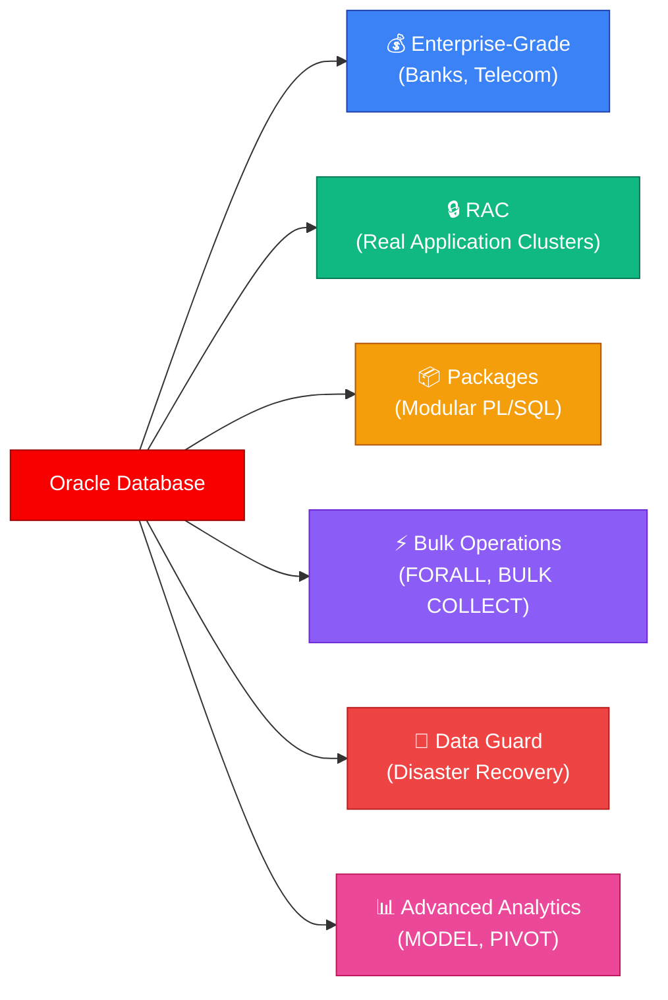
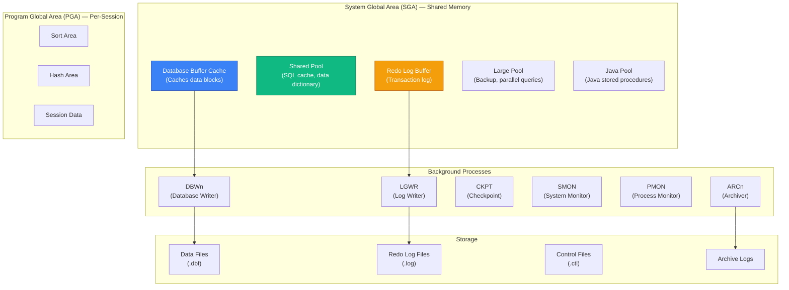
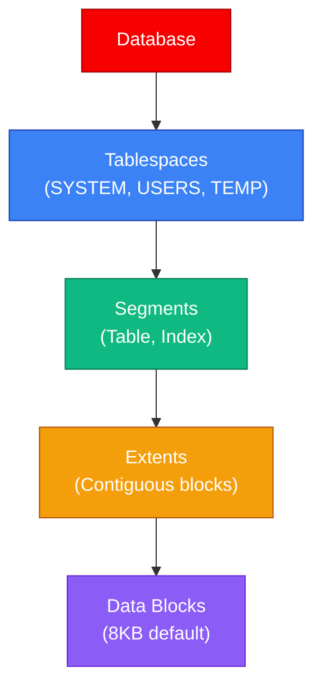
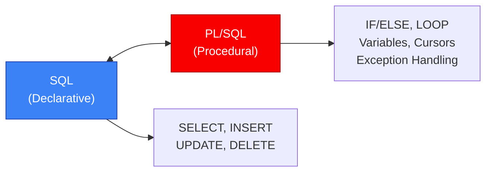
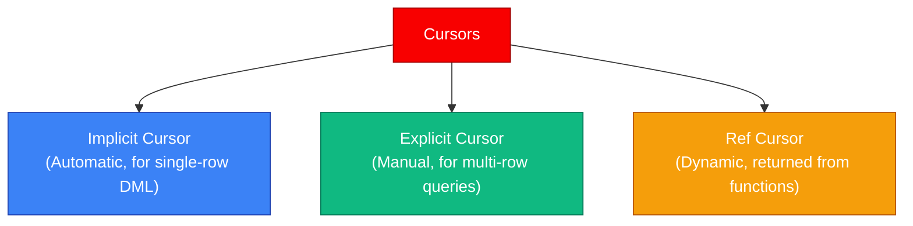
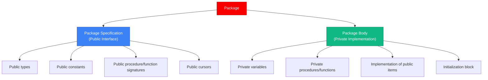
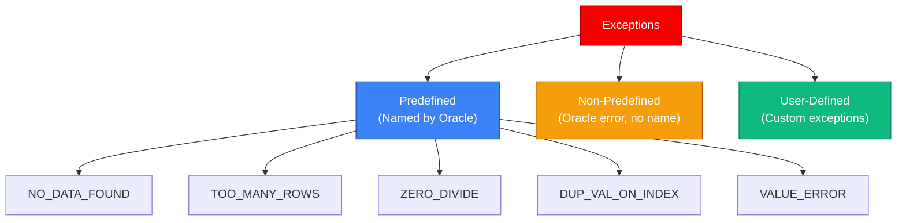
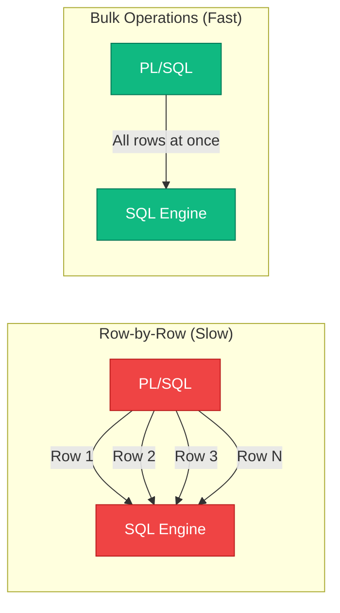

# 🔶 Module 04 — Oracle PL/SQL

<p align="center">
  
  
  
</p>

---

## 📌 Table of Contents

- [Why Oracle PL/SQL?](#-why-oracle-plsql)
- [1. Oracle Architecture Overview](#1-oracle-architecture-overview)
- [2. PL/SQL Fundamentals](#2-plsql-fundamentals)
- [3. Variables and Data Types](#3-variables-and-data-types)
- [4. Control Flow](#4-control-flow)
- [5. Cursors](#5-cursors)
- [6. Stored Procedures and Functions](#6-stored-procedures-and-functions)
- [7. Packages](#7-packages)
- [8. Triggers](#8-triggers)
- [9. Exception Handling](#9-exception-handling)
- [10. Collections and Bulk Operations](#10-collections-and-bulk-operations)
- [11. Dynamic SQL](#11-dynamic-sql)
- [12. Oracle-Specific SQL Features](#12-oracle-specific-sql-features)
- [13. Performance Tuning in Oracle](#13-performance-tuning-in-oracle)
- [14. Oracle vs PostgreSQL](#14-oracle-vs-postgresql)
- [Interview Questions](#-interview-questions)
- [Common Mistakes](#-common-mistakes)
- [FAQs](#-faqs)
- [Revision Notes](#-revision-notes)
- [Cheat Sheet](#-cheat-sheet)

---

## 🎯 Why Oracle PL/SQL?

> *"Oracle is the enterprise. If you work in banking, telecom, or government — you work with Oracle."*

Oracle Database holds **~30% of the global RDBMS market share** and dominates in Fortune 500 companies, banks, governments, and telecom companies. **PL/SQL** (Procedural Language/SQL) is Oracle's proprietary procedural extension to SQL.

**Why learn Oracle PL/SQL:**
- **Enterprise dominance** — Banking, ERP (SAP), telecom, healthcare
- **High-paying jobs** — Oracle DBAs and developers command premium salaries
- **Mature ecosystem** — 45+ years of development, battle-tested at scale
- **Interview frequency** — Commonly tested in enterprise company interviews



---

## 1. Oracle Architecture Overview

### Memory Architecture (SGA + PGA)



### Key Components

| Component | Purpose |
|-----------|---------|
| **SGA** | Shared memory for all sessions — caches data, SQL, redo logs |
| **PGA** | Private memory per session — sorting, hashing, session data |
| **DBWn** | Writes dirty buffers from SGA to data files |
| **LGWR** | Writes redo log buffer to redo log files (on COMMIT) |
| **SMON** | System recovery on startup, coalesces free space |
| **PMON** | Cleans up after failed processes, releases locks |
| **CKPT** | Signals DBWn to write, updates data file headers |
| **ARCn** | Archives filled redo logs for point-in-time recovery |

### Oracle Storage Hierarchy



---

## 2. PL/SQL Fundamentals

### PL/SQL Block Structure

Every PL/SQL program is made of **blocks**:

```sql
DECLARE
    -- Variable declarations (optional)
    v_name VARCHAR2(100) := 'Oracle';
BEGIN
    -- Executable statements (required)
    DBMS_OUTPUT.PUT_LINE('Hello, ' || v_name || '!');
EXCEPTION
    -- Error handlers (optional)
    WHEN OTHERS THEN
        DBMS_OUTPUT.PUT_LINE('Error: ' || SQLERRM);
END;
/
```

### Block Types

| Type | Description | Stored in DB? |
|------|------------|---------------|
| **Anonymous Block** | Unnamed, ad-hoc code | No |
| **Procedure** | Named block that performs an action | Yes |
| **Function** | Named block that returns a value | Yes |
| **Package** | Group of related procedures/functions | Yes |
| **Trigger** | Block that auto-executes on events | Yes |

### PL/SQL vs SQL



---

## 3. Variables and Data Types

### Variable Declaration

```sql
DECLARE
    -- Scalar types
    v_id          NUMBER(10);
    v_name        VARCHAR2(100) := 'Alice';
    v_salary      NUMBER(10,2) NOT NULL := 50000;
    v_hire_date   DATE := SYSDATE;
    v_is_active   BOOLEAN := TRUE;
    v_description CLOB;
    
    -- Anchored types
    v_emp_name    employees.first_name%TYPE;    -- Column type
    v_emp_row     employees%ROWTYPE;            -- Row type
    
    -- Constants
    c_tax_rate    CONSTANT NUMBER := 0.30;
    
    -- Bind variable
    v_dept        departments.department_name%TYPE;
BEGIN
    SELECT first_name INTO v_emp_name 
    FROM employees 
    WHERE employee_id = 101;
    
    DBMS_OUTPUT.PUT_LINE('Employee: ' || v_emp_name);
END;
/
```

### Oracle Data Types

| Type | Description | Size |
|------|------------|------|
| `NUMBER(p,s)` | Numeric (precision, scale) | Up to 38 digits |
| `VARCHAR2(n)` | Variable-length string | Max 32,767 (PL/SQL), 4,000 (SQL) |
| `CHAR(n)` | Fixed-length string | Max 2,000 |
| `DATE` | Date + Time (to seconds) | 7 bytes |
| `TIMESTAMP` | Date + Time (fractional seconds) | 11–13 bytes |
| `CLOB` | Character Large Object | Up to 4GB |
| `BLOB` | Binary Large Object | Up to 4GB |
| `BOOLEAN` | TRUE/FALSE/NULL | PL/SQL only (not in SQL!) |
| `PLS_INTEGER` | Integer (PL/SQL optimized) | Faster than NUMBER for integers |
| `BINARY_INTEGER` | Integer | Same as PLS_INTEGER |

> ⚠️ **Key Difference from PostgreSQL**: Oracle's `BOOLEAN` type exists only in PL/SQL — you **cannot** use it in table columns or SQL queries!

---

## 4. Control Flow

### IF-THEN-ELSIF-ELSE

```sql
DECLARE
    v_grade CHAR(1) := 'B';
    v_result VARCHAR2(20);
BEGIN
    IF v_grade = 'A' THEN
        v_result := 'Excellent';
    ELSIF v_grade = 'B' THEN
        v_result := 'Good';
    ELSIF v_grade = 'C' THEN
        v_result := 'Average';
    ELSE
        v_result := 'Below Average';
    END IF;
    
    DBMS_OUTPUT.PUT_LINE('Result: ' || v_result);
END;
/
```

### CASE Expression and Statement

```sql
-- CASE Expression (returns a value)
DECLARE
    v_dept_id NUMBER := 10;
    v_dept_name VARCHAR2(50);
BEGIN
    v_dept_name := CASE v_dept_id
        WHEN 10 THEN 'Administration'
        WHEN 20 THEN 'Marketing'
        WHEN 30 THEN 'Purchasing'
        ELSE 'Unknown'
    END;
END;
/

-- Searched CASE
DECLARE
    v_salary NUMBER := 75000;
    v_bracket VARCHAR2(20);
BEGIN
    v_bracket := CASE
        WHEN v_salary > 100000 THEN 'High'
        WHEN v_salary > 60000  THEN 'Medium'
        ELSE 'Low'
    END;
END;
/
```

### Loops

```sql
-- Basic LOOP
DECLARE
    v_counter NUMBER := 0;
BEGIN
    LOOP
        v_counter := v_counter + 1;
        EXIT WHEN v_counter >= 5;
    END LOOP;
END;
/

-- WHILE LOOP
DECLARE
    v_counter NUMBER := 0;
BEGIN
    WHILE v_counter < 5 LOOP
        v_counter := v_counter + 1;
        DBMS_OUTPUT.PUT_LINE('Count: ' || v_counter);
    END LOOP;
END;
/

-- FOR LOOP (numeric)
BEGIN
    FOR i IN 1..10 LOOP
        DBMS_OUTPUT.PUT_LINE('Iteration: ' || i);
    END LOOP;
    
    -- Reverse
    FOR i IN REVERSE 1..10 LOOP
        DBMS_OUTPUT.PUT_LINE('Countdown: ' || i);
    END LOOP;
END;
/

-- Cursor FOR LOOP (implicit cursor — recommended!)
BEGIN
    FOR emp_rec IN (SELECT first_name, salary FROM employees WHERE department_id = 10)
    LOOP
        DBMS_OUTPUT.PUT_LINE(emp_rec.first_name || ': ' || emp_rec.salary);
    END LOOP;
END;
/
```

### CONTINUE and GOTO

```sql
-- CONTINUE (Oracle 11g+)
BEGIN
    FOR i IN 1..10 LOOP
        CONTINUE WHEN MOD(i, 2) = 0;  -- Skip even numbers
        DBMS_OUTPUT.PUT_LINE('Odd: ' || i);
    END LOOP;
END;
/
```

---

## 5. Cursors

### Implicit vs Explicit Cursors



### Implicit Cursor Attributes

```sql
BEGIN
    UPDATE employees SET salary = salary * 1.10 WHERE department_id = 10;
    
    IF SQL%FOUND THEN
        DBMS_OUTPUT.PUT_LINE(SQL%ROWCOUNT || ' employees updated.');
    ELSE
        DBMS_OUTPUT.PUT_LINE('No employees found.');
    END IF;
END;
/
```

| Attribute | Description |
|-----------|------------|
| `SQL%FOUND` | TRUE if the last DML affected at least one row |
| `SQL%NOTFOUND` | TRUE if the last DML affected zero rows |
| `SQL%ROWCOUNT` | Number of rows affected |
| `SQL%ISOPEN` | Always FALSE for implicit cursors |

### Explicit Cursor

```sql
DECLARE
    CURSOR c_employees IS
        SELECT employee_id, first_name, salary
        FROM employees
        WHERE department_id = 10
        ORDER BY salary DESC;
    
    v_emp c_employees%ROWTYPE;
BEGIN
    OPEN c_employees;
    
    LOOP
        FETCH c_employees INTO v_emp;
        EXIT WHEN c_employees%NOTFOUND;
        
        DBMS_OUTPUT.PUT_LINE(v_emp.first_name || ': $' || v_emp.salary);
    END LOOP;
    
    CLOSE c_employees;
END;
/
```

### Parameterized Cursor

```sql
DECLARE
    CURSOR c_dept_emps(p_dept_id NUMBER) IS
        SELECT first_name, salary
        FROM employees
        WHERE department_id = p_dept_id;
BEGIN
    -- Use for different departments
    FOR emp IN c_dept_emps(10) LOOP
        DBMS_OUTPUT.PUT_LINE('Dept 10: ' || emp.first_name);
    END LOOP;
    
    FOR emp IN c_dept_emps(20) LOOP
        DBMS_OUTPUT.PUT_LINE('Dept 20: ' || emp.first_name);
    END LOOP;
END;
/
```

### Cursor FOR LOOP (Best Practice)

```sql
-- No need to OPEN/FETCH/CLOSE — Oracle does it automatically!
BEGIN
    FOR emp IN (
        SELECT first_name, salary 
        FROM employees 
        WHERE department_id = 10
    ) LOOP
        DBMS_OUTPUT.PUT_LINE(emp.first_name || ': $' || emp.salary);
    END LOOP;
END;
/
```

### REF CURSOR (Dynamic Cursor)

```sql
-- Strong REF CURSOR (typed)
DECLARE
    TYPE t_emp_cursor IS REF CURSOR RETURN employees%ROWTYPE;
    v_cursor t_emp_cursor;
    v_emp employees%ROWTYPE;
BEGIN
    OPEN v_cursor FOR SELECT * FROM employees WHERE department_id = 10;
    
    LOOP
        FETCH v_cursor INTO v_emp;
        EXIT WHEN v_cursor%NOTFOUND;
        DBMS_OUTPUT.PUT_LINE(v_emp.first_name);
    END LOOP;
    
    CLOSE v_cursor;
END;
/

-- Weak REF CURSOR (SYS_REFCURSOR — any query)
CREATE OR REPLACE FUNCTION get_employees(p_dept_id NUMBER)
RETURN SYS_REFCURSOR
IS
    v_cursor SYS_REFCURSOR;
BEGIN
    OPEN v_cursor FOR
        SELECT * FROM employees WHERE department_id = p_dept_id;
    RETURN v_cursor;
END;
/
```

---

## 6. Stored Procedures and Functions

### Procedure

```sql
CREATE OR REPLACE PROCEDURE raise_salary(
    p_emp_id   IN  NUMBER,
    p_percent  IN  NUMBER,
    p_new_sal  OUT NUMBER
)
IS
    v_current_salary NUMBER;
BEGIN
    SELECT salary INTO v_current_salary
    FROM employees
    WHERE employee_id = p_emp_id;
    
    p_new_sal := v_current_salary * (1 + p_percent / 100);
    
    UPDATE employees
    SET salary = p_new_sal
    WHERE employee_id = p_emp_id;
    
    COMMIT;
    
EXCEPTION
    WHEN NO_DATA_FOUND THEN
        RAISE_APPLICATION_ERROR(-20001, 'Employee not found: ' || p_emp_id);
END raise_salary;
/
```

### Function

```sql
CREATE OR REPLACE FUNCTION get_annual_salary(p_emp_id NUMBER)
RETURN NUMBER
IS
    v_salary NUMBER;
BEGIN
    SELECT salary * 12 INTO v_salary
    FROM employees
    WHERE employee_id = p_emp_id;
    
    RETURN v_salary;
    
EXCEPTION
    WHEN NO_DATA_FOUND THEN
        RETURN NULL;
END get_annual_salary;
/

-- Usage in SQL
SELECT first_name, get_annual_salary(employee_id) AS annual_sal
FROM employees
WHERE department_id = 10;
```

### Parameter Modes

| Mode | Direction | Can Read? | Can Write? | Default Behavior |
|------|-----------|-----------|-----------|-----------------|
| `IN` (default) | Caller → Procedure | ✅ Yes | ❌ No | Pass-by-reference (read-only) |
| `OUT` | Procedure → Caller | ❌ No (initially NULL) | ✅ Yes | Returns value to caller |
| `IN OUT` | Both directions | ✅ Yes | ✅ Yes | Pass-by-value (copy) |

### Procedure vs Function

| Feature | Procedure | Function |
|---------|-----------|----------|
| **Returns** | Via OUT params only | Via RETURN statement |
| **Called with** | `EXEC proc(args)` or `CALL proc(args)` | `SELECT func(args) FROM DUAL` |
| **Used in SQL** | ❌ No | ✅ Yes |
| **DML allowed?** | ✅ Yes | ✅ Yes (but not if used in SQL without PRAGMA) |
| **Transaction control** | ✅ Can COMMIT/ROLLBACK | ⚠️ Generally avoided |

---

## 7. Packages

### What Is a Package?

A **package** is a schema object that groups related PL/SQL types, variables, constants, cursors, procedures, and functions into a single unit. It's Oracle's way of organizing code — like a namespace or module in other languages.

### Package Architecture



### Package Specification

```sql
CREATE OR REPLACE PACKAGE emp_pkg
AS
    -- Public constant
    c_max_salary CONSTANT NUMBER := 500000;
    
    -- Public type
    TYPE t_emp_rec IS RECORD (
        emp_id   NUMBER,
        name     VARCHAR2(100),
        salary   NUMBER
    );
    
    -- Public procedures/functions
    PROCEDURE hire_employee(
        p_name     IN VARCHAR2,
        p_salary   IN NUMBER,
        p_dept_id  IN NUMBER
    );
    
    FUNCTION get_employee_count(p_dept_id NUMBER) RETURN NUMBER;
    
    PROCEDURE raise_salary(
        p_emp_id   IN NUMBER,
        p_percent  IN NUMBER
    );
END emp_pkg;
/
```

### Package Body

```sql
CREATE OR REPLACE PACKAGE BODY emp_pkg
AS
    -- Private variable (not accessible outside package)
    g_log_enabled BOOLEAN := TRUE;
    
    -- Private procedure
    PROCEDURE log_action(p_message VARCHAR2)
    IS
    BEGIN
        IF g_log_enabled THEN
            INSERT INTO audit_log (message, created_at)
            VALUES (p_message, SYSDATE);
        END IF;
    END log_action;
    
    -- Implementation of public procedure
    PROCEDURE hire_employee(
        p_name     IN VARCHAR2,
        p_salary   IN NUMBER,
        p_dept_id  IN NUMBER
    )
    IS
    BEGIN
        IF p_salary > c_max_salary THEN
            RAISE_APPLICATION_ERROR(-20002, 'Salary exceeds maximum');
        END IF;
        
        INSERT INTO employees (employee_id, first_name, salary, department_id)
        VALUES (employees_seq.NEXTVAL, p_name, p_salary, p_dept_id);
        
        log_action('Hired: ' || p_name);
        COMMIT;
    END hire_employee;
    
    -- Implementation of public function
    FUNCTION get_employee_count(p_dept_id NUMBER)
    RETURN NUMBER
    IS
        v_count NUMBER;
    BEGIN
        SELECT COUNT(*) INTO v_count
        FROM employees
        WHERE department_id = p_dept_id;
        
        RETURN v_count;
    END get_employee_count;
    
    PROCEDURE raise_salary(
        p_emp_id   IN NUMBER,
        p_percent  IN NUMBER
    )
    IS
    BEGIN
        UPDATE employees
        SET salary = salary * (1 + p_percent / 100)
        WHERE employee_id = p_emp_id;
        
        log_action('Salary raised for emp: ' || p_emp_id);
        COMMIT;
    END raise_salary;

-- Package initialization block (runs once per session)
BEGIN
    g_log_enabled := TRUE;
    DBMS_OUTPUT.PUT_LINE('emp_pkg initialized');
END emp_pkg;
/
```

### Using a Package

```sql
-- Call package procedures/functions
EXEC emp_pkg.hire_employee('John', 75000, 10);

SELECT emp_pkg.get_employee_count(10) FROM DUAL;

-- Access package constants
DECLARE
    v_max NUMBER := emp_pkg.c_max_salary;
BEGIN
    DBMS_OUTPUT.PUT_LINE('Max salary: ' || v_max);
END;
/
```

### Benefits of Packages

| Benefit | Description |
|---------|------------|
| **Encapsulation** | Hide implementation details in the body |
| **Modularity** | Group related code together |
| **Performance** | Entire package loaded into memory on first call |
| **Overloading** | Same procedure name with different parameters |
| **Session State** | Package variables persist for the session |
| **Dependency Management** | Changing the body doesn't invalidate dependent objects |

---

## 8. Triggers

### Oracle Trigger Types

| Type | Fires On | Level | Use Case |
|------|----------|-------|----------|
| **DML Trigger** | INSERT/UPDATE/DELETE | Row or Statement | Auditing, validation |
| **INSTEAD OF Trigger** | DML on views | Row | Updatable views |
| **DDL Trigger** | CREATE/ALTER/DROP | Schema/DB | Auditing schema changes |
| **System Trigger** | LOGON/LOGOFF/STARTUP/SHUTDOWN | Database | Session tracking |
| **Compound Trigger** | DML (multiple timing points) | Row + Statement | Avoiding mutating table errors |

### DML Trigger

```sql
-- Before trigger — validate and modify data
CREATE OR REPLACE TRIGGER trg_emp_salary_check
BEFORE INSERT OR UPDATE OF salary ON employees
FOR EACH ROW
BEGIN
    -- Prevent salary from exceeding max
    IF :NEW.salary > 500000 THEN
        RAISE_APPLICATION_ERROR(-20003, 'Salary cannot exceed 500,000');
    END IF;
    
    -- Auto-set modified date
    :NEW.last_modified := SYSDATE;
    :NEW.modified_by := USER;
END;
/
```

### Audit Trail Trigger

```sql
CREATE OR REPLACE TRIGGER trg_emp_audit
AFTER INSERT OR UPDATE OR DELETE ON employees
FOR EACH ROW
DECLARE
    v_action VARCHAR2(10);
BEGIN
    IF INSERTING THEN
        v_action := 'INSERT';
    ELSIF UPDATING THEN
        v_action := 'UPDATE';
    ELSIF DELETING THEN
        v_action := 'DELETE';
    END IF;
    
    INSERT INTO emp_audit_log (
        action, employee_id, old_salary, new_salary, changed_by, changed_at
    ) VALUES (
        v_action,
        NVL(:NEW.employee_id, :OLD.employee_id),
        :OLD.salary,
        :NEW.salary,
        USER,
        SYSDATE
    );
END;
/
```

### Compound Trigger (Oracle 11g+)

```sql
-- Solves the mutating table problem
CREATE OR REPLACE TRIGGER trg_emp_compound
FOR INSERT OR UPDATE ON employees
COMPOUND TRIGGER
    
    -- Package-level variables
    TYPE t_emp_ids IS TABLE OF NUMBER INDEX BY PLS_INTEGER;
    v_emp_ids t_emp_ids;
    v_idx PLS_INTEGER := 0;
    
    -- BEFORE STATEMENT
    BEFORE STATEMENT IS
    BEGIN
        v_idx := 0;
    END BEFORE STATEMENT;
    
    -- AFTER EACH ROW
    AFTER EACH ROW IS
    BEGIN
        v_idx := v_idx + 1;
        v_emp_ids(v_idx) := :NEW.employee_id;
    END AFTER EACH ROW;
    
    -- AFTER STATEMENT
    AFTER STATEMENT IS
    BEGIN
        FOR i IN 1..v_idx LOOP
            -- Safe to query employees table here (no mutating error)
            NULL; -- Your logic here
        END LOOP;
    END AFTER STATEMENT;
    
END trg_emp_compound;
/
```

### Trigger Predicates

| Predicate | Returns TRUE When |
|-----------|------------------|
| `INSERTING` | Trigger fired by INSERT |
| `UPDATING` | Trigger fired by UPDATE |
| `UPDATING('column')` | Specific column is being updated |
| `DELETING` | Trigger fired by DELETE |

---

## 9. Exception Handling

### Exception Types



### Predefined Exceptions

| Exception | ORA Error | Cause |
|-----------|----------|-------|
| `NO_DATA_FOUND` | ORA-01403 | SELECT INTO returned no rows |
| `TOO_MANY_ROWS` | ORA-01422 | SELECT INTO returned multiple rows |
| `ZERO_DIVIDE` | ORA-01476 | Division by zero |
| `DUP_VAL_ON_INDEX` | ORA-00001 | Unique constraint violation |
| `VALUE_ERROR` | ORA-06502 | Type conversion or size error |
| `INVALID_CURSOR` | ORA-01001 | Cursor operation on closed cursor |
| `CURSOR_ALREADY_OPEN` | ORA-06511 | OPEN on already-open cursor |
| `LOGIN_DENIED` | ORA-01017 | Invalid username/password |
| `TIMEOUT_ON_RESOURCE` | ORA-00051 | Timeout waiting for resource |

### Exception Handling Pattern

```sql
DECLARE
    v_name VARCHAR2(100);
    v_salary NUMBER;
    
    -- User-defined exception
    e_salary_too_high EXCEPTION;
    PRAGMA EXCEPTION_INIT(e_salary_too_high, -20001);
BEGIN
    SELECT first_name, salary INTO v_name, v_salary
    FROM employees
    WHERE employee_id = 999;
    
    IF v_salary > 500000 THEN
        RAISE e_salary_too_high;
    END IF;
    
EXCEPTION
    WHEN NO_DATA_FOUND THEN
        DBMS_OUTPUT.PUT_LINE('Employee not found');
    
    WHEN TOO_MANY_ROWS THEN
        DBMS_OUTPUT.PUT_LINE('Multiple employees found');
    
    WHEN e_salary_too_high THEN
        DBMS_OUTPUT.PUT_LINE('Salary exceeds limit');
    
    WHEN OTHERS THEN
        DBMS_OUTPUT.PUT_LINE('Error: ' || SQLCODE || ' - ' || SQLERRM);
        DBMS_OUTPUT.PUT_LINE('Backtrace: ' || DBMS_UTILITY.FORMAT_ERROR_BACKTRACE);
        RAISE;  -- Re-raise
END;
/
```

### RAISE_APPLICATION_ERROR

```sql
-- Custom error with specific error code (-20000 to -20999)
CREATE OR REPLACE PROCEDURE withdraw(p_account_id NUMBER, p_amount NUMBER)
IS
    v_balance NUMBER;
BEGIN
    SELECT balance INTO v_balance FROM accounts WHERE id = p_account_id;
    
    IF p_amount > v_balance THEN
        RAISE_APPLICATION_ERROR(-20100, 
            'Insufficient funds. Balance: ' || v_balance || 
            ', Requested: ' || p_amount);
    END IF;
    
    UPDATE accounts SET balance = balance - p_amount WHERE id = p_account_id;
    COMMIT;
END;
/
```

---

## 10. Collections and Bulk Operations

### Collection Types

| Type | Structure | Index Type | Sparse? | SQL Usable? |
|------|-----------|-----------|---------|-------------|
| **Associative Array** | Key-value pairs | PLS_INTEGER or VARCHAR2 | ✅ Yes | ❌ No |
| **Nested Table** | Ordered list | Integer (1-based) | ✅ Yes (after DELETE) | ✅ Yes |
| **VARRAY** | Fixed-size array | Integer (1-based) | ❌ No | ✅ Yes |

### Collection Examples

```sql
DECLARE
    -- Associative Array (INDEX BY table)
    TYPE t_name_table IS TABLE OF VARCHAR2(100) INDEX BY PLS_INTEGER;
    v_names t_name_table;
    
    -- Nested Table
    TYPE t_number_list IS TABLE OF NUMBER;
    v_ids t_number_list := t_number_list(10, 20, 30, 40);
    
    -- VARRAY
    TYPE t_colors IS VARRAY(5) OF VARCHAR2(20);
    v_colors t_colors := t_colors('Red', 'Green', 'Blue');
BEGIN
    -- Associative Array usage
    v_names(1) := 'Alice';
    v_names(2) := 'Bob';
    v_names(100) := 'Carol';  -- Sparse!
    
    -- Iterate
    FOR i IN 1..v_ids.COUNT LOOP
        DBMS_OUTPUT.PUT_LINE('ID: ' || v_ids(i));
    END LOOP;
END;
/
```

### BULK COLLECT — Fetch All Rows at Once

```sql
DECLARE
    TYPE t_emp_table IS TABLE OF employees%ROWTYPE;
    v_employees t_emp_table;
BEGIN
    -- Fetch all at once (instead of row-by-row)
    SELECT * BULK COLLECT INTO v_employees
    FROM employees
    WHERE department_id = 10;
    
    -- Process
    FOR i IN 1..v_employees.COUNT LOOP
        DBMS_OUTPUT.PUT_LINE(v_employees(i).first_name || ': ' || v_employees(i).salary);
    END LOOP;
END;
/

-- With LIMIT (for large datasets — prevents memory overflow)
DECLARE
    CURSOR c_emps IS SELECT * FROM employees;
    TYPE t_emp_table IS TABLE OF employees%ROWTYPE;
    v_employees t_emp_table;
BEGIN
    OPEN c_emps;
    LOOP
        FETCH c_emps BULK COLLECT INTO v_employees LIMIT 1000;
        EXIT WHEN v_employees.COUNT = 0;
        
        -- Process batch of 1000
        FOR i IN 1..v_employees.COUNT LOOP
            NULL; -- Process each employee
        END LOOP;
    END LOOP;
    CLOSE c_emps;
END;
/
```

### FORALL — Bulk DML Operations

```sql
DECLARE
    TYPE t_id_list IS TABLE OF NUMBER;
    TYPE t_salary_list IS TABLE OF NUMBER;
    v_ids t_id_list;
    v_salaries t_salary_list;
BEGIN
    -- Bulk fetch
    SELECT employee_id, salary * 1.10
    BULK COLLECT INTO v_ids, v_salaries
    FROM employees
    WHERE department_id = 10;
    
    -- Bulk update (single context switch to SQL engine!)
    FORALL i IN 1..v_ids.COUNT
        UPDATE employees
        SET salary = v_salaries(i)
        WHERE employee_id = v_ids(i);
    
    DBMS_OUTPUT.PUT_LINE(SQL%ROWCOUNT || ' rows updated');
    COMMIT;
END;
/
```

### Performance: Row-by-Row vs Bulk



| Approach | 100K Rows | Context Switches |
|----------|----------|-----------------|
| Row-by-row (cursor loop) | ~30 seconds | 100,000 |
| BULK COLLECT + FORALL | ~1 second | 1 |

---

## 11. Dynamic SQL

### EXECUTE IMMEDIATE

```sql
-- Simple dynamic SQL
DECLARE
    v_table_name VARCHAR2(30) := 'EMPLOYEES';
    v_count NUMBER;
BEGIN
    EXECUTE IMMEDIATE 'SELECT COUNT(*) FROM ' || v_table_name INTO v_count;
    DBMS_OUTPUT.PUT_LINE('Count: ' || v_count);
END;
/

-- With bind variables (prevents SQL injection!)
DECLARE
    v_dept_id NUMBER := 10;
    v_count NUMBER;
BEGIN
    EXECUTE IMMEDIATE 
        'SELECT COUNT(*) FROM employees WHERE department_id = :dept_id'
        INTO v_count
        USING v_dept_id;
    
    DBMS_OUTPUT.PUT_LINE('Count: ' || v_count);
END;
/

-- Dynamic DML
DECLARE
    v_sql VARCHAR2(500);
BEGIN
    v_sql := 'UPDATE employees SET salary = salary * :rate WHERE department_id = :dept';
    EXECUTE IMMEDIATE v_sql USING 1.10, 10;
    COMMIT;
END;
/
```

### DBMS_SQL (for complex dynamic SQL)

```sql
-- When you don't know the number of columns at compile time
DECLARE
    v_cursor_id INTEGER;
    v_rows_processed INTEGER;
BEGIN
    v_cursor_id := DBMS_SQL.OPEN_CURSOR;
    DBMS_SQL.PARSE(v_cursor_id, 'DELETE FROM temp_data WHERE created_at < SYSDATE - 30', DBMS_SQL.NATIVE);
    v_rows_processed := DBMS_SQL.EXECUTE(v_cursor_id);
    DBMS_SQL.CLOSE_CURSOR(v_cursor_id);
    
    DBMS_OUTPUT.PUT_LINE(v_rows_processed || ' rows deleted');
    COMMIT;
END;
/
```

---

## 12. Oracle-Specific SQL Features

### DUAL Table

```sql
-- DUAL is a one-row, one-column dummy table
SELECT SYSDATE FROM DUAL;
SELECT 2 + 2 FROM DUAL;
SELECT USER FROM DUAL;
```

### Sequences

```sql
-- Create a sequence
CREATE SEQUENCE emp_seq
    START WITH 1000
    INCREMENT BY 1
    NOCACHE
    NOCYCLE;

-- Use in INSERT
INSERT INTO employees (employee_id, first_name)
VALUES (emp_seq.NEXTVAL, 'Alice');

-- Get current value
SELECT emp_seq.CURRVAL FROM DUAL;
```

### ROWNUM and ROW_NUMBER

```sql
-- ROWNUM (Oracle's legacy row numbering)
SELECT * FROM (
    SELECT * FROM employees ORDER BY salary DESC
) WHERE ROWNUM <= 10;  -- Top 10

-- ROW_NUMBER (standard, preferred)
SELECT * FROM (
    SELECT e.*, ROW_NUMBER() OVER (ORDER BY salary DESC) AS rn
    FROM employees e
) WHERE rn BETWEEN 11 AND 20;  -- Page 2
```

### DECODE and NVL

```sql
-- DECODE (Oracle's CASE shorthand)
SELECT first_name,
    DECODE(department_id, 10, 'Admin', 20, 'Marketing', 30, 'Purchasing', 'Other') AS dept
FROM employees;

-- NVL (replace NULL)
SELECT first_name, NVL(commission_pct, 0) AS commission FROM employees;

-- NVL2 (if not null, use A; if null, use B)
SELECT NVL2(commission_pct, 'Has Commission', 'No Commission') FROM employees;

-- COALESCE (standard, works in all RDBMS)
SELECT COALESCE(commission_pct, 0) FROM employees;
```

### CONNECT BY (Hierarchical Queries)

```sql
-- Employee hierarchy (Oracle's alternative to recursive CTEs)
SELECT 
    LEVEL,
    LPAD(' ', 2 * (LEVEL - 1)) || first_name AS org_chart,
    employee_id,
    manager_id
FROM employees
START WITH manager_id IS NULL
CONNECT BY PRIOR employee_id = manager_id
ORDER SIBLINGS BY first_name;
```

### PIVOT and UNPIVOT

```sql
-- PIVOT: rows to columns
SELECT * FROM (
    SELECT department_id, job_id, salary
    FROM employees
)
PIVOT (
    AVG(salary)
    FOR job_id IN ('SA_MAN' AS sales_mgr, 'SA_REP' AS sales_rep, 'IT_PROG' AS it_prog)
);

-- UNPIVOT: columns to rows
SELECT * FROM quarterly_sales
UNPIVOT (
    sales FOR quarter IN (q1_sales AS 'Q1', q2_sales AS 'Q2', q3_sales AS 'Q3', q4_sales AS 'Q4')
);
```

### Analytic Functions with KEEP

```sql
-- FIRST/LAST value by group
SELECT 
    department_id,
    MIN(salary) KEEP (DENSE_RANK FIRST ORDER BY hire_date) AS first_hire_salary,
    MAX(salary) KEEP (DENSE_RANK LAST ORDER BY hire_date) AS latest_hire_salary
FROM employees
GROUP BY department_id;
```

---

## 13. Performance Tuning in Oracle

### Execution Plans

```sql
-- Explain plan
EXPLAIN PLAN FOR
SELECT * FROM employees WHERE department_id = 10;

SELECT * FROM TABLE(DBMS_XPLAN.DISPLAY);

-- Autotrace (SQL*Plus)
SET AUTOTRACE ON EXPLAIN STATISTICS;
SELECT * FROM employees WHERE department_id = 10;
```

### Oracle Optimizer Hints

```sql
-- Force a full table scan
SELECT /*+ FULL(e) */ * FROM employees e WHERE department_id = 10;

-- Force index usage
SELECT /*+ INDEX(e idx_emp_dept) */ * FROM employees e WHERE department_id = 10;

-- Parallel execution
SELECT /*+ PARALLEL(e, 4) */ * FROM employees e;

-- Join hints
SELECT /*+ USE_NL(e d) */ e.first_name, d.department_name
FROM employees e, departments d
WHERE e.department_id = d.department_id;
```

### Common Hints

| Hint | Purpose |
|------|---------|
| `/*+ FULL(table) */` | Force full table scan |
| `/*+ INDEX(table idx) */` | Force specific index |
| `/*+ NO_INDEX(table idx) */` | Prevent specific index |
| `/*+ PARALLEL(table, n) */` | Enable parallel execution |
| `/*+ USE_NL(t1 t2) */` | Force nested loop join |
| `/*+ USE_HASH(t1 t2) */` | Force hash join |
| `/*+ FIRST_ROWS(n) */` | Optimize for first N rows |
| `/*+ ALL_ROWS */` | Optimize for total throughput |

### AWR and ASH Reports

| Tool | Purpose | Access |
|------|---------|--------|
| **AWR** (Automatic Workload Repository) | Historical performance snapshots | `@$ORACLE_HOME/rdbms/admin/awrrpt.sql` |
| **ASH** (Active Session History) | Real-time session diagnostics | `V$ACTIVE_SESSION_HISTORY` |
| **ADDM** (Automatic Database Diagnostic Monitor) | Automated performance recommendations | `DBMS_ADVISOR` |

---

## 14. Oracle vs PostgreSQL

### Side-by-Side Comparison

| Feature | Oracle | PostgreSQL |
|---------|--------|-----------|
| **License** | Commercial ($47,500/processor) | Free (PostgreSQL License) |
| **Procedural Language** | PL/SQL | PL/pgSQL |
| **Anonymous Block** | `BEGIN ... END; /` | `DO $$ BEGIN ... END; $$;` |
| **String Type** | `VARCHAR2(n)` | `VARCHAR(n)` / `TEXT` |
| **Auto-Increment** | `SEQUENCE + trigger` or `IDENTITY` (12c) | `SERIAL` / `IDENTITY` |
| **NVL** | `NVL(a, b)` | `COALESCE(a, b)` |
| **SYSDATE** | `SYSDATE` | `NOW()` / `CURRENT_TIMESTAMP` |
| **ROWNUM** | `ROWNUM` | `LIMIT` / `OFFSET` |
| **DUAL** | Required (`SELECT 1 FROM DUAL`) | Not needed (`SELECT 1`) |
| **Packages** | ✅ Full support | ❌ Use schemas + functions |
| **DECODE** | `DECODE(...)` | `CASE WHEN ... END` |
| **CONNECT BY** | ✅ Native | Use `WITH RECURSIVE` |
| **Bulk Operations** | `BULK COLLECT` + `FORALL` | Set-based by default |
| **Hint Syntax** | `/*+ HINT */` | Limited (`SET enable_*`) |
| **Materialized View Refresh** | `DBMS_MVIEW.REFRESH` | `REFRESH MATERIALIZED VIEW` |
| **Empty String** | Empty string = NULL | Empty string ≠ NULL |

### PL/SQL to PL/pgSQL Quick Translation

| PL/SQL | PL/pgSQL |
|--------|----------|
| `NUMBER` | `NUMERIC` or `INTEGER` |
| `VARCHAR2(n)` | `VARCHAR(n)` or `TEXT` |
| `DBMS_OUTPUT.PUT_LINE(x)` | `RAISE NOTICE '%', x` |
| `NVL(a, b)` | `COALESCE(a, b)` |
| `SYSDATE` | `NOW()` or `CURRENT_TIMESTAMP` |
| `seq.NEXTVAL` | `nextval('seq')` |
| `EXCEPTION WHEN NO_DATA_FOUND` | `EXCEPTION WHEN no_data_found` |
| `RAISE_APPLICATION_ERROR(-20001, msg)` | `RAISE EXCEPTION 'msg'` |
| `EXECUTE IMMEDIATE sql USING var` | `EXECUTE sql USING var` |
| `:NEW.column` (trigger) | `NEW.column` (trigger) |
| `FORALL i IN 1..n` | Not needed (set-based) |
| `END; /` | `END; $$;` |

---

## ❓ Interview Questions

### 🟢 Beginner

1. **What is PL/SQL? How is it different from SQL?**
   > PL/SQL is Oracle's procedural extension to SQL. SQL is declarative (what); PL/SQL is procedural (how). PL/SQL adds variables, loops, conditions, and error handling.

2. **What are the sections of a PL/SQL block?**
   > DECLARE (variables — optional), BEGIN (executable code — required), EXCEPTION (error handling — optional), END.

3. **What is the difference between a procedure and a function?**
   > Procedure: performs actions, no return value, called with EXEC. Function: returns a value via RETURN, can be used in SQL SELECT.

4. **What is an implicit cursor?**
   > Automatically created by Oracle for DML statements (INSERT, UPDATE, DELETE) and single-row SELECT INTO. Attributes: SQL%FOUND, SQL%NOTFOUND, SQL%ROWCOUNT.

5. **What is the difference between VARCHAR and VARCHAR2?**
   > In Oracle, always use VARCHAR2. VARCHAR is reserved and may change behavior in future versions. VARCHAR2 is guaranteed variable-length character storage.

6. **What is a sequence in Oracle?**
   > A database object that generates unique sequential numbers. Used for primary key generation. Access with `seq_name.NEXTVAL` and `seq_name.CURRVAL`.

7. **What is the DUAL table?**
   > A single-row, single-column dummy table used for SELECT without a real table. Example: `SELECT SYSDATE FROM DUAL;`

8. **What does NVL do? How is it different from COALESCE?**
   > NVL(a, b) returns b if a is NULL. COALESCE(a, b, c, ...) returns the first non-NULL value from any number of arguments. COALESCE is SQL standard; NVL is Oracle-specific.

9. **What are %TYPE and %ROWTYPE?**
   > %TYPE: inherits the data type of a column. %ROWTYPE: inherits the row structure of a table/cursor. Both provide automatic type synchronization when the table changes.

10. **What is DBMS_OUTPUT.PUT_LINE?**
    > A procedure to display output in PL/SQL (like console.log or print). Must enable with `SET SERVEROUTPUT ON;` in SQL*Plus.

### 🟡 Intermediate

11. **What is a package in Oracle? What are its advantages?**
    > A package groups related procedures, functions, types, and variables. Advantages: encapsulation, performance (loaded once), modularity, overloading, session-level state, and separating specification from implementation.

12. **What is the mutating table error? How do you solve it?**
    > ORA-04091: occurs when a row-level trigger tries to SELECT from or modify the table that fired it. Solutions: (1) Compound trigger (11g+), (2) Statement-level trigger with package variable, (3) Autonomous transaction for logging only.

13. **Explain BULK COLLECT and FORALL. Why are they important?**
    > BULK COLLECT fetches multiple rows into collections in one operation. FORALL executes DML for all collection elements in one context switch. Together they reduce PL/SQL-to-SQL context switches from N to 1, improving performance 10-30x.

14. **What is a REF CURSOR? When would you use it?**
    > A REF CURSOR is a pointer to a query result set. Use when: (1) query is determined at runtime, (2) returning result sets from functions/procedures, (3) passing cursors between programs. SYS_REFCURSOR is the generic (weak) type.

15. **What is RAISE_APPLICATION_ERROR?**
    > Raises a user-defined error with code (-20000 to -20999) and message. It returns an error to the calling environment (unlike RAISE which stays in PL/SQL).

16. **What is PRAGMA EXCEPTION_INIT?**
    > Associates a user-defined exception name with an Oracle error number. Example: `PRAGMA EXCEPTION_INIT(e_deadlock, -60);` lets you catch ORA-00060 by name.

17. **Explain the difference between DECODE and CASE.**
    > DECODE: Oracle-specific, compact, works with equality only. CASE: SQL standard, supports ranges and complex conditions, works in PL/SQL and SQL. Prefer CASE for readability and portability.

18. **What is an autonomous transaction? When would you use it?**
    > An autonomous transaction commits independently of the main transaction. Use for: audit logging (log must persist even if main transaction rolls back), error logging. Declared with `PRAGMA AUTONOMOUS_TRANSACTION`.

19. **What are Oracle optimizer hints?**
    > Comments (`/*+ HINT */`) that tell the optimizer which execution strategy to use. Common hints: FULL (table scan), INDEX (use specific index), PARALLEL (multi-threaded). Use when the optimizer chooses a poor plan.

20. **Explain CONNECT BY for hierarchical queries.**
    > Oracle's syntax for tree traversal: `START WITH` identifies root nodes, `CONNECT BY PRIOR child = parent` defines the relationship. `LEVEL` gives the depth. Standard alternative: `WITH RECURSIVE` CTE.

### 🔴 Advanced

21. **How does Oracle's SGA differ from PostgreSQL's shared_buffers?**
    > SGA is multi-component: buffer cache (like shared_buffers), shared pool (SQL cache, dictionary cache), redo log buffer, large pool, Java pool. PostgreSQL has shared_buffers (data cache) and relies on OS cache for the rest. SGA is more structured but requires more tuning.

22. **What is the difference between UNDO and REDO in Oracle?**
    > REDO logs record changes for crash recovery (replay committed changes). UNDO stores pre-change data for rollback and read consistency (MVCC). PostgreSQL combines both in WAL + dead tuple versions.

23. **How does Oracle handle read consistency (MVCC)?**
    > Oracle uses UNDO tablespace to reconstruct past versions of data. A query sees data as of the query start time (SCN). Long-running queries may get ORA-01555 (snapshot too old) if UNDO is recycled.

24. **What is the difference between EXECUTE IMMEDIATE and DBMS_SQL?**
    > EXECUTE IMMEDIATE: simpler, for known column count at compile time. DBMS_SQL: complex, for dynamic SQL where column count/types are unknown at compile time. EXECUTE IMMEDIATE is preferred for most cases.

25. **How would you tune a PL/SQL program that processes millions of rows?**
    > (1) Replace row-by-row cursors with BULK COLLECT + FORALL. (2) Use LIMIT clause to batch processing. (3) Use PARALLEL hints. (4) Profile with DBMS_PROFILER. (5) Consider set-based SQL instead of PL/SQL loops.

26. **Explain Oracle's locking mechanism. What is a deadlock?**
    > Oracle uses row-level locks for DML (no read locks due to MVCC). A deadlock occurs when two transactions wait for each other's locks. Oracle automatically detects deadlocks (ORA-00060) and rolls back one transaction.

27. **What is Oracle RAC? How does it differ from PostgreSQL's replication?**
    > RAC (Real Application Clusters): multiple instances share ONE database on shared storage (active-active). PostgreSQL replication: each instance has its own copy (primary-replica). RAC scales horizontally for writes; PG replication only scales reads.

28. **How do you handle the "too many context switches" problem?**
    > Context switches occur between PL/SQL and SQL engines. Solution: (1) BULK COLLECT reduces SELECT switches. (2) FORALL reduces DML switches. (3) Inline SQL where possible. (4) Use pipelined functions for table functions.

29. **What is a pipelined table function?**
    > A function that returns rows incrementally (as they're produced) rather than all at once. Uses `PIPELINED` keyword and `PIPE ROW()`. Allows streaming of large result sets without memory overhead.

30. **Compare Oracle's CONNECT BY with PostgreSQL's WITH RECURSIVE.**
    > CONNECT BY: Oracle-specific, cleaner syntax for trees, supports `LEVEL`, `SYS_CONNECT_BY_PATH`, `CONNECT_BY_ROOT`. WITH RECURSIVE: SQL standard, works in all modern RDBMS, more flexible (can handle graphs, not just trees). Performance is similar.

---

## ⚠️ Common Mistakes

| # | Mistake | Why It's Wrong | Correct Approach |
|---|---------|---------------|-----------------|
| 1 | Row-by-row processing in loops | Extremely slow due to context switches | Use BULK COLLECT + FORALL |
| 2 | Using VARCHAR instead of VARCHAR2 | VARCHAR behavior may change in future Oracle versions | Always use VARCHAR2 |
| 3 | Catching WHEN OTHERS without RAISE | Silently swallows errors | Always `RAISE;` or log + raise |
| 4 | Hardcoding values instead of bind variables | Causes SQL hard-parsing, performance degradation | Use bind variables (`:param`) |
| 5 | Not using packages | Loose procedures are hard to manage | Group related code into packages |
| 6 | Committing inside triggers | Unexpected behavior, breaks atomicity | Never COMMIT in a trigger (unless autonomous) |
| 7 | Using SELECT * in production PL/SQL | Breaks if columns added/removed | List specific columns |
| 8 | Ignoring the mutating table error | ORA-04091 in row triggers accessing own table | Use compound triggers |
| 9 | Not using LIMIT with BULK COLLECT | Memory overflow for large tables | `BULK COLLECT INTO ... LIMIT 1000` |
| 10 | Empty string treated as NULL | Oracle treats '' as NULL (unlike PostgreSQL!) | Use NVL or handle NULL explicitly |

---

## 💬 FAQs

**Q1: Should I learn PL/SQL or PL/pgSQL?**
> If you target enterprise/banking/government roles → PL/SQL. If you target startups/tech companies → PL/pgSQL. Best: learn both. They're 80% similar; the concepts transfer directly.

**Q2: Is Oracle still relevant in 2025?**
> Absolutely. Oracle powers 50%+ of Fortune 500 databases. While new projects favor PostgreSQL, maintaining and optimizing Oracle systems is a massive market worth billions.

**Q3: What is the difference between Oracle's UNDO and PostgreSQL's dead tuples?**
> Oracle stores pre-change data in a dedicated UNDO tablespace (separate from data). PostgreSQL creates new tuple versions in the same table (dead tuples cleaned by VACUUM). Oracle's approach avoids table bloat; PostgreSQL's avoids UNDO space management.

**Q4: Can I use PL/SQL outside Oracle?**
> No, PL/SQL is Oracle-proprietary. However, EnterpriseDB (EDB) Postgres Advanced Server provides PL/SQL compatibility mode for PostgreSQL, enabling migration.

**Q5: What is the '' = NULL issue in Oracle?**
> Oracle treats empty string ('') as NULL. So `'' IS NULL` returns TRUE. PostgreSQL distinguishes between '' and NULL. This is a common source of bugs when migrating between databases.

**Q6: How do Oracle packages compare to PostgreSQL schemas?**
> Packages provide encapsulation (public/private), session state, and overloading. PostgreSQL schemas provide namespace separation but no encapsulation. The closest PostgreSQL equivalent is schemas + SECURITY DEFINER functions.

---

## 📝 Revision Notes

1. **PL/SQL blocks**: DECLARE → BEGIN → EXCEPTION → END; /
2. **Oracle Architecture**: SGA (shared memory) + PGA (per-session) + Background Processes
3. **Implicit cursor**: automatic for DML, attributes: SQL%FOUND, SQL%ROWCOUNT
4. **Explicit cursor**: DECLARE → OPEN → FETCH → CLOSE (or use cursor FOR loop)
5. **Packages** = Specification (public) + Body (private) — always use packages
6. **BULK COLLECT** + **FORALL** = 10-30x faster than row-by-row
7. **Exceptions**: predefined (NO_DATA_FOUND), non-predefined (PRAGMA EXCEPTION_INIT), user-defined
8. **RAISE_APPLICATION_ERROR**: custom errors from -20000 to -20999
9. **Triggers**: BEFORE (modify data), AFTER (audit/log), COMPOUND (avoid mutating error)
10. **Oracle treats '' as NULL** — critical difference from PostgreSQL
11. **CONNECT BY** for hierarchical queries; **WITH RECURSIVE** is the SQL standard
12. **ROWNUM** for pagination; prefer **ROW_NUMBER()** window function
13. **DECODE** is Oracle-specific; **CASE** is SQL standard
14. **NVL** is Oracle-specific; **COALESCE** is SQL standard
15. **DUAL table** required for SELECT without FROM in Oracle

---

## 📋 Cheat Sheet

```
╔══════════════════════════════════════════════════════════════════╗
║                   ORACLE PL/SQL CHEAT SHEET                     ║
╠══════════════════════════════════════════════════════════════════╣
║                                                                  ║
║  BLOCK STRUCTURE:                                               ║
║  DECLARE ... BEGIN ... EXCEPTION ... END; /                     ║
║                                                                  ║
║  VARIABLES:                                                      ║
║  v_name TYPE [:= value];                                        ║
║  v_col  table.column%TYPE;       -- Column type                 ║
║  v_row  table%ROWTYPE;           -- Row type                    ║
║                                                                  ║
║  CURSORS:                                                        ║
║  Implicit: SQL%FOUND, SQL%NOTFOUND, SQL%ROWCOUNT                ║
║  Explicit: CURSOR c IS query; OPEN/FETCH/CLOSE                  ║
║  REF CURSOR: SYS_REFCURSOR (dynamic queries)                   ║
║  Best: FOR rec IN (query) LOOP ... END LOOP;                    ║
║                                                                  ║
║  PACKAGES:                                                       ║
║  CREATE PACKAGE pkg AS ... END;      -- Specification           ║
║  CREATE PACKAGE BODY pkg AS ... END; -- Body                    ║
║                                                                  ║
║  BULK OPERATIONS:                                                ║
║  SELECT ... BULK COLLECT INTO collection [LIMIT n];             ║
║  FORALL i IN 1..n INSERT/UPDATE/DELETE ...;                     ║
║                                                                  ║
║  EXCEPTIONS:                                                     ║
║  NO_DATA_FOUND | TOO_MANY_ROWS | DUP_VAL_ON_INDEX              ║
║  ZERO_DIVIDE | VALUE_ERROR | INVALID_CURSOR                    ║
║  RAISE_APPLICATION_ERROR(-20001, 'message');                    ║
║                                                                  ║
║  TRIGGERS:                                                       ║
║  BEFORE/AFTER INSERT/UPDATE/DELETE ON table                     ║
║  FOR EACH ROW (row-level) | COMPOUND TRIGGER                   ║
║  :NEW.column, :OLD.column, INSERTING, UPDATING, DELETING       ║
║                                                                  ║
║  ORACLE-SPECIFIC SQL:                                            ║
║  NVL(a,b)     → COALESCE(a,b) in PG                            ║
║  SYSDATE      → NOW() in PG                                    ║
║  ROWNUM       → LIMIT/OFFSET in PG                             ║
║  DECODE(...)  → CASE ... END in PG                              ║
║  FROM DUAL    → Not needed in PG                                ║
║  CONNECT BY   → WITH RECURSIVE in PG                            ║
║  '' = NULL    → '' ≠ NULL in PG                                 ║
║                                                                  ║
║  PERFORMANCE:                                                    ║
║  Use BULK COLLECT + FORALL (not row-by-row)                     ║
║  Use bind variables (not literal values)                        ║
║  Use optimizer hints: /*+ INDEX(t idx) */                       ║
║  Check plans: EXPLAIN PLAN + DBMS_XPLAN.DISPLAY                 ║
║                                                                  ║
╚══════════════════════════════════════════════════════════════════╝
```

---

<p align="center">
  <b>⬅️ <a href="../03_postgresql_and_plpgsql/README.md">Previous: PostgreSQL & PL/pgSQL</a> · <a href="../05_advanced_rdbms_topics/README.md">Next: Advanced RDBMS Topics →</a></b>
</p>
