# 🔬 Module 05 — Advanced RDBMS Topics

<p align="center">
  
  
  
</p>

---

## 📌 Table of Contents

- [Why Advanced RDBMS Topics Matter](#-why-advanced-rdbms-topics-matter)
- [1. Indexing Internals](#1-indexing-internals)
- [2. Query Optimization](#2-query-optimization)
- [3. Transaction Management Deep Dive](#3-transaction-management-deep-dive)
- [4. Concurrency Control](#4-concurrency-control)
- [5. Database Locking](#5-database-locking)
- [6. Storage and Buffer Management](#6-storage-and-buffer-management)
- [7. Query Processing Pipeline](#7-query-processing-pipeline)
- [8. Database Security](#8-database-security)
- [9. Backup and Recovery](#9-backup-and-recovery)
- [10. Replication](#10-replication)
- [11. Partitioning and Sharding](#11-partitioning-and-sharding)
- [12. NoSQL vs RDBMS — When to Use What](#12-nosql-vs-rdbms--when-to-use-what)
- [Interview Questions](#-interview-questions)
- [Common Mistakes](#-common-mistakes)
- [FAQs](#-faqs)
- [Revision Notes](#-revision-notes)
- [Cheat Sheet](#-cheat-sheet)

---

## 🎯 Why Advanced RDBMS Topics Matter

> *"Anyone can write SQL. Very few understand what happens between the query and the disk."*

Advanced RDBMS topics separate **senior engineers** from juniors. In interviews at top companies, you'll be asked about:
- How indexes actually work internally
- Why your query is slow and how to fix it
- How transactions prevent race conditions
- How to design for high availability and scale

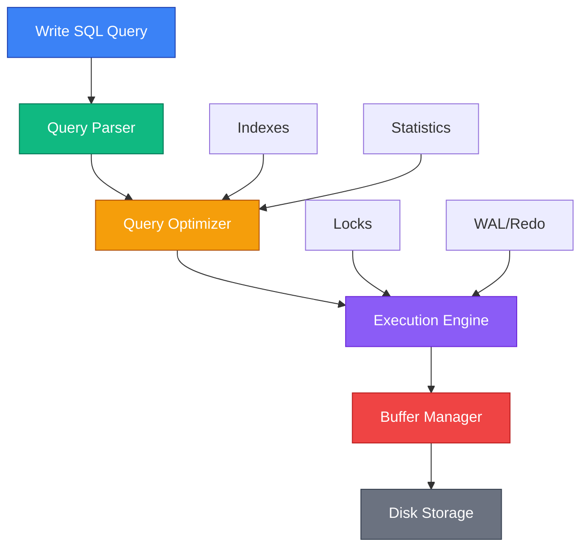

---

## 1. Indexing Internals

### First Principles: Why Do Indexes Exist?

Without an index, finding a row requires scanning **every row** in the table (full table scan). With an index, you can jump directly to the relevant rows — like a book index.

### B-tree Index (The Default)

The **B-tree** (Balanced Tree) is the most common index structure in all major RDBMS.

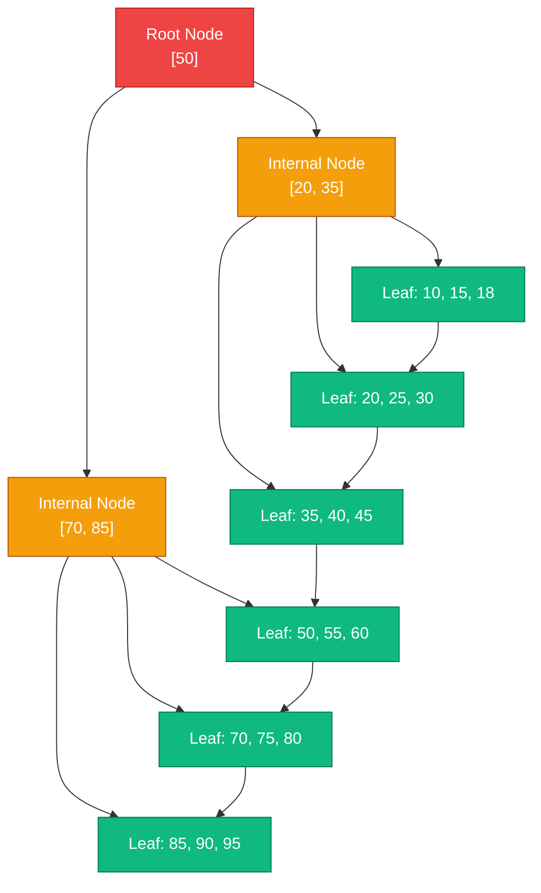

**Key Properties:**
- **Balanced**: All leaf nodes are at the same depth → O(log n) lookup
- **Sorted**: Leaf nodes are linked in order → efficient range scans
- **Self-balancing**: Splits/merges maintain balance on INSERT/DELETE

### B-tree Lookup: How It Works

To find salary = 75:
1. Start at root: 75 > 50 → go right
2. Internal node: 70 < 75 < 85 → go to middle child
3. Leaf node: scan → found 75! Follow pointer to table row.

**Complexity**: O(log n) — for 1 million rows, only ~20 comparisons (vs 1,000,000 for full scan).

### Index Types Comparison

| Index Type | Data Structure | Best For | Operations | RDBMS |
|-----------|---------------|----------|-----------|-------|
| **B-tree** | Balanced tree | Equality, range, sorting | `=`, `<`, `>`, `BETWEEN`, `LIKE 'prefix%'` | All |
| **Hash** | Hash table | Equality only | `=` | PostgreSQL, Oracle |
| **GIN** | Inverted index | Multi-valued (JSONB, arrays, full-text) | `@>`, `?`, `@@` | PostgreSQL |
| **GiST** | Generalized tree | Geometric, range, nearest-neighbor | `&&`, `<@`, `<<->` | PostgreSQL |
| **BRIN** | Block range summary | Physically sorted columns | `=`, `<`, `>` | PostgreSQL |
| **Bitmap** | Bit arrays | Low-cardinality columns | `AND`, `OR` | Oracle |
| **R-tree** | Rectangle tree | Spatial data | Bounding box | Oracle Spatial |

### Clustered vs Non-Clustered Index

| Feature | Clustered Index | Non-Clustered Index |
|---------|----------------|-------------------|
| **Data order** | Table data physically sorted by index | Separate structure pointing to data |
| **Per table** | Only ONE (data can only be sorted one way) | Multiple allowed |
| **Leaf nodes** | Contain actual data rows | Contain pointers (rowid/ctid) to data |
| **Lookup speed** | Fastest for range scans | Requires extra lookup (heap fetch) |
| **PostgreSQL** | No true clustered index (CLUSTER reorders once) | All indexes are non-clustered |
| **SQL Server** | Primary key is clustered by default | All other indexes |

### Composite Index and Column Order

```sql
CREATE INDEX idx_dept_salary ON employees (dept_id, salary);
```

The **leftmost prefix rule** — this index supports:
- ✅ `WHERE dept_id = 10` (uses index)
- ✅ `WHERE dept_id = 10 AND salary > 50000` (uses index fully)
- ❌ `WHERE salary > 50000` (can't use — dept_id is not specified)

> **Rule**: A composite index `(A, B, C)` supports queries on `(A)`, `(A, B)`, or `(A, B, C)` — but NOT `(B)`, `(C)`, or `(B, C)`.

### Index-Only Scan (Covering Index)

```sql
-- PostgreSQL: INCLUDE clause
CREATE INDEX idx_emp_dept ON employees (dept_id) INCLUDE (name, salary);

-- If query only needs dept_id, name, salary → index-only scan (no heap access!)
SELECT name, salary FROM employees WHERE dept_id = 10;
```

### When NOT to Index

| Situation | Why |
|-----------|-----|
| Very small tables (< 1000 rows) | Full scan is faster than index lookup |
| Low-cardinality columns (e.g., gender) | Index doesn't filter enough rows |
| Heavy write tables with few reads | Index maintenance overhead exceeds benefit |
| Columns rarely in WHERE/JOIN/ORDER BY | Index is never used |
| Already indexed column in different order | May create redundant index |

---

## 2. Query Optimization

### The Query Optimizer

The optimizer converts your SQL query into the most efficient execution plan.

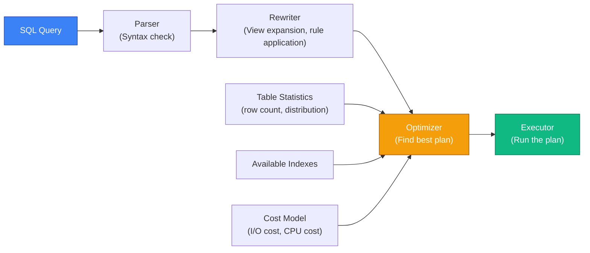

### Join Algorithms

| Algorithm | How It Works | Best When | Complexity |
|-----------|-------------|-----------|-----------|
| **Nested Loop Join** | For each row in outer, scan inner table | Small outer table, indexed inner | O(n × m), O(n × log m) with index |
| **Hash Join** | Build hash table on smaller table, probe with larger | Equality joins, no useful index | O(n + m) |
| **Sort-Merge Join** | Sort both tables, merge | Both tables already sorted, range joins | O(n log n + m log m) |

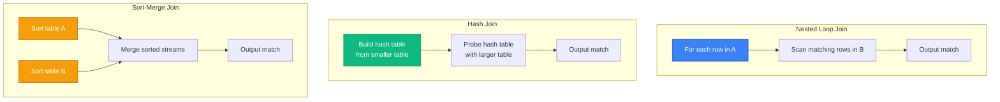

### Reading Execution Plans

```sql
EXPLAIN ANALYZE
SELECT e.first_name, d.dept_name
FROM employees e
JOIN departments d ON e.dept_id = d.dept_id
WHERE e.salary > 80000;
```

```
Hash Join  (cost=1.09..2.26 rows=3 width=19) (actual time=0.045..0.055 rows=3 loops=1)
  Hash Cond: (e.dept_id = d.dept_id)
  ->  Seq Scan on employees e  (cost=0.00..1.10 rows=3 width=15) (actual time=0.010..0.015 rows=3 loops=1)
        Filter: (salary > 80000)
        Rows Removed by Filter: 7
  ->  Hash  (cost=1.05..1.05 rows=5 width=12) (actual time=0.020..0.020 rows=5 loops=1)
        ->  Seq Scan on departments d  (cost=0.00..1.05 rows=5 width=12)
Planning Time: 0.200 ms
Execution Time: 0.080 ms
```

**How to read it:**
1. Read **innermost operations first** (bottom-up)
2. Check **estimated vs actual rows** — large discrepancy means stale statistics
3. Look for **Seq Scans on large tables** — potential index opportunity
4. Check **Rows Removed by Filter** — high numbers indicate poor selectivity

### Top 10 Query Optimization Strategies

| # | Strategy | Example |
|---|---------|---------|
| 1 | **Add missing indexes** | Index columns in WHERE, JOIN, ORDER BY |
| 2 | **Use covering indexes** | Avoid heap lookups with INCLUDE |
| 3 | **Update statistics** | `ANALYZE table_name;` |
| 4 | **Avoid SELECT *** | Select only needed columns |
| 5 | **Use JOINs over subqueries** | Replace correlated subqueries with JOINs |
| 6 | **Limit result sets** | Add LIMIT, use keyset pagination |
| 7 | **Avoid functions on indexed columns** | `WHERE LOWER(name) = 'x'` → can't use index on `name` |
| 8 | **Batch operations** | Insert 1000 rows at once, not one at a time |
| 9 | **Partition large tables** | Partition by date for time-series data |
| 10 | **Connection pooling** | Avoid connection overhead with PgBouncer |

---

## 3. Transaction Management Deep Dive

### Transaction Lifecycle

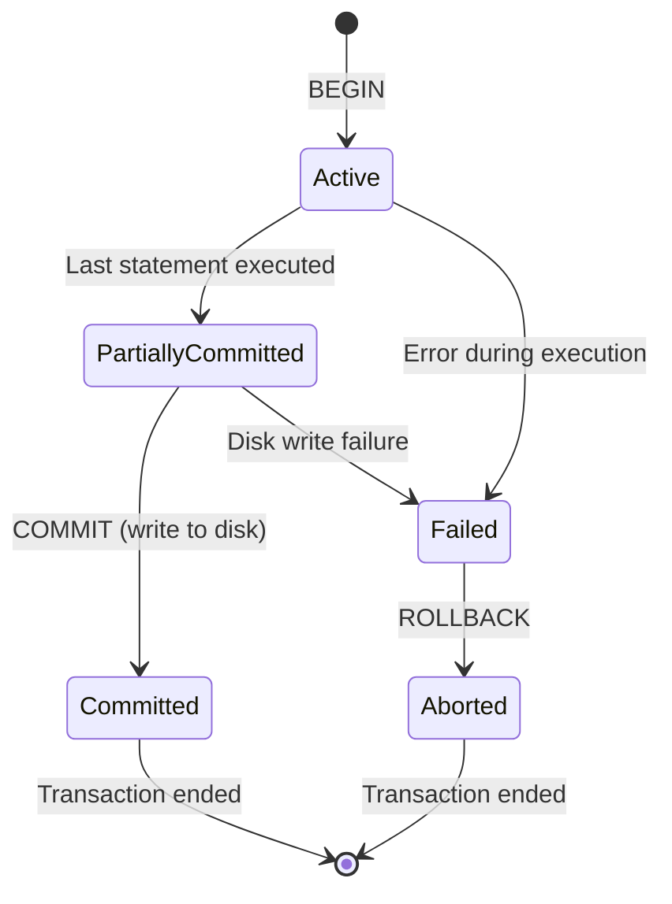

### Write-Ahead Logging (WAL)

The **WAL** protocol ensures durability: every change is written to the log **before** being applied to data files.

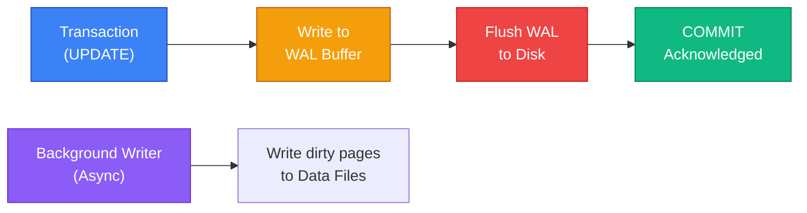

**Why WAL?**
- Sequential writes to log are **much faster** than random writes to data files
- On crash: replay the WAL to recover committed transactions
- Enables replication: send WAL to replicas

### Isolation Levels in Detail

| Phenomenon | Description |
|-----------|------------|
| **Dirty Read** | Read uncommitted data from another transaction |
| **Non-Repeatable Read** | Same query returns different results within one transaction |
| **Phantom Read** | New rows appear in repeated query (another txn inserted) |
| **Write Skew** | Two transactions read overlapping data, make decisions based on stale reads |

| Isolation Level | Dirty Read | Non-Repeatable Read | Phantom Read | Write Skew |
|----------------|-----------|-------------------|-------------|-----------|
| **Read Uncommitted** | ✅ Possible | ✅ Possible | ✅ Possible | ✅ Possible |
| **Read Committed** | ❌ Prevented | ✅ Possible | ✅ Possible | ✅ Possible |
| **Repeatable Read** | ❌ Prevented | ❌ Prevented | ✅ PG: No / Others: Yes | ✅ Possible |
| **Serializable** | ❌ Prevented | ❌ Prevented | ❌ Prevented | ❌ Prevented |

> **PostgreSQL**: Repeatable Read actually prevents phantom reads (uses snapshot isolation).
> **MySQL InnoDB**: Repeatable Read uses gap locks to prevent phantoms in some cases.

### MVCC vs Locking

| Feature | MVCC (PostgreSQL, Oracle) | Lock-Based (MySQL MyISAM) |
|---------|---------------------------|---------------------------|
| **Readers block writers?** | ❌ No | ✅ Yes |
| **Writers block readers?** | ❌ No | ✅ Yes |
| **Concurrency** | High | Low |
| **Space overhead** | Dead tuples / UNDO | Lock table |
| **Cleanup needed** | VACUUM (PG) / UNDO expiry (Oracle) | No |

---

## 4. Concurrency Control

### Concurrency Problems

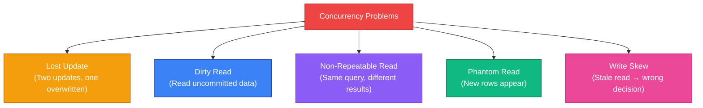

### Lost Update Example

```
Transaction A:                Transaction B:
READ balance = 1000           
                              READ balance = 1000
UPDATE balance = 1000 + 200
                              UPDATE balance = 1000 - 500
COMMIT (balance = 1200)
                              COMMIT (balance = 500)
                              
Result: Balance = 500 (A's update is lost!)
Expected: Balance = 700 (1000 + 200 - 500)
```

**Solution**: Use `SELECT ... FOR UPDATE` to lock the row, or use serializable isolation.

### Optimistic vs Pessimistic Concurrency Control

| Approach | How It Works | When To Use |
|----------|-------------|-------------|
| **Pessimistic** | Lock data before modifying | High contention (banking, inventory) |
| **Optimistic** | Check for conflicts at commit time | Low contention (user profiles, CMS) |

```sql
-- Pessimistic: Lock rows before reading
BEGIN;
SELECT balance FROM accounts WHERE id = 1 FOR UPDATE;  -- Locks the row
UPDATE accounts SET balance = balance - 500 WHERE id = 1;
COMMIT;

-- Optimistic: Version-based checking
UPDATE products 
SET price = 29.99, version = version + 1
WHERE id = 42 AND version = 5;  -- Only updates if version matches

-- If 0 rows affected → someone else changed it → retry
```

---

## 5. Database Locking

### Lock Types

| Lock Type | Scope | Blocks | Use Case |
|-----------|-------|--------|----------|
| **Shared Lock (S)** | Row/Table | Blocks exclusive writes | SELECT ... FOR SHARE |
| **Exclusive Lock (X)** | Row/Table | Blocks all other access | UPDATE, DELETE |
| **Intent Shared (IS)** | Table | Signals intent to S-lock rows | Before row-level S lock |
| **Intent Exclusive (IX)** | Table | Signals intent to X-lock rows | Before row-level X lock |
| **Row Lock** | Single row | Other txns can't modify this row | DML operations |
| **Table Lock** | Entire table | Other txns can't modify table | DDL, LOCK TABLE |
| **Advisory Lock** | Application-defined | Application must check | Custom concurrency control |

### Lock Compatibility Matrix

| Requested ↓ / Held → | S (Shared) | X (Exclusive) |
|----------------------|-----------|--------------|
| **S (Shared)** | ✅ Compatible | ❌ Conflict |
| **X (Exclusive)** | ❌ Conflict | ❌ Conflict |

### Deadlocks

A **deadlock** occurs when two or more transactions wait for each other's locks indefinitely.

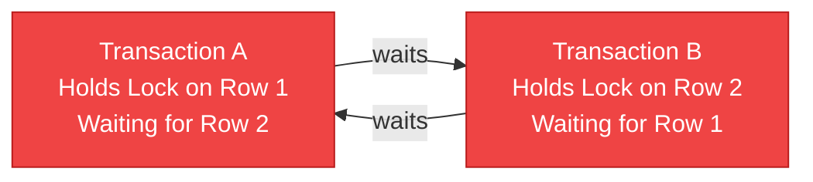

```
Transaction A:                Transaction B:
UPDATE accounts SET ... WHERE id = 1;  -- Locks row 1
                              UPDATE accounts SET ... WHERE id = 2;  -- Locks row 2
UPDATE accounts SET ... WHERE id = 2;  -- WAITS for row 2
                              UPDATE accounts SET ... WHERE id = 1;  -- WAITS for row 1
                              
💀 DEADLOCK! Both waiting forever.
```

**How databases handle deadlocks:**
1. **Detection**: Run a "wait-for graph" check periodically
2. **Resolution**: Choose a victim transaction and roll it back
3. **Prevention**: Always access resources in the same order

**Prevention strategies:**
- Always lock tables/rows in a consistent order (e.g., by primary key)
- Keep transactions short
- Use appropriate isolation levels
- Use `SELECT ... FOR UPDATE NOWAIT` to fail immediately instead of waiting

---

## 6. Storage and Buffer Management

### Page/Block Architecture

Databases store data in fixed-size **pages** (or **blocks**):

| RDBMS | Default Page Size |
|-------|------------------|
| PostgreSQL | 8 KB |
| Oracle | 8 KB |
| MySQL InnoDB | 16 KB |
| SQL Server | 8 KB |

### Buffer Pool

The **buffer pool** (shared buffers in PostgreSQL, buffer cache in Oracle) caches frequently accessed pages in memory.

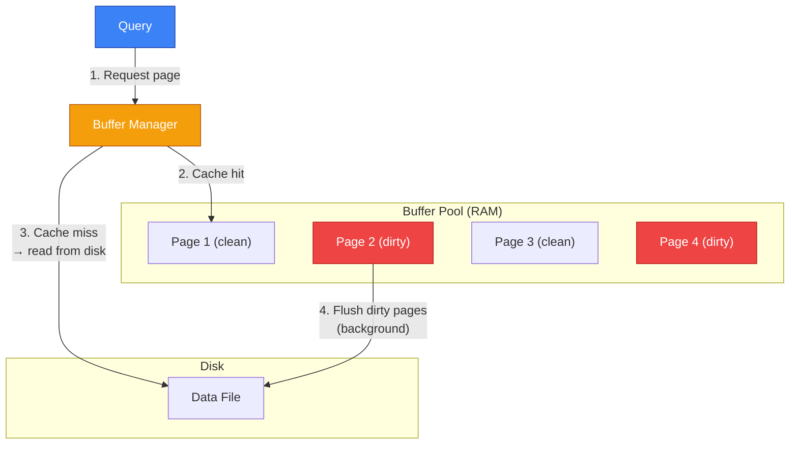

### Buffer Replacement Policies

| Policy | How It Works | Used By |
|--------|-------------|---------|
| **LRU** (Least Recently Used) | Evict the page not accessed for the longest time | MySQL, basic systems |
| **Clock** (Approximate LRU) | Circular buffer with reference bits | PostgreSQL |
| **LRU-K** | Track last K accesses, evict by oldest K-th access | SQL Server |

### Heap vs Index-Organized Tables

| Feature | Heap Table (PostgreSQL) | Index-Organized (Oracle IOT) |
|---------|----------------------|---------------------------|
| **Row storage** | Unordered (append-only) | Ordered by primary key |
| **Primary key lookup** | Index → heap → data | Index IS the data |
| **Insert performance** | Fast (append anywhere) | Slower (maintains order) |
| **Range scan on PK** | Requires index + heap | Very fast (data is sorted) |

---

## 7. Query Processing Pipeline

### Full Pipeline

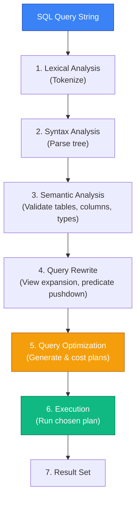

### Query Optimization Techniques

| Technique | What the Optimizer Does |
|-----------|------------------------|
| **Predicate Pushdown** | Push WHERE conditions as close to data source as possible |
| **Join Reordering** | Choose the optimal join order (e.g., smallest table first) |
| **Index Selection** | Decide which indexes to use (or full scan) |
| **Join Algorithm** | Choose nested loop, hash join, or merge join |
| **Subquery Flattening** | Convert subqueries into joins |
| **View Merging** | Inline view definitions into the main query |
| **Parallel Execution** | Split work across multiple CPU cores |
| **Partition Pruning** | Skip partitions that can't contain matching rows |

### Cost-Based vs Rule-Based Optimization

| Feature | Cost-Based (CBO) | Rule-Based (RBO) |
|---------|------------------|-------------------|
| **Uses statistics?** | ✅ Yes | ❌ No |
| **Adapts to data?** | ✅ Yes | ❌ No (fixed rules) |
| **Quality** | Generally better | Predictable but suboptimal |
| **Current status** | Used by all modern RDBMS | Deprecated (Oracle removed in 10g) |

---

## 8. Database Security

### Security Layers

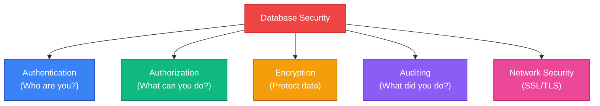

### Access Control (GRANT/REVOKE)

```sql
-- Grant specific permissions
GRANT SELECT, INSERT ON employees TO app_user;
GRANT ALL PRIVILEGES ON employees TO admin_user;
GRANT EXECUTE ON FUNCTION calc_salary TO hr_team;

-- Revoke permissions
REVOKE INSERT ON employees FROM app_user;

-- Role-based access control (RBAC)
CREATE ROLE readonly_role;
GRANT SELECT ON ALL TABLES IN SCHEMA public TO readonly_role;
GRANT readonly_role TO report_user;
```

### SQL Injection Prevention

```sql
-- ❌ VULNERABLE — String concatenation
EXECUTE 'SELECT * FROM users WHERE name = ''' || user_input || '''';
-- Input: ' OR '1'='1  → Returns ALL rows!

-- ✅ SAFE — Parameterized queries
EXECUTE 'SELECT * FROM users WHERE name = $1' USING user_input;

-- ✅ SAFE — Prepared statements (application level)
-- PreparedStatement ps = conn.prepareStatement("SELECT * FROM users WHERE name = ?");
-- ps.setString(1, userInput);
```

### Encryption

| Type | What It Protects | How |
|------|-----------------|-----|
| **TDE** (Transparent Data Encryption) | Data at rest (disk files) | Encrypts data files automatically |
| **SSL/TLS** | Data in transit (network) | Encrypted client-server connection |
| **Column-Level Encryption** | Specific sensitive columns | Application encrypts before storing |
| **pgcrypto** (PostgreSQL) | Application-level encryption | `pgp_sym_encrypt()` / `pgp_sym_decrypt()` |

---

## 9. Backup and Recovery

### Backup Types

| Type | What It Captures | Size | Speed | Recovery Time |
|------|-----------------|------|-------|---------------|
| **Full Backup** | Entire database | Large | Slow | Fast |
| **Incremental** | Changes since last backup | Small | Fast | Slower (chain of backups) |
| **Differential** | Changes since last full backup | Medium | Medium | Medium |
| **Logical** (pg_dump) | SQL statements to recreate | Medium | Slow | Slow |
| **Physical** (pg_basebackup) | Raw data files + WAL | Large | Fast | Fast |

### Recovery Models

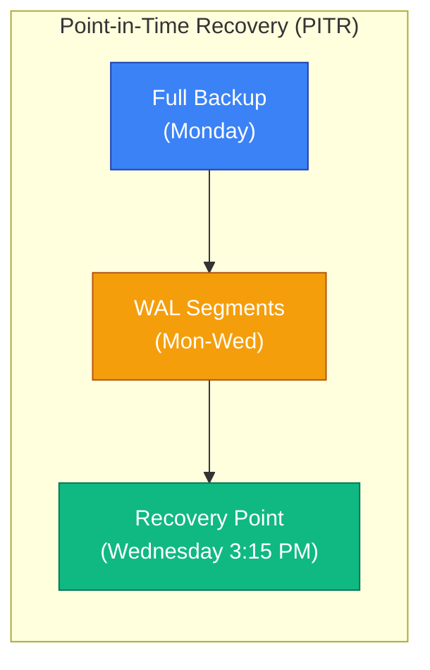

### PostgreSQL Backup Commands

```bash
# Logical backup (SQL dump)
pg_dump -h localhost -U postgres mydb > backup.sql
pg_dump -Fc mydb > backup.dump         # Custom format (compressed)
pg_dumpall > all_databases.sql          # All databases

# Restore
psql -U postgres mydb < backup.sql
pg_restore -d mydb backup.dump

# Physical backup (for PITR)
pg_basebackup -D /backup/path -Fp -Xs -P
```

---

## 10. Replication

### Replication Types

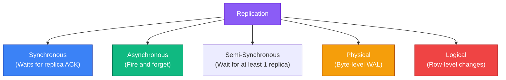

### Replication Comparison

| Feature | Synchronous | Asynchronous |
|---------|------------|-------------|
| **Data loss risk** | Zero (replica confirmed) | Non-zero (lag window) |
| **Write latency** | Higher (waits for replica) | Lower (doesn't wait) |
| **Availability** | Lower (replica failure blocks writes) | Higher |
| **Use case** | Financial systems, critical data | Reporting replicas, cross-region |

### Primary-Replica Architecture

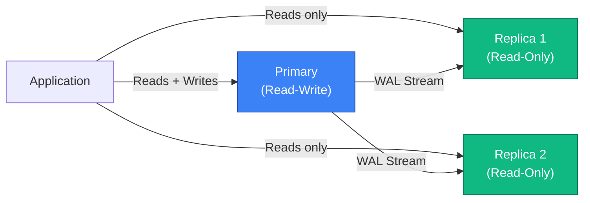

| Strategy | How It Works | Trade-offs |
|----------|-------------|-----------|
| **Read replicas** | Offload reads to replicas | Read scaling, potential stale reads |
| **Failover** | Promote replica to primary on failure | High availability, brief downtime |
| **Multi-primary** | Multiple nodes accept writes | Complex conflict resolution |

---

## 11. Partitioning and Sharding

### Partitioning vs Sharding

| Feature | Partitioning | Sharding |
|---------|-------------|---------|
| **Scope** | Single database server | Multiple database servers |
| **Data split** | Table split into partitions | Database split across nodes |
| **Transparency** | Application sees one table | Application must route queries |
| **Use case** | Large table performance | Horizontal scaling beyond one server |
| **Managed by** | Database engine | Application or middleware |

### Partitioning Strategies

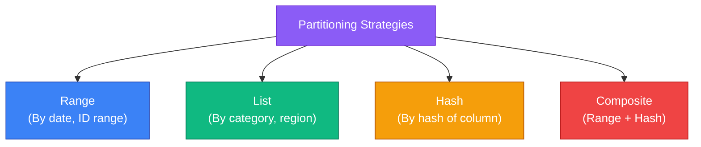

| Strategy | Partitions By | Example | Best For |
|----------|-------------- |---------|----------|
| **Range** | Value ranges | Orders by month, IDs 1-1M, 1M-2M | Time-series, sequential data |
| **List** | Explicit values | Users by country: US, UK, IN | Known discrete categories |
| **Hash** | Hash function | `user_id % 4` → partition 0-3 | Even distribution, unknown patterns |
| **Composite** | Two strategies | Range by year, hash within year | Large-scale, complex queries |

### Sharding Strategies

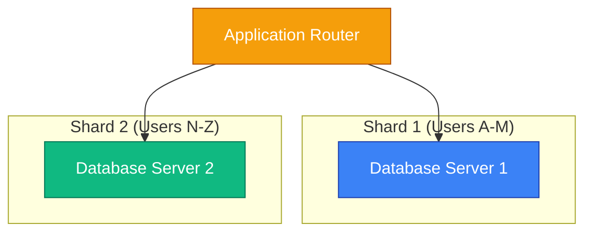

| Sharding Key | Example | Pros | Cons |
|-------------|---------|------|------|
| **User ID** | `user_id % N` | Even distribution, simple | Cross-shard queries hard |
| **Geography** | US shard, EU shard | Data locality, compliance | Uneven load |
| **Tenant** | One shard per customer | Isolation, easy scaling | Hot tenants |
| **Time** | Current month on fast shard | Old data on cheap storage | Range queries across shards |

### When to Partition vs Shard

| Question | If Yes → |
|----------|----------|
| Data fits on one server? | **Partition** |
| Need to scale beyond one server? | **Shard** |
| Need to delete old data quickly? | **Partition** (drop partition) |
| Multi-region latency requirements? | **Shard** (by region) |

---

## 12. NoSQL vs RDBMS — When to Use What

### The CAP Theorem

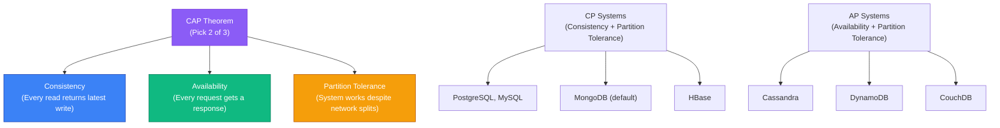

### ACID vs BASE

| Property | ACID (RDBMS) | BASE (NoSQL) |
|----------|-------------|-------------|
| **Consistency** | Strong (immediate) | Eventual |
| **Availability** | May sacrifice for consistency | Prioritized |
| **Transaction model** | Strict, multi-statement | Often single-document |
| **Example** | PostgreSQL, Oracle | Cassandra, DynamoDB |

### When to Use What

| Scenario | Use RDBMS | Use NoSQL |
|----------|-----------|-----------|
| **Banking/Financial** | ✅ ACID transactions critical | ❌ |
| **E-commerce catalog** | ✅ Structured, relational | ✅ Flexible attributes (document) |
| **Social media feed** | ❌ | ✅ High throughput, eventual consistency |
| **IoT sensor data** | ❌ | ✅ Time-series (InfluxDB) |
| **Session storage** | ❌ | ✅ Key-value (Redis) |
| **Fraud detection** | ❌ | ✅ Graph (Neo4j) |
| **Complex reporting** | ✅ JOINs, aggregations, views | ❌ |
| **Real-time analytics** | ⚠️ | ✅ Column store (ClickHouse) |
| **User profiles** | ✅ or ✅ Document | ✅ (flexible schema) |
| **Caching layer** | ❌ | ✅ Key-value (Redis, Memcached) |

> **Modern approach**: Most systems use **polyglot persistence** — RDBMS for transactions, Redis for caching, Elasticsearch for search, S3 for files.

---

## ❓ Interview Questions

### 🟢 Beginner

1. **What is an index? Why does it speed up queries?**
   > An index is a data structure (usually B-tree) that provides O(log n) lookups instead of O(n) full table scans. It stores sorted copies of indexed columns with pointers to the actual rows.

2. **What is the difference between a clustered and non-clustered index?**
   > Clustered: table data is physically sorted by the index (only one per table). Non-clustered: separate structure with pointers to data (multiple per table).

3. **What is a transaction? Why do we need transactions?**
   > A transaction is a logical unit of work (BEGIN → SQL operations → COMMIT/ROLLBACK) that ensures ACID properties. Without transactions, partial failures could leave data in an inconsistent state.

4. **What is a deadlock? How do you prevent it?**
   > A deadlock occurs when two transactions wait for each other's locks. Prevention: always lock resources in the same order, keep transactions short, use timeout-based lock acquisition.

5. **What is the difference between a shared lock and an exclusive lock?**
   > Shared lock (S): allows concurrent reads but blocks writes. Exclusive lock (X): blocks both reads and writes. Multiple S locks are compatible; S and X locks conflict.

6. **What is replication? Why is it used?**
   > Replication copies data from one database (primary) to others (replicas). Used for: read scaling, high availability (failover), disaster recovery, geographic distribution.

7. **What is the difference between a full backup and an incremental backup?**
   > Full: copies entire database (large, slow, simple recovery). Incremental: copies only changes since last backup (small, fast, chain recovery).

8. **What is SQL injection? How do you prevent it?**
   > SQL injection injects malicious SQL through user input. Prevention: parameterized queries, prepared statements, input validation, principle of least privilege.

9. **What is partitioning? When would you use it?**
   > Splitting a large table into smaller physical pieces. Use for: time-series data (partition by month), very large tables (millions+ rows), dropping old data quickly (drop partition).

10. **What is the CAP theorem?**
    > In a distributed system, you can only guarantee 2 of 3: Consistency (latest data), Availability (always responds), Partition tolerance (works despite network failures). RDBMS typically chooses CP; NoSQL often chooses AP.

### 🟡 Intermediate

11. **Explain how a B-tree index works. What is its time complexity?**
    > B-tree: balanced tree where internal nodes have 2+ children, leaves are linked. Lookup: O(log n) — traverse from root to leaf. Range scan: O(log n + k) — find start, follow leaf links. For 1M rows, ~20 comparisons.

12. **What are the three types of join algorithms? When is each used?**
    > Nested Loop: small outer table + indexed inner. Hash Join: large unsorted tables, equality joins. Sort-Merge: both tables sorted, range joins. The optimizer chooses based on table sizes, indexes, and sort order.

13. **Explain the difference between optimistic and pessimistic concurrency control.**
    > Pessimistic: lock data before reading (SELECT FOR UPDATE). Best for high contention. Optimistic: check for conflicts at commit time (version column). Best for low contention.

14. **What is Write-Ahead Logging (WAL)? Why is it important?**
    > WAL writes changes to a sequential log before data files. Ensures durability (replay log on crash), enables replication (send log to replicas), and improves performance (sequential I/O is faster).

15. **How does the query optimizer choose an execution plan?**
    > Cost-based: estimates I/O + CPU cost for multiple plans using table statistics (row count, value distribution, index cardinality). Chooses the plan with the lowest estimated cost.

16. **What is the difference between physical and logical replication?**
    > Physical: byte-level WAL replication (exact copy, same version required). Logical: row-level change replication (selective tables, cross-version). Physical for HA; logical for data integration.

17. **Explain partition pruning.**
    > When a query includes a condition on the partition key, the optimizer skips (prunes) partitions that can't contain matching rows. Example: `WHERE order_date = '2024-03-15'` only scans the March 2024 partition.

18. **What is the difference between ACID and BASE?**
    > ACID: strong consistency, transaction guarantees (RDBMS). BASE: Basically Available, Soft state, Eventually consistent (NoSQL). ACID prioritizes correctness; BASE prioritizes availability and scale.

19. **How do you identify and fix a slow query?**
    > 1) EXPLAIN ANALYZE to see the plan. 2) Check for Seq Scans → add indexes. 3) Check estimated vs actual rows → ANALYZE. 4) Check for disk spills → increase work_mem. 5) Consider query rewriting (JOINs vs subqueries).

20. **What is a covering index? Why is it faster?**
    > A covering index includes all columns the query needs (via INCLUDE). This enables index-only scans — the database reads everything from the index without accessing the heap (table data), eliminating random I/O.

### 🔴 Advanced

21. **How would you design a database for a high-write, high-read workload?**
    > Write path: partitioned tables, batch inserts, async replication. Read path: read replicas, materialized views, covering indexes, caching (Redis). Separate OLTP (writes) and OLAP (reads) workloads.

22. **Explain write skew. How does serializable isolation prevent it?**
    > Write skew: two transactions read overlapping data, make decisions based on stale reads, and write non-overlapping data. Example: both doctors see "2 on-call" and each decides to take time off → 0 on-call. Serializable detects this conflict and aborts one transaction.

23. **Compare B-tree vs LSM-tree. When would you prefer each?**
    > B-tree: balanced tree, good for reads, moderate writes, random I/O. LSM-tree: log-structured merge tree, optimized for writes (sequential I/O), compaction needed. Use B-tree for OLTP (RDBMS). Use LSM-tree for write-heavy workloads (RocksDB, LevelDB, Cassandra).

24. **How does PostgreSQL's VACUUM work internally?**
    > 1) Scan heap for dead tuples (xmax set, no live transaction references). 2) Remove dead tuples, mark space as reusable. 3) Update visibility map and free space map. 4) Optionally freeze old transaction IDs (prevent wraparound). VACUUM does NOT return disk space to OS (VACUUM FULL does, with table lock).

25. **What is the phantom read problem? How does PostgreSQL's SSI prevent it?**
    > Phantom: a repeated query returns new rows because another transaction inserted. PostgreSQL's SSI (Serializable Snapshot Isolation) tracks read/write dependencies. If a cycle is detected (transaction A reads what B writes, B reads what A writes), one is aborted.

26. **Design a sharding strategy for a multi-tenant SaaS application.**
    > Shard by tenant_id (ensures all tenant data is co-located). Use consistent hashing for even distribution. Keep metadata/tenant directory in a shared database. Handle cross-tenant queries via application aggregation. Plan for shard splitting when a tenant grows too large.

27. **What is the difference between a hot standby and a warm standby?**
    > Hot standby: accepts read queries while replicating (PostgreSQL with `hot_standby = on`). Warm standby: applies WAL but doesn't accept queries. Hot standbys offload reads; warm standbys are purely for failover.

28. **How would you implement zero-downtime schema migration on a large table?**
    > 1) Create new column with DEFAULT (PG 11+ is instant). 2) Backfill in batches. 3) Add NOT NULL constraint using `NOT VALID` + `VALIDATE CONSTRAINT`. 4) For renames: add new column, dual-write, backfill, switch reads, drop old. Tools: pg_repack, gh-ost (MySQL).

29. **Explain the trade-offs of synchronous vs asynchronous commit in PostgreSQL.**
    > Synchronous commit (`synchronous_commit = on`): waits for WAL flush to disk. Guarantees durability but adds latency (~2-5ms). Async commit (`synchronous_commit = off`): returns immediately. Faster but risks losing last ~600ms of data on crash. Use async for non-critical data (logs, analytics).

30. **What is connection pooling? Compare PgBouncer modes.**
    > Connection pooling reuses database connections to avoid fork-per-connection overhead. PgBouncer modes: **Session** (pool per session, safest), **Transaction** (pool per transaction, most efficient), **Statement** (pool per statement, most aggressive but breaks multi-statement transactions).

---

## ⚠️ Common Mistakes

| # | Mistake | Why It's Wrong | Correct Approach |
|---|---------|---------------|-----------------|
| 1 | Indexing every column | Indexes slow writes and waste storage | Index columns used in WHERE/JOIN/ORDER BY with high selectivity |
| 2 | Ignoring the query plan | Can't optimize what you can't see | Always EXPLAIN ANALYZE before optimizing |
| 3 | Using READ UNCOMMITTED for speed | Dirty reads cause data corruption bugs | Use READ COMMITTED as minimum |
| 4 | Not using connection pooling | PostgreSQL creates ~10MB per connection | Use PgBouncer or application-level pooling |
| 5 | Scaling vertically forever | Single-server limits are real | Plan for read replicas or sharding early |
| 6 | Storing passwords in plaintext | Security breach → game over | Use bcrypt/argon2 hashing |
| 7 | No backup strategy | "It won't happen to us" → data loss | Automated daily backups with tested restores |
| 8 | Using ORM-generated queries blindly | ORMs generate N+1 queries, unnecessary JOINs | Monitor generated SQL, use raw SQL for complex queries |
| 9 | Not monitoring for deadlocks | Silent failures in production | Set up alerting on deadlock events |
| 10 | Partitioning too early | Adds complexity for small tables | Partition when table exceeds ~10M rows or 10GB |

---

## 💬 FAQs

**Q1: How do I decide between adding an index and rewriting a query?**
> First: check if a simple index solves it. If the query is inherently inefficient (correlated subquery, N+1), rewrite it. If the table is write-heavy, consider if the index overhead is worth it. Often, both help.

**Q2: What is the difference between horizontal and vertical scaling?**
> Vertical: bigger server (more RAM, CPU). Simple but has limits. Horizontal: more servers (replicas, shards). Complex but scales indefinitely. Most RDBMS scale vertically first, then add read replicas for horizontal read scaling.

**Q3: When should I use a materialized view vs a cache (Redis)?**
> Materialized view: complex queries, refresh on schedule, stays in the database. Redis cache: simple key-value, sub-millisecond reads, invalidation complexity. Use materialized views for dashboards; Redis for API response caching.

**Q4: Is SERIALIZABLE isolation always the safest choice?**
> Safest for correctness, but highest performance cost. Read Committed is sufficient for most workloads. Use Serializable only when you need to prevent write skew (e.g., financial constraints).

**Q5: How do distributed databases handle transactions across shards?**
> Two-Phase Commit (2PC): coordinator ensures all shards commit or abort (slow, blocking). Saga pattern: sequence of local transactions with compensating actions. Most modern systems use sagas for better availability.

---

## 📝 Revision Notes

1. **B-tree index**: O(log n) lookup, sorted leaves linked for range scans
2. **Composite index**: follows leftmost prefix rule — `(A,B,C)` supports `(A)`, `(A,B)`, `(A,B,C)` only
3. **Join algorithms**: Nested Loop (small + indexed), Hash (large + equality), Sort-Merge (sorted + range)
4. **EXPLAIN ANALYZE**: read bottom-up, compare estimated vs actual rows
5. **WAL**: write log first, then data — enables crash recovery and replication
6. **Isolation levels**: Read Uncommitted → Read Committed → Repeatable Read → Serializable
7. **MVCC**: multiple row versions, readers don't block writers
8. **Deadlock**: circular wait → database detects and rolls back one victim
9. **Optimistic vs Pessimistic**: low contention → optimistic (version check); high contention → pessimistic (locks)
10. **Replication**: synchronous (zero data loss, higher latency) vs asynchronous (fast, slight data loss risk)
11. **Partitioning**: range (time), list (category), hash (even distribution) — single server
12. **Sharding**: splits database across multiple servers — application must route queries
13. **CAP theorem**: Consistency, Availability, Partition tolerance — pick 2
14. **ACID** (RDBMS) vs **BASE** (NoSQL)
15. **Connection pooling** is essential for PostgreSQL (PgBouncer: session/transaction/statement modes)

---

## 📋 Cheat Sheet

```
╔══════════════════════════════════════════════════════════════════╗
║                ADVANCED RDBMS TOPICS CHEAT SHEET                ║
╠══════════════════════════════════════════════════════════════════╣
║                                                                  ║
║  INDEXES:                                                        ║
║  B-tree     → default, equality + range + sort, O(log n)       ║
║  Hash       → equality only, O(1) amortized                    ║
║  GIN        → JSONB, arrays, full-text (PostgreSQL)            ║
║  BRIN       → physically sorted columns (time-series)          ║
║  Composite  → (A,B,C) supports A, A+B, A+B+C only             ║
║  Covering   → INCLUDE extra columns for index-only scans       ║
║                                                                  ║
║  JOIN ALGORITHMS:                                                ║
║  Nested Loop  → small outer + indexed inner                    ║
║  Hash Join    → large tables, equality joins, O(n+m)           ║
║  Sort-Merge   → pre-sorted data, range joins                  ║
║                                                                  ║
║  ISOLATION LEVELS (weakest → strongest):                        ║
║  Read Uncommitted → Read Committed → Repeatable Read →         ║
║  Serializable                                                   ║
║                                                                  ║
║  CONCURRENCY:                                                    ║
║  Pessimistic → SELECT FOR UPDATE (lock first)                  ║
║  Optimistic  → Version column (check at commit)                ║
║                                                                  ║
║  LOCKING:                                                        ║
║  Shared (S)    → read lock, compatible with other S            ║
║  Exclusive (X) → write lock, blocks all others                 ║
║  Deadlock      → circular wait → DB rolls back victim          ║
║                                                                  ║
║  REPLICATION:                                                    ║
║  Sync      → zero data loss, higher latency                    ║
║  Async     → lower latency, risk of data loss                  ║
║  Physical  → WAL bytes (exact copy)                            ║
║  Logical   → row changes (selective, cross-version)            ║
║                                                                  ║
║  PARTITIONING:                                                   ║
║  Range → time-series  | List → categories  | Hash → even dist  ║
║                                                                  ║
║  SHARDING:                                                       ║
║  Split DB across servers | App routes queries | Scale writes    ║
║                                                                  ║
║  CAP: Consistency + Availability + Partition Tolerance          ║
║  RDBMS → CP (strong consistency)                                ║
║  NoSQL → AP (high availability)                                 ║
║                                                                  ║
║  BACKUP: Full | Incremental | Differential | Logical | Physical ║
║  PITR: Full backup + replay WAL to specific timestamp           ║
║                                                                  ║
║  PERFORMANCE:                                                    ║
║  1. EXPLAIN ANALYZE → find bottleneck                          ║
║  2. Add index → speed up WHERE/JOIN                            ║
║  3. ANALYZE table → update statistics                          ║
║  4. Increase work_mem → avoid disk spills                      ║
║  5. Connection pooling → reduce connection overhead            ║
║                                                                  ║
╚══════════════════════════════════════════════════════════════════╝
```

---

<p align="center">
  <b>⬅️ <a href="../04_oracle_plsql/README.md">Previous: Oracle PL/SQL</a> · <a href="../06_interview_prep/README.md">Next: Interview Prep →</a></b>
</p>
