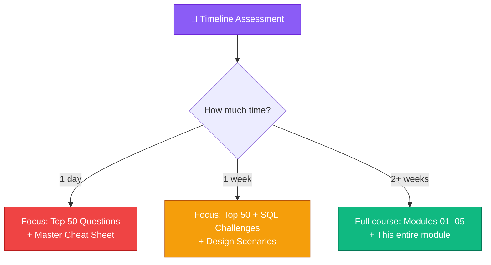
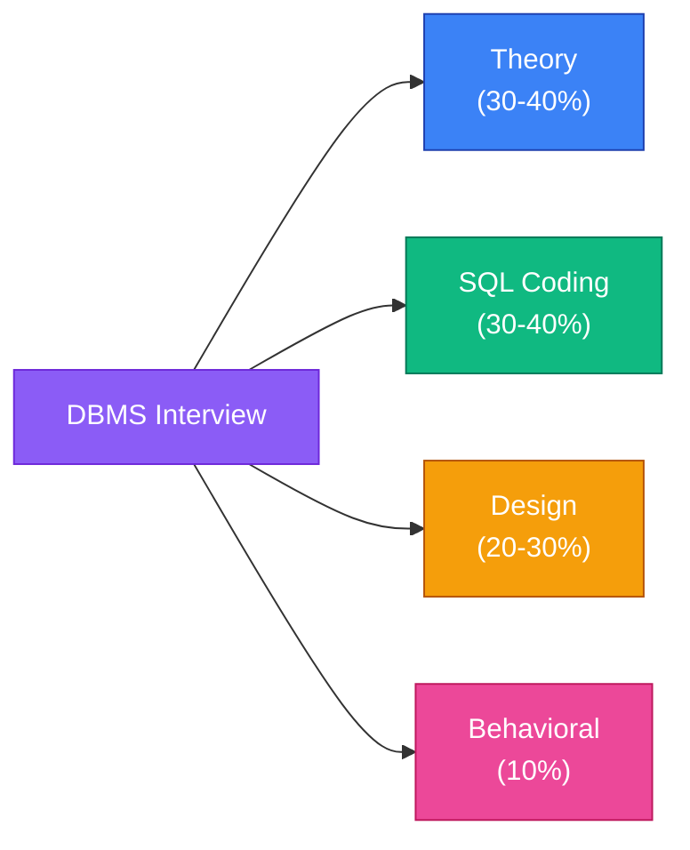
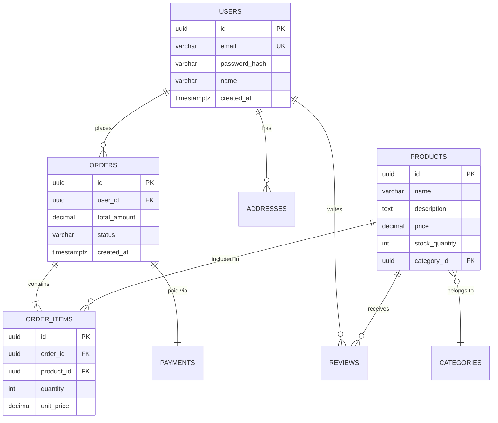
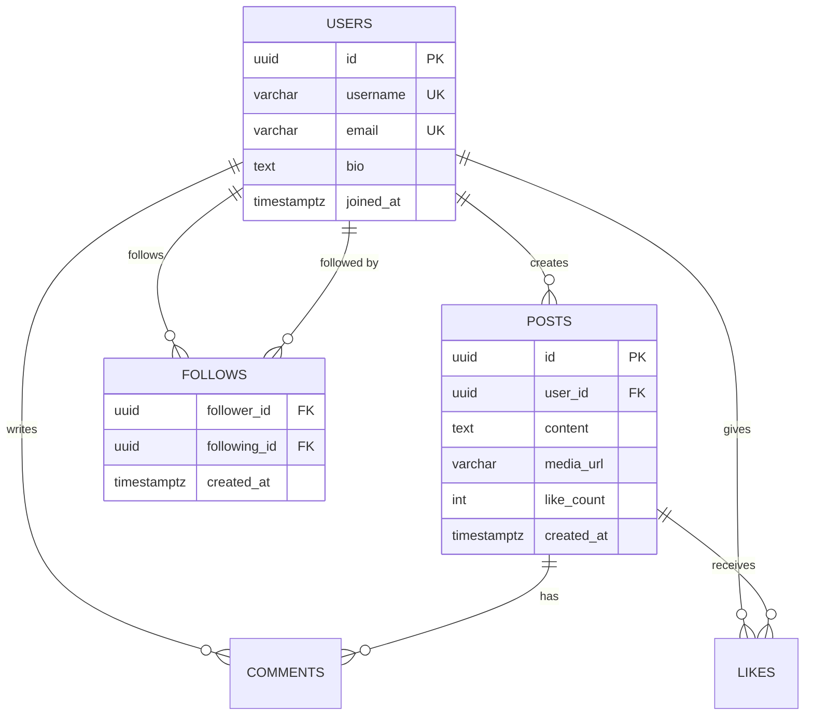
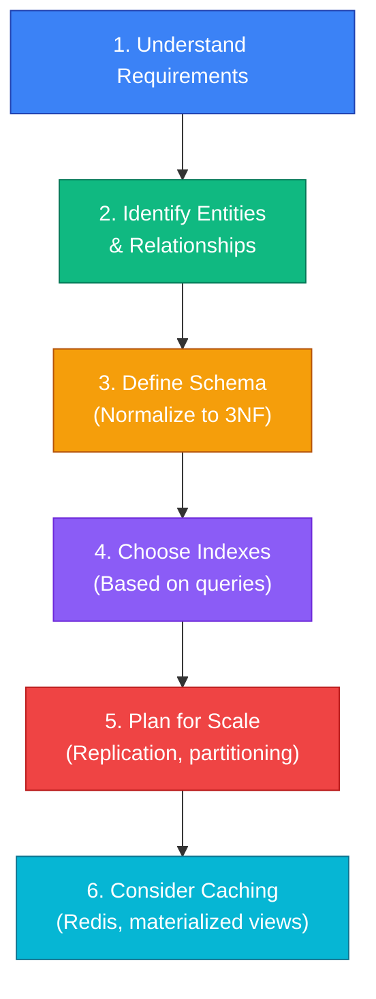

# 🎯 Module 06 — Interview Preparation

<p align="center">
  
  
  
</p>

---

## 📌 Table of Contents

- [How to Use This Module](#-how-to-use-this-module)
- [1. Interview Format Guide](#1-interview-format-guide)
- [2. Top 50 Must-Know Questions](#2-top-50-must-know-questions)
- [3. SQL Coding Challenges](#3-sql-coding-challenges)
- [4. Database Design Scenarios](#4-database-design-scenarios)
- [5. System Design — Database Layer](#5-system-design--database-layer)
- [6. Behavioral Questions for DB Roles](#6-behavioral-questions-for-db-roles)
- [7. Company-Specific Patterns](#7-company-specific-patterns)
- [Interview Questions](#-bonus-rapid-fire-questions)
- [Common Mistakes](#-common-interview-mistakes)
- [FAQs](#-faqs)
- [Revision Notes](#-ultimate-revision-notes)
- [Cheat Sheet](#-master-cheat-sheet)

---

## 🎯 How to Use This Module



### The 3-Pass Study Strategy

| Pass | Focus | Time |
|------|-------|------|
| **Pass 1: Breadth** | Read all questions, mark ones you can't answer | 2 hours |
| **Pass 2: Depth** | Study weak areas using Modules 01–05 | 3–4 hours |
| **Pass 3: Drill** | Answer every question out loud (simulate interview) | 2 hours |

---

## 1. Interview Format Guide

### What to Expect



| Company Type | Focus Areas | Common Topics |
|-------------|-------------|---------------|
| **FAANG/Big Tech** | SQL coding, system design | Window functions, indexing, distributed systems |
| **Banks/FinTech** | Transactions, PL/SQL, Oracle | ACID, stored procedures, concurrency |
| **Startups** | Practical SQL, schema design | PostgreSQL, migrations, performance |
| **Consulting** | Broad theory, multiple RDBMS | Normalization, ER diagrams, comparison questions |
| **Data Engineering** | ETL, warehouse design | Partitioning, CTEs, data modeling |

### How Interviewers Evaluate

| Signal | What They Look For |
|--------|-------------------|
| **Depth** | Can you explain *why*, not just *what*? |
| **Trade-offs** | "It depends" + explaining when each choice is better |
| **Real-world experience** | Examples from actual projects, not just textbook |
| **Problem-solving** | Can you optimize a slow query? Debug a deadlock? |
| **Communication** | Clear, structured answers (situation → approach → result) |

---

## 2. Top 50 Must-Know Questions

> These are the questions that appear in **90%+ of DBMS interviews**. Master these, and you'll handle most interviews confidently.

### Category 1: Fundamentals (Q1–Q10)

**Q1: What is a DBMS? What are its advantages over a file system?**
> A DBMS is software that manages databases. Advantages: (1) Data independence — apps don't depend on file format, (2) Reduced redundancy via normalization, (3) Concurrent access with ACID transactions, (4) Built-in security with GRANT/REVOKE, (5) Data integrity via constraints, (6) Backup and recovery mechanisms.

**Q2: Explain the ACID properties with a real-world example.**
> Bank transfer of ₹500 from Alice to Bob:
> - **Atomicity**: Debit Alice AND credit Bob, or neither (no half-transfers)
> - **Consistency**: Total money in the system stays the same before and after
> - **Isolation**: A third person checking balances sees either old state or new state, never a mix
> - **Durability**: After the bank confirms the transfer, it persists even if the server crashes

**Q3: What are the different types of keys in RDBMS?**
> - **Super Key**: Any uniquely identifying attribute set
> - **Candidate Key**: Minimal super key
> - **Primary Key**: Chosen candidate key (NOT NULL, unique)
> - **Alternate Key**: Non-chosen candidate keys
> - **Foreign Key**: References PK/UNIQUE in another table
> - **Composite Key**: PK with 2+ columns
> - **Surrogate Key**: System-generated (auto-increment/UUID)

**Q4: What is normalization? Explain 1NF, 2NF, 3NF, and BCNF.**
> Normalization organizes data to minimize redundancy and anomalies:
> - **1NF**: Atomic values only (no arrays, no repeating groups)
> - **2NF**: 1NF + no partial dependencies (non-key depends on full PK, not part)
> - **3NF**: 2NF + no transitive dependencies (non-key doesn't depend on other non-key)
> - **BCNF**: 3NF + every determinant is a super key
> 
> Most production databases target 3NF. BCNF handles edge cases with multiple candidate keys.

**Q5: What is the difference between DELETE, TRUNCATE, and DROP?**
> | | DELETE | TRUNCATE | DROP |
> |---|--------|----------|------|
> | Type | DML | DDL | DDL |
> | WHERE clause? | ✅ Yes | ❌ No | ❌ N/A |
> | Rollback? | ✅ Yes | ❌ No (usually) | ❌ No |
> | Triggers fire? | ✅ Yes | ❌ No | ❌ No |
> | Speed | Slow (logged per row) | Fast | Instant |
> | Effect | Removes rows | Removes all rows | Removes table |

**Q6: What is the difference between WHERE and HAVING?**
> - **WHERE**: Filters individual rows BEFORE grouping (can't use aggregates)
> - **HAVING**: Filters groups AFTER GROUP BY (can use aggregates)
> - Execution order: FROM → WHERE → GROUP BY → HAVING → SELECT

**Q7: Explain the different types of JOINs with examples.**
> - **INNER JOIN**: Only matching rows from both tables
> - **LEFT JOIN**: All left rows + matching right (NULL if no match)
> - **RIGHT JOIN**: All right rows + matching left (NULL if no match)
> - **FULL OUTER JOIN**: All rows from both tables
> - **CROSS JOIN**: Cartesian product (every combination)
> - **SELF JOIN**: Table joined with itself (e.g., employee-manager hierarchy)

**Q8: What is an index? When should you create one?**
> An index is a B-tree (usually) that speeds up lookups from O(n) to O(log n).
> - ✅ Create: columns in WHERE, JOIN, ORDER BY with high cardinality
> - ❌ Don't create: small tables, low cardinality, heavy write workloads

**Q9: What is a view? How is it different from a table?**
> A view is a saved SQL query that acts as a virtual table. It doesn't store data — it runs the query on access. A table stores data physically. Views provide security (expose only certain columns), simplification (hide complex JOINs), and abstraction.

**Q10: What is a trigger? Give a use case.**
> A trigger is a function that automatically executes on INSERT/UPDATE/DELETE. Use case: auto-update `updated_at` timestamp on every UPDATE, or maintain an audit log of all changes.

### Category 2: Intermediate (Q11–Q30)

**Q11: What is a subquery? What are the types?**
> A query nested inside another query. Types:
> - **Scalar**: Returns single value (`WHERE salary > (SELECT AVG(salary) ...)`)
> - **Row**: Returns single row
> - **Table**: Returns multiple rows/columns (in FROM clause)
> - **Correlated**: References outer query (runs per outer row)

**Q12: What are window functions? How do they differ from aggregates?**
> Window functions compute values across a set of rows WITHOUT collapsing them. Aggregates with GROUP BY reduce rows to one per group. Window functions preserve all rows while adding computed columns.

**Q13: Explain ROW_NUMBER(), RANK(), and DENSE_RANK().**
> For values: 90, 85, 85, 70 (DESC):
> - ROW_NUMBER: 1, 2, 3, 4 (unique, arbitrary tie-break)
> - RANK: 1, 2, 2, 4 (ties get same rank, then gaps)
> - DENSE_RANK: 1, 2, 2, 3 (ties get same rank, no gaps)

**Q14: Write a query to find the Nth highest salary.**
```sql
-- Using DENSE_RANK (handles ties correctly)
SELECT salary FROM (
    SELECT salary, DENSE_RANK() OVER (ORDER BY salary DESC) AS rnk
    FROM employees
) t WHERE rnk = N;
```

**Q15: Write a query to find duplicate records.**
```sql
SELECT email, COUNT(*) 
FROM users 
GROUP BY email 
HAVING COUNT(*) > 1;
```

**Q16: What is a CTE? What is a recursive CTE?**
> CTE (Common Table Expression): named temporary result set using `WITH`. Improves readability.
> Recursive CTE: self-referencing CTE for hierarchical data (org charts, tree traversal).
```sql
WITH RECURSIVE org AS (
    SELECT id, name, manager_id, 1 AS level FROM employees WHERE manager_id IS NULL
    UNION ALL
    SELECT e.id, e.name, e.manager_id, o.level + 1 FROM employees e JOIN org o ON e.manager_id = o.id
)
SELECT * FROM org;
```

**Q17: What is the SQL query execution order?**
> FROM → WHERE → GROUP BY → HAVING → SELECT → DISTINCT → ORDER BY → LIMIT
> 
> This is why you can't use column aliases in WHERE (SELECT hasn't run yet).

**Q18: Explain transactions. What is a savepoint?**
> A transaction is a logical unit of work (BEGIN → operations → COMMIT/ROLLBACK). A SAVEPOINT creates a named checkpoint within a transaction — you can ROLLBACK TO SAVEPOINT without rolling back the entire transaction.

**Q19: What are the isolation levels? Which is the default?**
> Read Uncommitted → Read Committed → Repeatable Read → Serializable
> - PostgreSQL/Oracle default: Read Committed
> - MySQL InnoDB default: Repeatable Read

**Q20: What is a stored procedure? How is it different from a function?**
> | Feature | Procedure | Function |
> |---------|-----------|----------|
> | Returns | Via OUT params | Via RETURN |
> | Used in SQL | ❌ No | ✅ Yes (SELECT func()) |
> | Transaction control | ✅ Can COMMIT | ❌ Cannot (PG) / ⚠️ (Oracle) |

**Q21: What is MVCC? How does PostgreSQL implement it?**
> MVCC (Multi-Version Concurrency Control) keeps multiple versions of each row. Readers see a snapshot; writers create new versions. No read locks needed. PostgreSQL uses `xmin`/`xmax` system columns. Dead versions cleaned by VACUUM.

**Q22: What is the difference between a clustered and non-clustered index?**
> Clustered: data physically sorted by index (only one per table). Non-clustered: separate structure pointing to data (multiple per table). PostgreSQL has no true clustered index — CLUSTER reorders once but doesn't maintain order.

**Q23: What is a deadlock? How do you prevent it?**
> Circular wait between transactions. Prevention: (1) Lock resources in consistent order, (2) Keep transactions short, (3) Use SELECT FOR UPDATE NOWAIT, (4) Set lock timeouts.

**Q24: What is the difference between UNION and UNION ALL?**
> UNION removes duplicates (slower — sorts/hashes). UNION ALL keeps all rows (faster). Use UNION ALL when duplicates are impossible or acceptable.

**Q25: What is the difference between EXISTS and IN?**
> EXISTS: short-circuits (returns TRUE on first match), handles NULLs well. IN: compares full list. EXISTS is generally faster for large subqueries; IN for small static lists.

**Q26: How do you handle NULLs in SQL?**
> - NULL = NULL → UNKNOWN (not TRUE). Use IS NULL.
> - Aggregates (SUM, AVG) ignore NULLs. COUNT(*) includes them.
> - NULLs in JOINs don't match. Use COALESCE for defaults.
> - ORDER BY: NULLs first (PG) or last (Oracle). Control with NULLS FIRST/LAST.

**Q27: What is the CAP theorem?**
> In a distributed system, you can guarantee at most 2 of: Consistency, Availability, Partition tolerance. RDBMS typically chooses CP (strong consistency). NoSQL often chooses AP (high availability, eventual consistency).

**Q28: When would you denormalize a database?**
> For read-heavy OLAP workloads, reporting dashboards, data warehouses, and caching layers. Trade-offs: faster reads but slower writes, data redundancy, risk of inconsistency. Always normalize first, denormalize deliberately.

**Q29: What is the difference between a foreign key and a JOIN?**
> Foreign key: a constraint that enforces referential integrity (prevents orphaned rows). JOIN: a query operation that combines tables. A FK doesn't require a JOIN, and a JOIN doesn't require a FK (though both usually exist together).

**Q30: What is the difference between OLTP and OLAP?**
> | | OLTP | OLAP |
> |---|------|------|
> | Purpose | Transactions | Analytics |
> | Queries | Simple, frequent | Complex, infrequent |
> | Data | Current, operational | Historical, aggregated |
> | Schema | Normalized (3NF) | Denormalized (star/snowflake) |
> | Examples | Banking, e-commerce | BI dashboards, data warehouses |

### Category 3: Advanced (Q31–Q50)

**Q31: How do you optimize a slow query?**
> 1. `EXPLAIN ANALYZE` → identify bottleneck
> 2. Missing index? → Add B-tree on WHERE/JOIN columns
> 3. Bad row estimates? → `ANALYZE table`
> 4. Correlated subquery? → Rewrite as JOIN
> 5. Full table scan on large table? → Check index usage
> 6. Sort/hash spilling to disk? → Increase `work_mem`

**Q32: Explain the B-tree index structure.**
> Balanced tree: root → internal nodes → leaf nodes. All leaves at same depth. Leaves are linked (for range scans). Lookup: O(log n). Range scan: O(log n + k). For 1M rows: ~20 comparisons.

**Q33: What is a covering index?**
> An index that includes all columns the query needs (via INCLUDE). Enables index-only scans — no heap access needed. Dramatically faster for read-heavy queries.

**Q34: Explain the difference between optimistic and pessimistic locking.**
> Pessimistic: `SELECT ... FOR UPDATE` (lock before read). Use when conflict is likely.
> Optimistic: version column, check at write time. Use when conflict is rare.

**Q35: What is partitioning? What strategies exist?**
> Splitting a large table into smaller physical pieces. Strategies:
> - Range: by date, ID ranges (time-series)
> - List: by discrete values (region, category)
> - Hash: by hash(column) (even distribution)
> - Composite: combination of above

**Q36: What is sharding? How is it different from partitioning?**
> Partitioning: single server, database manages splits. Sharding: multiple servers, application routes queries. Sharding scales writes beyond one server but adds complexity (cross-shard queries, distributed transactions).

**Q37: Explain Write-Ahead Logging (WAL).**
> Every change is written to a sequential log before data files. On crash, replay WAL to recover. Benefits: durability, replication (send WAL to replicas), faster than random writes.

**Q38: What is the difference between physical and logical replication?**
> Physical: byte-level WAL copy (exact replica, same version). Logical: row-level changes (selective tables, cross-version). Physical for HA/failover. Logical for data integration, selective sync.

**Q39: How does connection pooling work? Why is it important?**
> Maintains a pool of reusable connections instead of fork-per-request. PostgreSQL creates a ~10MB process per connection. Without pooling, 1000 connections = 10GB. PgBouncer modes: session (safest), transaction (most efficient), statement (most aggressive).

**Q40: What is the N+1 query problem? How do you solve it?**
> Fetching N related records with N+1 queries (1 for parent, N for children). Solution: use JOIN or subquery to fetch all data in 1-2 queries. In ORMs: use eager loading (`includes`, `prefetch_related`).

**Q41: Explain write skew and how to prevent it.**
> Two transactions read overlapping data, make decisions on stale reads, write non-overlapping data. Example: two doctors check "2 on-call," both take leave → 0 on-call. Prevention: SERIALIZABLE isolation or explicit row-level locks.

**Q42: How would you design a schema for an e-commerce system?**
> Core tables: users, products, orders, order_items, categories, payments, addresses, reviews. Key decisions: surrogate PKs, money as DECIMAL(10,2), soft deletes for orders, product variants as separate table, inventory tracking.

**Q43: What is a materialized view? When would you use it?**
> A materialized view stores query results physically (unlike regular views). Use for expensive aggregation queries that don't need real-time data (dashboards, reports). Must be refreshed manually or on schedule.

**Q44: How do you implement pagination efficiently?**
> - Offset-based: `LIMIT 20 OFFSET 40` (simple but slow for large offsets — scans skipped rows)
> - Keyset/cursor: `WHERE id > last_id LIMIT 20` (fast, O(log n), but can't jump to page N)
> Use keyset for infinite scroll / APIs. Use offset only for small datasets or admin panels.

**Q45: What is the difference between CHAR and VARCHAR?**
> CHAR(n): fixed-length, padded with spaces (10 bytes for CHAR(10) regardless of content). VARCHAR(n): variable-length (stores only actual characters + length header). Use CHAR for fixed codes (country codes); VARCHAR for everything else.

**Q46: What are ACID guarantees in a distributed database?**
> Challenging to maintain all four across nodes. Solutions: Two-Phase Commit (2PC) for strong consistency (slow, blocking). Saga pattern for eventual consistency (faster, compensating transactions). Most distributed DBs sacrifice strict isolation for availability.

**Q47: How do you handle schema migrations in production?**
> - Use migration tools (Flyway, Liquibase, Alembic)
> - Add columns with DEFAULT (instant in PG 11+)
> - Never rename/drop columns directly — use expand-contract pattern
> - Create indexes CONCURRENTLY (no locks)
> - Backfill data in batches (not one giant UPDATE)

**Q48: Explain the difference between OLTP and OLAP data models.**
> OLTP: normalized (3NF), many small tables, optimized for writes. OLAP: denormalized (star/snowflake schema), few large tables, optimized for reads. Star schema: fact table (measures) + dimension tables (descriptors).

**Q49: What is a cursor? When should you avoid it?**
> A cursor processes query results row-by-row. Avoid for bulk operations (use set-based SQL instead). Use only when: (1) row-by-row logic is unavoidable, (2) processing millions of rows in batches (with LIMIT), (3) complex conditional logic per row.

**Q50: How do you monitor and tune PostgreSQL performance?**
> - `pg_stat_statements` → find slow queries
> - `EXPLAIN ANALYZE` → understand query plans
> - `pg_stat_user_tables` → check for dead tuples, last vacuum
> - Key settings: shared_buffers (25% RAM), effective_cache_size (75% RAM), work_mem (per-sort)
> - Connection pooling: PgBouncer for > 100 connections

---

## 3. SQL Coding Challenges

### Challenge 1: Second Highest Salary

```sql
-- Method 1: DENSE_RANK
SELECT DISTINCT salary FROM (
    SELECT salary, DENSE_RANK() OVER (ORDER BY salary DESC) AS rnk
    FROM employees
) t WHERE rnk = 2;

-- Method 2: Subquery
SELECT MAX(salary) FROM employees
WHERE salary < (SELECT MAX(salary) FROM employees);

-- Method 3: LIMIT/OFFSET
SELECT DISTINCT salary FROM employees
ORDER BY salary DESC
LIMIT 1 OFFSET 1;
```

### Challenge 2: Top 3 Earners Per Department

```sql
SELECT dept_name, name, salary FROM (
    SELECT 
        d.dept_name,
        e.name,
        e.salary,
        DENSE_RANK() OVER (PARTITION BY e.dept_id ORDER BY e.salary DESC) AS rnk
    FROM employees e
    JOIN departments d ON e.dept_id = d.dept_id
) ranked
WHERE rnk <= 3
ORDER BY dept_name, salary DESC;
```

### Challenge 3: Running Total

```sql
SELECT 
    transaction_date,
    amount,
    SUM(amount) OVER (
        ORDER BY transaction_date 
        ROWS BETWEEN UNBOUNDED PRECEDING AND CURRENT ROW
    ) AS running_total
FROM transactions
ORDER BY transaction_date;
```

### Challenge 4: Find Gaps in a Sequence

```sql
SELECT 
    id + 1 AS gap_start,
    next_id - 1 AS gap_end
FROM (
    SELECT id, LEAD(id) OVER (ORDER BY id) AS next_id
    FROM orders
) t
WHERE next_id - id > 1;
```

### Challenge 5: Month-over-Month Growth

```sql
SELECT 
    month,
    revenue,
    LAG(revenue) OVER (ORDER BY month) AS prev_revenue,
    ROUND(
        (revenue - LAG(revenue) OVER (ORDER BY month)) * 100.0 / 
        NULLIF(LAG(revenue) OVER (ORDER BY month), 0),
        2
    ) AS growth_pct
FROM monthly_revenue;
```

### Challenge 6: Find Employees Who Report to the Same Manager

```sql
SELECT 
    e1.name AS employee_1,
    e2.name AS employee_2,
    m.name AS shared_manager
FROM employees e1
JOIN employees e2 ON e1.manager_id = e2.manager_id AND e1.emp_id < e2.emp_id
JOIN employees m ON e1.manager_id = m.emp_id;
```

### Challenge 7: Pivot — Quarterly Sales

```sql
SELECT 
    employee_id,
    SUM(CASE WHEN quarter = 'Q1' THEN amount ELSE 0 END) AS q1,
    SUM(CASE WHEN quarter = 'Q2' THEN amount ELSE 0 END) AS q2,
    SUM(CASE WHEN quarter = 'Q3' THEN amount ELSE 0 END) AS q3,
    SUM(CASE WHEN quarter = 'Q4' THEN amount ELSE 0 END) AS q4,
    SUM(amount) AS total
FROM sales
GROUP BY employee_id;
```

### Challenge 8: Consecutive Active Days

```sql
-- Find users with 3+ consecutive login days
WITH login_groups AS (
    SELECT 
        user_id,
        login_date,
        login_date - ROW_NUMBER() OVER (PARTITION BY user_id ORDER BY login_date)::INT AS grp
    FROM (SELECT DISTINCT user_id, login_date::DATE FROM logins) t
)
SELECT user_id, MIN(login_date) AS streak_start, MAX(login_date) AS streak_end, COUNT(*) AS streak_days
FROM login_groups
GROUP BY user_id, grp
HAVING COUNT(*) >= 3
ORDER BY user_id, streak_start;
```

### Challenge 9: Cumulative Percentage

```sql
SELECT 
    product,
    revenue,
    SUM(revenue) OVER (ORDER BY revenue DESC) AS cumulative_revenue,
    ROUND(
        SUM(revenue) OVER (ORDER BY revenue DESC) * 100.0 / SUM(revenue) OVER (),
        2
    ) AS cumulative_pct
FROM product_sales
ORDER BY revenue DESC;
```

### Challenge 10: Delete Duplicates (Keep One)

```sql
-- PostgreSQL (using ctid)
DELETE FROM employees e1
WHERE ctid NOT IN (
    SELECT MIN(ctid)
    FROM employees
    GROUP BY first_name, last_name, email, salary
);

-- Universal (using ROW_NUMBER)
WITH dupes AS (
    SELECT *, ROW_NUMBER() OVER (
        PARTITION BY first_name, last_name, email, salary
        ORDER BY emp_id
    ) AS rn
    FROM employees
)
DELETE FROM employees WHERE emp_id IN (SELECT emp_id FROM dupes WHERE rn > 1);
```

---

## 4. Database Design Scenarios

### Scenario 1: E-Commerce Platform

**Requirements**: Users, products, orders, payments, reviews, categories.



**Key Design Decisions:**
- Surrogate UUIDs for all PKs (distributed-friendly)
- `unit_price` in ORDER_ITEMS (price may change after order)
- `stock_quantity` with CHECK constraint (>= 0)
- Soft delete via `status` column, not physical DELETE

### Scenario 2: Social Media Platform



**Key Design Decisions:**
- Denormalized `like_count` on POSTS for fast read (increment via trigger or application)
- FOLLOWS is a many-to-many self-relationship
- Index on `(user_id, created_at DESC)` for timeline queries
- Consider partitioning POSTS by date for large-scale

### Scenario 3: Banking System

**Design Principles:**
- Strict ACID compliance — use SERIALIZABLE isolation for transfers
- Audit trail for every balance change
- Soft deletes — never physically delete financial records
- Double-entry bookkeeping: every transaction has debit AND credit entries

```sql
-- Transfer with audit trail
BEGIN;
SET TRANSACTION ISOLATION LEVEL SERIALIZABLE;

-- Debit
UPDATE accounts SET balance = balance - 500 WHERE id = 'A';
INSERT INTO transactions (account_id, type, amount) VALUES ('A', 'DEBIT', 500);

-- Credit
UPDATE accounts SET balance = balance + 500 WHERE id = 'B';
INSERT INTO transactions (account_id, type, amount) VALUES ('B', 'CREDIT', 500);

COMMIT;
```

---

## 5. System Design — Database Layer

### How to Approach Database Design Questions



### Scaling Decision Framework

| Question | If Yes → |
|----------|----------|
| Read-heavy workload? | Add read replicas |
| Write-heavy workload? | Consider sharding or write-ahead batching |
| Complex analytical queries? | Add materialized views or OLAP database |
| Sub-millisecond reads needed? | Add caching layer (Redis) |
| Data > 1TB? | Partition tables by time or ID range |
| Global users? | Multi-region replication |

### Example: Design Twitter's Database Layer

| Component | Technology | Why |
|-----------|-----------|-----|
| User data | PostgreSQL (primary) | ACID for account operations |
| Timeline | Redis sorted sets | Sub-ms reads for fan-out |
| Tweets | PostgreSQL + partitioning | By date, for efficient pruning |
| Search | Elasticsearch | Full-text search on tweet content |
| Media | S3 + CDN | Blob storage, not in database |
| Analytics | ClickHouse or Snowflake | Columnar for aggregations |
| Cache | Redis | Hot data caching |

---

## 6. Behavioral Questions for DB Roles

### Common Questions and Answer Framework

Use the **STAR method**: Situation → Task → Action → Result.

| Question | What They're Looking For |
|----------|------------------------|
| "Tell me about a time you optimized a slow query." | Problem identification, systematic approach, measurable improvement |
| "How do you handle conflicting priorities?" | Communication, prioritization, stakeholder management |
| "Describe a database outage you handled." | Incident response, root cause analysis, prevention measures |
| "How do you ensure data quality?" | Constraints, validation, monitoring, processes |

### Sample Answer: "Tell me about a time you optimized a slow query."

> **Situation**: Our e-commerce dashboard was taking 30+ seconds to load. The main query joined 5 tables with aggregations.
> 
> **Task**: Reduce load time to under 3 seconds.
> 
> **Action**: 
> 1. Ran `EXPLAIN ANALYZE` — found Seq Scan on 10M-row orders table
> 2. Added composite index on `(customer_id, order_date)`
> 3. Created a materialized view for the dashboard aggregations
> 4. Set up a cron to refresh the MV every 15 minutes
> 
> **Result**: Load time dropped from 30s to 800ms. Dashboard became the fastest page in the application.

---

## 7. Company-Specific Patterns

### FAANG / Big Tech

| Company | Focus Areas | Common Questions |
|---------|-------------|-----------------|
| **Google** | System design, distributed systems | Design a distributed counter, sharding strategies |
| **Amazon** | DynamoDB, NoSQL vs SQL trade-offs | When to use NoSQL, partition key design |
| **Meta** | Large-scale data, MySQL at scale | Social graph queries, timeline optimization |
| **Apple** | Data privacy, PostgreSQL | Encryption, GDPR compliance, query optimization |
| **Netflix** | Cassandra, eventual consistency | Time-series data, recommendation system storage |

### Banks / FinTech

| Focus | Why | Typical Questions |
|-------|-----|-------------------|
| **Oracle PL/SQL** | Legacy systems, mission-critical | Packages, bulk operations, triggers |
| **ACID transactions** | Money cannot be lost | Isolation levels, deadlocks, two-phase commit |
| **Audit compliance** | Regulatory requirements | Audit triggers, immutable logs |
| **Performance tuning** | Batch processing SLAs | AWR reports, execution plans, index strategies |

### Startups

| Focus | Why | Typical Questions |
|-------|-----|-------------------|
| **PostgreSQL** | Standard startup database | JSONB, schema design, migrations |
| **Schema design** | "Design from scratch" | ER diagrams, normalization, scaling plan |
| **Performance** | "Make it fast" | Indexing, query optimization, caching |
| **Migration** | Growing pains | Schema evolution, zero-downtime migrations |

---

## ❓ Bonus: Rapid-Fire Questions

Quick answers for rapid-fire interview rounds:

| # | Question | One-Line Answer |
|---|---------|----------------|
| 1 | What is SQL? | Structured Query Language — declarative language for managing relational databases |
| 2 | CHAR vs VARCHAR? | CHAR = fixed-length; VARCHAR = variable-length |
| 3 | Primary key vs unique key? | PK = NOT NULL + UNIQUE + one per table; UK = allows one NULL + multiple per table |
| 4 | DDL vs DML? | DDL defines structure (CREATE/ALTER/DROP); DML manipulates data (INSERT/UPDATE/DELETE) |
| 5 | What is a constraint? | A rule enforcing data integrity (PK, FK, UNIQUE, CHECK, NOT NULL) |
| 6 | INNER vs OUTER JOIN? | INNER = only matches; OUTER = includes non-matching rows with NULLs |
| 7 | What is a cursor? | Pointer for row-by-row processing of query results |
| 8 | COUNT(*) vs COUNT(col)? | COUNT(*) = all rows; COUNT(col) = non-NULL values only |
| 9 | What is referential integrity? | FK ensures referenced row exists — no orphaned records |
| 10 | What is data independence? | Changing one schema level doesn't affect others |
| 11 | What is a schema? | Logical structure of a database (tables, columns, constraints, relationships) |
| 12 | TRUNCATE vs DELETE? | TRUNCATE = DDL, fast, no WHERE, no rollback; DELETE = DML, slow, WHERE, rollback |
| 13 | What is denormalization? | Intentionally adding redundancy for read performance |
| 14 | What is a composite key? | Primary key with 2+ columns |
| 15 | What is COALESCE? | Returns first non-NULL value from a list of arguments |
| 16 | What is a self join? | Joining a table with itself (e.g., employee-manager) |
| 17 | What is a natural join? | JOIN based on all columns with matching names (usually avoided) |
| 18 | BETWEEN inclusive? | Yes — `BETWEEN 1 AND 10` includes both 1 and 10 |
| 19 | What is an ER diagram? | Visual model showing entities, attributes, and relationships |
| 20 | What is a weak entity? | Entity that can't exist without its owner (e.g., OrderItem needs Order) |

---

## ⚠️ Common Interview Mistakes

| # | Mistake | Better Approach |
|---|---------|----------------|
| 1 | Answering "What is X?" without explaining *why* it exists | Always start with the problem X solves |
| 2 | Saying "always use normalization" | Explain the trade-off: normalize for writes, denormalize for reads |
| 3 | Not asking clarifying questions | Ask about data volume, access patterns, and constraints |
| 4 | Writing SQL without explaining approach | Talk through your thought process before/while writing |
| 5 | Ignoring edge cases (NULLs, empty tables, ties) | Explicitly handle NULLs and mention edge cases |
| 6 | Saying "I've never used that" | Say "I haven't used it directly, but I understand the concept is..." |
| 7 | Jumping to advanced topics | Build from basics to advanced — show structured thinking |
| 8 | Not mentioning trade-offs | Every design decision has trade-offs — discuss both sides |
| 9 | Memorizing answers without understanding | Interviewers can tell — be prepared for follow-up questions |
| 10 | Not practicing SQL on a live database | Set up PostgreSQL locally and practice — hands-on beats theory |

### The Perfect Answer Structure

```
1. WHAT — Define the concept (1 sentence)
2. WHY  — Why it exists / what problem it solves
3. HOW  — How it works (with example)
4. WHEN — When to use it (and when NOT to)
5. COMPARE — How it differs from alternatives
```

---

## 💬 FAQs

**Q1: How much SQL do I need to know for a backend interview?**
> JOINs, aggregations, window functions, CTEs, subqueries, and basic optimization. You should be able to write medium-complex queries on a whiteboard in 10-15 minutes.

**Q2: Do I need to know both PostgreSQL and Oracle?**
> Know one deeply (usually PostgreSQL for tech companies, Oracle for enterprise). Understand the key differences for the other. This course covers both.

**Q3: How do I practice SQL for interviews?**
> 1) LeetCode Database section (50+ problems). 2) HackerRank SQL challenges. 3) Set up PostgreSQL locally and create test data. 4) Practice window functions extensively — they're the most common advanced topic.

**Q4: What if I get a question I don't know?**
> Say "I'm not deeply familiar with that specific topic, but based on my understanding of [related concept], I'd reason that..." Show your thought process, even if you don't know the exact answer.

**Q5: Should I memorize SQL syntax or understand concepts?**
> Understand concepts. Syntax can be looked up, but understanding why something works (and when it fails) cannot. Interviewers want to see reasoning, not memorization.

**Q6: How do system design interviews test database knowledge?**
> They'll ask you to design the data model, choose appropriate databases (SQL vs NoSQL), plan for scaling (replication, sharding), and handle edge cases (consistency, failover). See [Section 5](#5-system-design--database-layer).

---

## 📝 Ultimate Revision Notes

> **Print these and review 30 minutes before your interview.**

### Database Theory
1. ACID: Atomicity (all-or-nothing), Consistency (valid state), Isolation (no interference), Durability (permanent)
2. Keys: Super → Candidate → Primary/Alternate, Foreign, Composite, Surrogate
3. Normalization: 1NF (atomic) → 2NF (no partial deps) → 3NF (no transitive deps) → BCNF (all determinants are keys)
4. ER Model: Entities (rect), Attributes (oval), Relationships (diamond). Cardinalities: 1:1, 1:N, M:N

### SQL
5. Execution order: FROM → WHERE → GROUP BY → HAVING → SELECT → DISTINCT → ORDER BY → LIMIT
6. JOINs: INNER (matches), LEFT (all left), RIGHT (all right), FULL (all), CROSS (cartesian), SELF
7. WHERE filters rows (before grouping); HAVING filters groups (after grouping)
8. Window functions: ROW_NUMBER (unique), RANK (gaps), DENSE_RANK (no gaps), LAG/LEAD
9. CTE: `WITH name AS (query)`. Recursive: base case UNION ALL recursive case
10. NULLs: NULL = NULL → UNKNOWN. Use IS NULL. Aggregates ignore NULLs (except COUNT(*))

### PostgreSQL
11. MVCC: multiple row versions, readers don't block writers. VACUUM cleans dead tuples
12. JSONB > JSON (binary, indexed, faster queries)
13. UPSERT: `INSERT ... ON CONFLICT DO UPDATE`
14. Index types: B-tree (default), GIN (JSONB/arrays), GiST (geometry), BRIN (time-series)

### Oracle
15. PL/SQL: DECLARE → BEGIN → EXCEPTION → END; /
16. BULK COLLECT + FORALL = 10-30x faster than row-by-row
17. Packages: Specification (public) + Body (private). Always use packages.
18. Oracle '' = NULL (critical difference from PostgreSQL)

### Advanced Topics
19. B-tree: O(log n) lookup, sorted leaves, self-balancing. Composite: leftmost prefix rule
20. Join algorithms: Nested Loop (small+indexed), Hash (large+equality), Sort-Merge (sorted+range)
21. Isolation: Read Uncommitted → Read Committed → Repeatable Read → Serializable
22. Deadlock: circular lock wait → DB detects, rolls back victim. Prevent: consistent lock order
23. Replication: sync (zero loss, slower) vs async (fast, risk). Physical (bytes) vs Logical (rows)
24. CAP: Consistency + Availability + Partition Tolerance → pick 2. RDBMS = CP. NoSQL = AP
25. Partitioning (single server) vs Sharding (multi-server)

---

## 📋 Master Cheat Sheet

```
╔══════════════════════════════════════════════════════════════════════╗
║                    DBMS INTERVIEW MASTER CHEAT SHEET                ║
╠══════════════════════════════════════════════════════════════════════╣
║                                                                      ║
║  ACID: Atomicity | Consistency | Isolation | Durability             ║
║                                                                      ║
║  KEYS: Super → Candidate → Primary/Alternate | Foreign | Composite ║
║                                                                      ║
║  NORMALIZATION:                                                      ║
║  1NF: atomic | 2NF: no partial deps | 3NF: no transitive deps      ║
║  BCNF: every determinant is a super key                             ║
║                                                                      ║
║  SQL EXECUTION ORDER:                                                ║
║  FROM → WHERE → GROUP BY → HAVING → SELECT → DISTINCT →            ║
║  ORDER BY → LIMIT                                                   ║
║                                                                      ║
║  JOINS: INNER | LEFT | RIGHT | FULL | CROSS | SELF                  ║
║                                                                      ║
║  WINDOW: ROW_NUMBER (unique) | RANK (gaps) | DENSE_RANK (no gaps)   ║
║          LAG (prev) | LEAD (next) | SUM/AVG OVER (PARTITION BY)     ║
║                                                                      ║
║  NULL RULES:                                                         ║
║  NULL = NULL → UNKNOWN | IS NULL to check | Aggregates ignore NULL  ║
║                                                                      ║
║  INDEXES:                                                            ║
║  B-tree: default, O(log n) | Composite: leftmost prefix rule       ║
║  Create on: WHERE, JOIN, ORDER BY columns                           ║
║  Covering: INCLUDE for index-only scans                             ║
║                                                                      ║
║  TRANSACTIONS:                                                       ║
║  BEGIN → SQL → COMMIT/ROLLBACK | SAVEPOINT for partial rollback     ║
║  Isolation: Read Uncommitted → Read Committed → Repeatable Read     ║
║  → Serializable (default PG/Oracle: Read Committed)                 ║
║                                                                      ║
║  CONCURRENCY:                                                        ║
║  MVCC: readers don't block writers | VACUUM cleans dead tuples      ║
║  Pessimistic: SELECT FOR UPDATE | Optimistic: version column        ║
║  Deadlock: circular wait → DB rolls back victim                     ║
║                                                                      ║
║  REPLICATION:                                                        ║
║  Physical (WAL bytes, exact copy) | Logical (row changes, flexible) ║
║  Sync (zero loss) | Async (faster) | Semi-sync (compromise)        ║
║                                                                      ║
║  SCALING:                                                            ║
║  Read replicas → scale reads | Partitioning → single server        ║
║  Sharding → multi-server | Caching → Redis/Materialized Views      ║
║  Connection pooling → PgBouncer (essential for PostgreSQL)          ║
║                                                                      ║
║  CAP THEOREM: Consistency + Availability + Partition Tolerance      ║
║  RDBMS → CP (strong consistency) | NoSQL → AP (high availability)  ║
║                                                                      ║
║  DELETE vs TRUNCATE vs DROP:                                         ║
║  DELETE: DML, WHERE, rollback | TRUNCATE: DDL, fast, no rollback   ║
║  DROP: removes entire table                                        ║
║                                                                      ║
║  VIEW: virtual (runs query) | MATERIALIZED VIEW: cached (refresh)  ║
║                                                                      ║
║  PG vs ORACLE:                                                       ║
║  VARCHAR2 ↔ TEXT | NVL ↔ COALESCE | SYSDATE ↔ NOW()               ║
║  ROWNUM ↔ LIMIT | DUAL ↔ (not needed) | '' = NULL ↔ '' ≠ NULL     ║
║  CONNECT BY ↔ WITH RECURSIVE | FORALL ↔ set-based SQL             ║
║                                                                      ║
║  ANSWER STRUCTURE: WHAT → WHY → HOW → WHEN → COMPARE               ║
║                                                                      ║
╚══════════════════════════════════════════════════════════════════════╝
```

---

<p align="center">
  <b>⬅️ <a href="../05_advanced_rdbms_topics/README.md">Previous: Advanced RDBMS Topics</a> · <a href="../README.md">🏠 Back to Home</a></b>
</p>

---

<p align="center">
  <b>🎉 Congratulations! You've completed the entire DBMS course.</b><br/><br/>
  <i>"The interview is not about knowing every answer — it's about showing how you think about data."</i><br/><br/>
  ⭐ <b>If this helped you, give the repo a star!</b> ⭐
</p>
