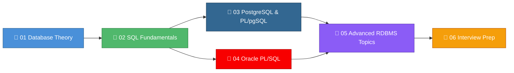
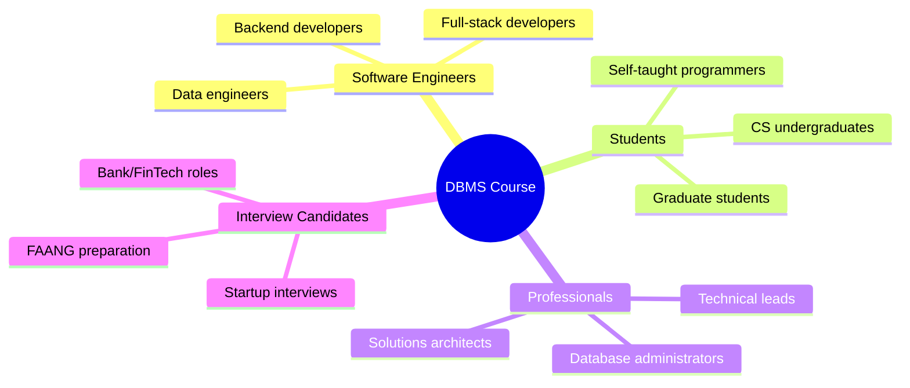
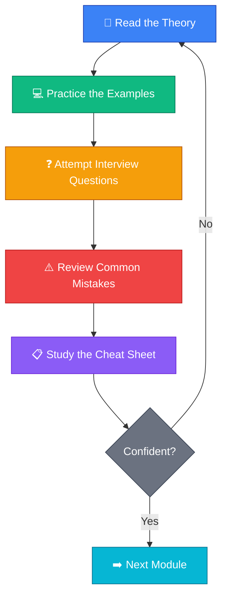

<p align="center">
  
  
  
</p>

<h1 align="center">🗄️ DBMS Complete Course — From First Principles to Interview Mastery</h1>

<p align="center">
  <b>The most comprehensive, open-source DBMS interview preparation resource on the internet.</b><br/>
  Built from first principles · Real-world examples · 500+ interview questions · Production-grade knowledge
</p>

---

## 📌 Why This Repository Exists

Every year, **millions of candidates** face DBMS questions in interviews for roles at Google, Amazon, Microsoft, Oracle, startups, and banks. Most preparation resources are either:

- ❌ Too shallow — "What is a database?" and nothing more.
- ❌ Too scattered — random blog posts with no structure.
- ❌ Too theoretical — no connection to real-world production systems.
- ❌ Too vendor-specific — only PostgreSQL or only Oracle, never both.

This repository solves all four problems. It is a **single, structured, progressive curriculum** that takes you from "What is data?" to "Design a distributed transaction system" — with interview questions, real-world examples, Mermaid diagrams, and cheat sheets at every step.

---

## 🗺️ Repository Structure & Learning Roadmap



| # | Module | What You'll Learn | Difficulty | Est. Time |
|---|--------|-------------------|------------|-----------|
| 01 | [**Database Theory**](./01_database_theory/README.md) | Data models, ER diagrams, normalization, relational algebra, ACID properties | ⭐ Beginner → Intermediate | 8–10 hrs |
| 02 | [**SQL Fundamentals**](./02_sql_fundamentals/README.md) | DDL, DML, joins, subqueries, aggregations, window functions, CTEs | ⭐ Beginner → Advanced | 10–12 hrs |
| 03 | [**PostgreSQL & PL/pgSQL**](./03_postgresql_and_plpgsql/README.md) | PostgreSQL architecture, PL/pgSQL programming, extensions, performance tuning | ⭐⭐ Intermediate → Advanced | 8–10 hrs |
| 04 | [**Oracle PL/SQL**](./04_oracle_plsql/README.md) | Oracle architecture, PL/SQL programming, packages, bulk operations | ⭐⭐ Intermediate → Advanced | 8–10 hrs |
| 05 | [**Advanced RDBMS Topics**](./05_advanced_rdbms_topics/README.md) | Indexing internals, query optimization, transactions, concurrency, sharding, replication | ⭐⭐⭐ Advanced | 10–12 hrs |
| 06 | [**Interview Prep**](./06_interview_prep/README.md) | Curated questions, system design scenarios, behavioral prep, mock interviews | ⭐⭐⭐ All Levels | 6–8 hrs |

> **Total estimated study time**: 50–62 hours for the complete curriculum.

---

## 🎯 Who Is This For?



| Audience | Start Here | Focus Areas |
|----------|------------|-------------|
| **Complete Beginner** | Module 01 | Theory → SQL → Pick one RDBMS → Interview Prep |
| **Know SQL, Weak Theory** | Module 01, then Module 05 | Theory → Advanced Topics → Interview Prep |
| **Backend Developer** | Module 02 or 03 | SQL → PostgreSQL → Advanced → Interview Prep |
| **Oracle Shop Developer** | Module 04 | Oracle PL/SQL → Advanced → Interview Prep |
| **Interview in 1 Week** | Module 06 | Interview Prep → Cheat Sheets from all modules |
| **DBA / Data Engineer** | Module 05 | Advanced Topics → PostgreSQL or Oracle deep-dives |

---

## 📖 How to Use This Repository

### 🔄 The Learning Loop



### 📐 Consistent Structure

Every module follows the **same structure** for predictable learning:

```
Module README
├── 🎯 Introduction & Why It Matters
├── 📚 Core Concepts (Beginner → Advanced)
│   ├── Explanations with real-world analogies
│   ├── Code examples with comments
│   └── Mermaid diagrams
├── 📊 Comparison Tables
├── ❓ Interview Questions
│   ├── 🟢 Beginner (10+ questions)
│   ├── 🟡 Intermediate (10+ questions)
│   └── 🔴 Advanced (10+ questions)
├── ⚠️ Common Mistakes
├── 💬 FAQs
├── 📝 Revision Notes
└── 📋 Cheat Sheet
```

---

## 🧭 Suggested Learning Paths

### Path 1: The Full Journey (8–10 weeks)

```
Week 1–2:  Module 01 — Database Theory
Week 3–4:  Module 02 — SQL Fundamentals
Week 5–6:  Module 03 — PostgreSQL & PL/pgSQL  OR  Module 04 — Oracle PL/SQL
Week 7–8:  Module 05 — Advanced RDBMS Topics
Week 9–10: Module 06 — Interview Prep + Revision
```

### Path 2: The Speed Run (2–3 weeks)

```
Days 1–3:  Module 01 — Theory (focus on normalization, ACID, ER diagrams)
Days 4–7:  Module 02 — SQL (focus on joins, subqueries, window functions)
Days 8–10: Module 05 — Advanced (focus on indexing, transactions, optimization)
Days 11–14: Module 06 — Interview Questions + All Cheat Sheets
```

### Path 3: Interview Tomorrow 🚨

```
→ Jump to Module 06 (Interview Prep)
→ Read all Cheat Sheets from Modules 01–05
→ Focus on: Normalization, Joins, Indexing, Transactions, ACID
```

---

## 🌟 Key Features

| Feature | Description |
|---------|-------------|
| 🧠 **First Principles** | Every topic starts with *why* it exists, not just *what* it is |
| 📈 **Progressive Difficulty** | Beginner → Intermediate → Advanced within each module |
| 🏭 **Real-World Examples** | Examples from e-commerce, banking, social media, and more |
| 📊 **Mermaid Diagrams** | Visual explanations for complex concepts |
| ❓ **500+ Interview Questions** | Categorized by difficulty with detailed answers |
| ⚠️ **Common Mistakes** | Learn what NOT to do — the mistakes interviewers look for |
| 📋 **Cheat Sheets** | Quick-reference sheets for last-minute revision |
| 🔄 **Dual RDBMS Coverage** | Both PostgreSQL and Oracle — covers 80% of the market |
| 🆓 **100% Free & Open Source** | No paywalls, no sign-ups, no ads |

---

## 💡 How to Contribute

We welcome contributions! Here's how:

1. **🐛 Found an error?** Open an issue with the module name and section.
2. **📝 Want to add content?** Fork the repo, make changes, submit a PR.
3. **❓ Have a question?** Open a discussion thread.
4. **⭐ Found it helpful?** Star the repo to help others find it.

### Contribution Guidelines

- Follow the existing format and structure.
- Include Mermaid diagrams for complex concepts.
- Add interview questions with detailed answers.
- Test all SQL examples before submitting.
- Use clear, simple English.

---

## 📜 License

This project is open source and available under the [MIT License](LICENSE).

---

## 🙏 Acknowledgments

Built with ❤️ for the developer community. Special thanks to:

- The PostgreSQL and Oracle documentation teams
- Database researchers whose papers made this knowledge possible
- Every contributor who helps improve this resource

---

<p align="center">
  <b>⭐ If this repository helps you crack your interview, give it a star! ⭐</b><br/><br/>
  <i>"The best time to learn databases was 10 years ago. The second best time is now."</i>
</p>
