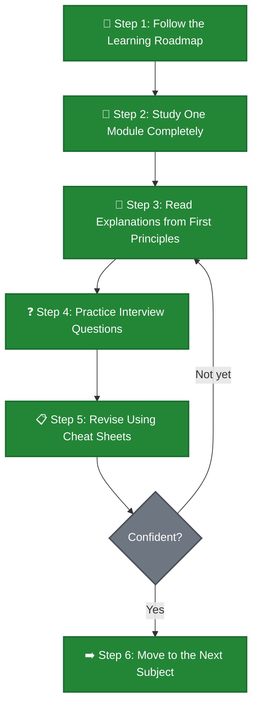
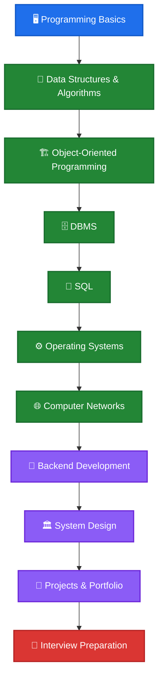

<p align="center">
  
</p>

<p align="center">
  <strong>A comprehensive, open-source collection of Computer Science interview preparation notes — built from first principles, designed for mastery.</strong>
</p>

<p align="center">
  <a href="https://github.com/sam6611/Interview-Preparation-Notes/stargazers"></a>
  <a href="https://github.com/sam6611/Interview-Preparation-Notes/network/members"></a>
  <a href="https://github.com/sam6611/Interview-Preparation-Notes/issues"></a>
  <a href="LICENSE"></a>
  <a href="https://github.com/sam6611/Interview-Preparation-Notes/commits/main"></a>
</p>

<p align="center">
  
  
  
  
</p>

<p align="center">
  <a href="#-repository-overview">Overview</a> · <a href="#-how-to-use-this-repository">How to Use</a> · <a href="#-learning-roadmap">Roadmap</a> · <a href="#-current-progress">Progress</a> · <a href="#-module-navigation">Modules</a> · <a href="#-contributing">Contributing</a>
</p>

---

## 🔍 Repository Overview

### What is this?

**Interview Preparation Notes** is a structured, in-depth knowledge base covering the core Computer Science subjects tested in software engineering interviews. Every topic is explained from **first principles** — not just *what* something is, but *why* it exists, *how* it works internally, and *when* to use it in production.

### Who is this for?

| Audience | How this helps |
|:---|:---|
| **Students** preparing for campus placements | Structured curriculum from basics to advanced |
| **Software Engineers** targeting top companies | Deep-dive notes with real interview questions |
| **Self-taught developers** filling CS gaps | First-principles explanations without jargon |
| **Backend / Full-stack engineers** | Production-oriented knowledge with real examples |
| **Anyone transitioning to SWE** | Complete CS foundation in one repository |

### Why does this exist?

Most interview resources fall into one of these traps:

| Problem | This Repository's Solution |
|:---|:---|
| 🚫 Surface-level definitions | ✅ Explains internals, trade-offs, and design rationale |
| 🚫 Random, unstructured notes | ✅ Progressive curriculum with a clear learning path |
| 🚫 Theory without practice | ✅ Code examples, diagrams, and comprehensive interview questions |
| 🚫 Memorization-focused | ✅ Understanding-first approach with real-world analogies |
| 🚫 Scattered across platforms | ✅ Single repository — everything in one place |

---

## 🚀 How to Use This Repository

> Follow this loop for every subject. Repeat until you feel confident, then move on.



**Each module is self-contained.** You can study subjects in the recommended order or jump directly to what you need most.

---

## 🗺️ Learning Roadmap

> Follow this roadmap to build a rock-solid CS foundation. Start from the top and work your way down.



**Legend** &ensp; 🔵 Foundation &ensp; 🟢 Core CS &ensp; 🟣 Applied Skills &ensp; 🔴 Final Stage

---

## 📁 Repository Structure

```
Interview-Preparation-Notes/
│
├── 📂 DBMS/                                ✅ Complete
│   ├── 📂 01_database_theory/
│   ├── 📂 02_sql_fundamentals/
│   ├── 📂 03_postgresql_and_plpgsql/
│   ├── 📂 04_oracle_plsql/
│   ├── 📂 05_advanced_rdbms_topics/
│   └── 📂 06_interview_prep/
│
├── 📂 data-structures-algorithms/          🚧 Planned
├── 📂 operating-systems/                   🚧 Planned
├── 📂 computer-networks/                   🚧 Planned
├── 📂 object-oriented-programming/         🚧 Planned
├── 📂 system-design/                       🚧 Planned
├── 📂 backend-development/                 🚧 Planned
├── 📂 javascript/                          🚧 Planned
├── 📂 react/                               🚧 Planned
├── 📂 nodejs/                              🚧 Planned
├── 📂 sql/                                 🚧 Planned
├── 📂 machine-learning-basics/             🚧 Planned (Optional)
│
├── LICENSE
└── README.md                               ← You are here
```

---

## 🖼️ Repository Preview

> Screenshots will be added here as the repository grows.

| Preview | Description |
|:--------|:------------|
| ** | Overview of the DBMS module structure and content |
| ** | Visual representation of the full learning journey |
| ** | Example of a module page with diagrams and questions |

<!-- Replace the placeholder paths above with actual screenshots when available -->

---

## 📊 Current Progress

| # | Subject | Status | Progress | Topics |
|:-:|:--------|:------:|:--------:|:-------|
| 01 | **DBMS** | ✅ Complete |  | Database Theory · SQL · PostgreSQL · Oracle · Advanced · Interview Prep |
| 02 | **Data Structures & Algorithms** | 🚧 Planned |  | Arrays, Trees, Graphs, DP, Greedy |
| 03 | **Operating Systems** | 🚧 Planned |  | Processes, Memory, Scheduling, Deadlocks |
| 04 | **Computer Networks** | 🚧 Planned |  | OSI, TCP/IP, DNS, HTTP, Sockets |
| 05 | **OOP** | 🚧 Planned |  | Principles, Design Patterns, SOLID |
| 06 | **System Design** | 🚧 Planned |  | HLD, LLD, Scalability, Case Studies |
| 07 | **Backend Development** | 🚧 Planned |  | APIs, Auth, Caching, Microservices |
| 08 | **JavaScript** | 🚧 Planned |  | Core JS, ES6+, Async, Event Loop |
| 09 | **React** | 🚧 Planned |  | Components, Hooks, State, Performance |
| 10 | **Node.js** | 🚧 Planned |  | Runtime, Streams, Clustering, Express |
| 11 | **SQL** | 🚧 Planned |  | Advanced Queries, Optimization, Practice |
| 12 | **Machine Learning Basics** | 💡 Optional |  | Supervised, Unsupervised, Evaluation |

> **Overall Completion** &ensp; █░░░░░░░░░ &ensp; **1 / 12 subjects complete**

---

## ✨ Features

> Every module in this repository follows a consistent, high-quality standard.

| Feature | Description |
|:--------|:------------|
| 🧠 **First Principles** | Topics start with *why* something exists — not just definitions |
| 🔬 **Internal Workings** | Explains how things work under the hood (e.g., B-Tree internals, MVCC) |
| ❓ **Interview Questions** | Comprehensive collection categorized by difficulty — 🟢 🟡 🔴 |
| 📋 **Cheat Sheets** | Quick-reference summaries for last-minute revision |
| 🏭 **Production Examples** | Real-world scenarios from e-commerce, banking, and social media |
| 📊 **Mermaid Diagrams** | Rich visual explanations for complex architectures and flows |
| 📝 **Revision Notes** | Condensed summaries at the end of every module |
| ⚠️ **Common Mistakes** | Pitfalls interviewers specifically look for |
| 💎 **Best Practices** | Industry-standard approaches and design patterns |

---

## 🧬 Repository Philosophy

This repository is built on a core belief:

> **If you understand *why* something was designed a certain way, you can derive the answer to any interview question about it — no memorization needed.**

Every module follows these principles:

- **Understanding over memorization** — Concepts are explained through reasoning and real-world analogies, not rote definitions. The goal is to build mental models that last.

- **First principles thinking** — Each topic starts from the foundational *why* before moving to *what* and *how*. You'll understand the problem a concept solves before learning the concept itself.

- **Internal workings** — Surface-level knowledge breaks under pressure. These notes go deeper — how does a B+ Tree split? What happens during MVCC? Why does a deadlock occur at the engine level?

- **Production thinking** — Theory matters, but so does knowing how things behave in real systems. Examples are drawn from production scenarios, not toy problems.

- **Interview mindset** — Every section is written with interviews in mind. Common follow-up questions, tricky edge cases, and the mistakes interviewers watch for are baked into the content.

---

## 💡 Why This Repository?

<table>
<tr>
<td width="50%">

### 📖 Typical Notes

- Definitions copied from textbooks
- No structure or learning path
- Theory disconnected from practice
- "What is X?" without "Why does X exist?"
- No interview context
- Memorization over understanding

</td>
<td width="50%">

### 🚀 This Repository

- First-principles explanations with analogies
- Progressive curriculum with clear roadmap
- Code examples tested on real databases
- Covers *what*, *why*, *how*, and *when*
- Comprehensive categorized interview questions
- **Understanding-first** approach

</td>
</tr>
</table>

---

## 🧭 Module Navigation

### 🗄️ DBMS — Complete Course

<details>
<summary><b>01 · Database Theory</b> — Foundations of database systems</summary>

&nbsp;

| # | Topic | Description |
|:-:|:------|:------------|
| 01 | [Introduction to DBMS](./DBMS/01_database_theory/01_introduction_to_dbms.md) | What is a database, DBMS vs file systems |
| 02 | [Data Models](./DBMS/01_database_theory/02_data_models.md) | Hierarchical, Network, Relational, Object-oriented |
| 03 | [ER Model](./DBMS/01_database_theory/03_er_model.md) | Entity-Relationship diagrams, cardinality, participation |
| 04 | [Relational Model](./DBMS/01_database_theory/04_relational_model.md) | Relations, keys, constraints, integrity rules |
| 05 | [Relational Algebra](./DBMS/01_database_theory/05_relational_algebra.md) | Selection, projection, joins, set operations |
| 06 | [Relational Calculus](./DBMS/01_database_theory/06_relational_calculus.md) | Tuple and domain relational calculus |
| 07 | [Normalization](./DBMS/01_database_theory/07_normalization/) | 1NF → BCNF, functional dependencies, decomposition |
| 08 | [Transactions](./DBMS/01_database_theory/08_transactions/) | ACID properties, states, serializability |
| 09 | [Concurrency Control](./DBMS/01_database_theory/09_concurrency_control/) | Locks, 2PL, timestamp ordering, MVCC |
| 10 | [Recovery System](./DBMS/01_database_theory/10_recovery_system/) | Log-based recovery, checkpointing, ARIES |
| 11 | [Indexing & Hashing](./DBMS/01_database_theory/11_indexing_and_hashing/) | B-Trees, B+ Trees, hash indexes, bitmap |
| 12 | [Query Processing](./DBMS/01_database_theory/12_query_processing_optimization.md) | Query plans, cost estimation, optimization |
| 13 | [Distributed Databases](./DBMS/01_database_theory/13_distributed_databases.md) | Fragmentation, replication, CAP theorem |
| 14 | [NoSQL vs SQL](./DBMS/01_database_theory/14_nosql_vs_sql.md) | When to use what, trade-offs, comparisons |

</details>

<details>
<summary><b>02 · SQL Fundamentals</b> — From basic queries to advanced techniques</summary>

&nbsp;

| # | Topic | Description |
|:-:|:------|:------------|
| 01 | [DDL](./DBMS/02_sql_fundamentals/01_ddl.md) | CREATE, ALTER, DROP, TRUNCATE |
| 02 | [DML](./DBMS/02_sql_fundamentals/02_dml.md) | INSERT, UPDATE, DELETE, MERGE |
| 03 | [DQL Basics](./DBMS/02_sql_fundamentals/03_dql_basic.md) | SELECT, WHERE, ORDER BY, LIMIT |
| 04 | [Joins](./DBMS/02_sql_fundamentals/04_joins.md) | INNER, LEFT, RIGHT, FULL, CROSS, SELF |
| 05 | [Subqueries](./DBMS/02_sql_fundamentals/05_subqueries.md) | Correlated, scalar, EXISTS, IN |
| 06 | [Set Operations](./DBMS/02_sql_fundamentals/06_set_operations.md) | UNION, INTERSECT, EXCEPT |
| 07 | [Aggregation & Grouping](./DBMS/02_sql_fundamentals/07_aggregation_and_grouping.md) | GROUP BY, HAVING, aggregate functions |
| 08 | [Views](./DBMS/02_sql_fundamentals/08_views.md) | Virtual tables, materialized views |
| 09 | [Window Functions](./DBMS/02_sql_fundamentals/09_window_functions.md) | ROW_NUMBER, RANK, LEAD, LAG, frames |
| 10 | [CTEs](./DBMS/02_sql_fundamentals/10_ctes.md) | Common Table Expressions, recursive CTEs |
| 11 | [String & Date Functions](./DBMS/02_sql_fundamentals/11_string_date_functions.md) | Text manipulation, date arithmetic |
| 12 | [Constraints](./DBMS/02_sql_fundamentals/12_constraints.md) | PRIMARY KEY, FOREIGN KEY, UNIQUE, CHECK |
| 13 | [Indexes in SQL](./DBMS/02_sql_fundamentals/13_indexes_in_sql.md) | Index types, when to use, performance impact |

</details>

<details>
<summary><b>03 · PostgreSQL & PL/pgSQL</b> — Deep dive into PostgreSQL internals</summary>

&nbsp;

| # | Topic | Description |
|:-:|:------|:------------|
| 01 | [PostgreSQL Architecture](./DBMS/03_postgresql_and_plpgsql/01_postgresql_architecture.md) | Process model, memory, storage, WAL |
| 02 | [Data Types](./DBMS/03_postgresql_and_plpgsql/02_data_types.md) | Native types, arrays, enums, composite |
| 03 | [PL/pgSQL Basics](./DBMS/03_postgresql_and_plpgsql/03_plpgsql_basics.md) | Blocks, variables, control flow |
| 04 | [Variables & Control](./DBMS/03_postgresql_and_plpgsql/04_variables_and_control_structures.md) | IF/ELSE, LOOP, FOR, WHILE |
| 05 | [Cursors](./DBMS/03_postgresql_and_plpgsql/05_cursors.md) | Implicit, explicit, REF cursors |
| 06 | [Procedures vs Functions](./DBMS/03_postgresql_and_plpgsql/06_stored_procedures_vs_functions.md) | When to use each, transaction control |
| 07 | [Triggers](./DBMS/03_postgresql_and_plpgsql/07_triggers.md) | BEFORE, AFTER, INSTEAD OF, event triggers |
| 08 | [Exception Handling](./DBMS/03_postgresql_and_plpgsql/08_exception_handling.md) | RAISE, custom exceptions, error codes |
| 09 | [Transactions](./DBMS/03_postgresql_and_plpgsql/09_transactions_in_postgresql.md) | Isolation levels, savepoints, deadlocks |
| 10 | [Indexes](./DBMS/03_postgresql_and_plpgsql/10_indexes_in_postgresql.md) | B-Tree, GIN, GiST, BRIN, partial indexes |
| 11 | [Partitioning](./DBMS/03_postgresql_and_plpgsql/11_partitioning.md) | Range, list, hash partitioning |
| 12 | [JSON/JSONB](./DBMS/03_postgresql_and_plpgsql/12_json_jsonb_handling.md) | Operators, indexing, querying JSON data |
| 13 | [Extensions](./DBMS/03_postgresql_and_plpgsql/13_extensions_common.md) | pg_stat, pg_trgm, PostGIS, pgcrypto |
| 14 | [Performance Tuning](./DBMS/03_postgresql_and_plpgsql/14_performance_tuning_postgresql.md) | EXPLAIN ANALYZE, query planning, config |

</details>

<details>
<summary><b>04 · Oracle PL/SQL</b> — Enterprise database programming</summary>

&nbsp;

| # | Topic | Description |
|:-:|:------|:------------|
| 01 | [Oracle Architecture](./DBMS/04_oracle_plsql/01_oracle_architecture.md) | SGA, PGA, background processes |
| 02 | [PL/SQL Basics](./DBMS/04_oracle_plsql/02_plsql_basics.md) | Blocks, declarations, execution |
| 03 | [Variables & Control](./DBMS/04_oracle_plsql/03_variables_and_control_structures.md) | Datatypes, control flow, loops |
| 04 | [Cursors](./DBMS/04_oracle_plsql/04_cursors_explicit_implicit.md) | Explicit, implicit, cursor attributes |
| 05 | [Procedures & Functions](./DBMS/04_oracle_plsql/05_procedures_and_functions.md) | IN/OUT parameters, return types |
| 06 | [Packages](./DBMS/04_oracle_plsql/06_packages.md) | Spec, body, overloading, state |
| 07 | [Triggers](./DBMS/04_oracle_plsql/07_triggers.md) | DML, DDL, compound, system triggers |
| 08 | [Exception Handling](./DBMS/04_oracle_plsql/08_exception_handling.md) | Predefined, user-defined, PRAGMA |
| 09 | [Collections](./DBMS/04_oracle_plsql/09_collections_varray_nested_table.md) | VARRAY, nested tables, associative arrays |
| 10 | [Bulk Operations](./DBMS/04_oracle_plsql/10_bulk_collect_forall.md) | BULK COLLECT, FORALL, performance |
| 11 | [Dynamic SQL](./DBMS/04_oracle_plsql/11_dynamic_sql.md) | EXECUTE IMMEDIATE, DBMS_SQL |
| 12 | [Transactions](./DBMS/04_oracle_plsql/12_transactions_in_oracle.md) | COMMIT, ROLLBACK, savepoints, SCN |

</details>

<details>
<summary><b>05 · Advanced RDBMS Topics</b> — Production-grade database knowledge</summary>

&nbsp;

| # | Topic | Description |
|:-:|:------|:------------|
| 01 | [Triggers & Procedures Comparison](./DBMS/05_advanced_rdbms_topics/01_triggers_and_procedures_comparison.md) | Cross-platform comparison |
| 02 | [Dynamic SQL Across Platforms](./DBMS/05_advanced_rdbms_topics/02_dynamic_sql_across_platforms.md) | PostgreSQL vs Oracle approach |
| 03 | [Performance Tuning & EXPLAIN](./DBMS/05_advanced_rdbms_topics/03_performance_tuning_and_explain.md) | Query plans, optimization strategies |
| 04 | [Database Security](./DBMS/05_advanced_rdbms_topics/04_database_security.md) | Authentication, authorization, encryption |
| 05 | [Data Warehousing](./DBMS/05_advanced_rdbms_topics/05_data_warehousing_intro.md) | Star schema, OLAP vs OLTP, ETL |
| 06 | [Replication & Sharding](./DBMS/05_advanced_rdbms_topics/06_replication_and_sharding.md) | Horizontal scaling, consistency models |
| 07 | [CAP Theorem](./DBMS/05_advanced_rdbms_topics/07_cap_theorem.md) | Consistency, Availability, Partition tolerance |

</details>

<details>
<summary><b>06 · Interview Preparation</b> — Crack the DBMS interview</summary>

&nbsp;

| # | Topic | Description |
|:-:|:------|:------------|
| 01 | [SQL Query Questions](./DBMS/06_interview_prep/01_sql_query_questions.md) | Practical SQL problem-solving |
| 02 | [Normalization Questions](./DBMS/06_interview_prep/02_normalization_questions.md) | NF identification, decomposition |
| 03 | [Transaction & Isolation](./DBMS/06_interview_prep/03_transaction_isolation_levels.md) | ACID, isolation levels, anomalies |
| 04 | [Joins vs Subqueries](./DBMS/06_interview_prep/04_joins_vs_subqueries.md) | When to use what, performance |
| 05 | [PL/SQL vs PL/pgSQL](./DBMS/06_interview_prep/05_plsql_vs_plpgsql_differences.md) | Key differences, migration |
| 06 | [Common Scenarios](./DBMS/06_interview_prep/06_common_scenarios.md) | Real-world problem patterns |
| 07 | [DB Comparison](./DBMS/06_interview_prep/07_postgresql_vs_oracle_vs_mysql.md) | PostgreSQL vs Oracle vs MySQL |
| 08 | [Query Optimization Cases](./DBMS/06_interview_prep/08_real_world_query_optimization_cases.md) | Real performance case studies |
| 09 | [Behavioral & Project](./DBMS/06_interview_prep/09_behavioral_and_project_questions.md) | Non-technical interview prep |

</details>

---

## 📅 Recommended Study Plan

<details>
<summary><b>🟢 Phase 1 — Build the Foundation (Weeks 1–4)</b></summary>

&nbsp;

| Week | Subject | Focus Areas |
|:----:|:--------|:------------|
| 1 | Programming Basics | Variables, control flow, functions, complexity |
| 2 | OOP | Classes, inheritance, polymorphism, SOLID |
| 3 | DBMS Theory | ER models, normalization, ACID, transactions |
| 4 | SQL | Joins, subqueries, aggregation, window functions |

</details>

<details>
<summary><b>🟡 Phase 2 — Core CS Subjects (Weeks 5–10)</b></summary>

&nbsp;

| Week | Subject | Focus Areas |
|:----:|:--------|:------------|
| 5–6 | Data Structures & Algorithms | Arrays, trees, graphs, DP, sorting |
| 7–8 | Operating Systems | Processes, memory management, scheduling |
| 9–10 | Computer Networks | OSI model, TCP/IP, HTTP, DNS, sockets |

</details>

<details>
<summary><b>🔴 Phase 3 — Applied & Interview (Weeks 11–16)</b></summary>

&nbsp;

| Week | Subject | Focus Areas |
|:----:|:--------|:------------|
| 11–12 | Backend Development | APIs, authentication, databases, caching |
| 13–14 | System Design | Scalability, load balancing, case studies |
| 15–16 | Interview Preparation | Mock interviews, revision, behavioral prep |

</details>

> **Tip**: Use the cheat sheets and revision notes at the end of each module for quick review before interviews.

---

## 🤝 Contributing

Contributions are welcome and appreciated! Here's how you can help:

```
1. Fork this repository
2. Create a feature branch         →  git checkout -b add/topic-name
3. Follow the existing format      →  Use the same structure as current modules
4. Add your content                →  Include diagrams, examples, and interview questions
5. Test all code examples          →  Ensure SQL/code snippets are correct
6. Submit a Pull Request           →  Describe what you added and why
```

<details>
<summary><b>📐 Contribution Guidelines</b></summary>

&nbsp;

| Guideline | Details |
|:----------|:--------|
| 📐 **Format** | Follow the existing module structure consistently |
| 📊 **Diagrams** | Include Mermaid diagrams for complex concepts |
| ❓ **Questions** | Add interview questions with detailed answers |
| 🧪 **Testing** | Verify all code examples before submitting |
| 🌍 **Language** | Use clear, simple English — this is for a global audience |
| 📎 **Sources** | Credit original sources where applicable |

</details>

> **First time contributing?** Start by fixing typos, adding interview questions, or improving existing explanations.

---

## 🛣️ Future Roadmap

- [x] 🗄️ **DBMS** — Database Theory, SQL, PostgreSQL, Oracle, Advanced Topics, Interview Prep
- [ ] 🧮 **Data Structures & Algorithms** — Arrays, Linked Lists, Trees, Graphs, DP, Sorting &ensp; `🚧 Planned`
- [ ] ⚙️ **Operating Systems** — Processes, Threads, Memory, Scheduling, Deadlocks &ensp; `🚧 Planned`
- [ ] 🌐 **Computer Networks** — OSI Model, TCP/IP, HTTP/HTTPS, DNS, Sockets &ensp; `🚧 Planned`
- [ ] 🏗️ **Object-Oriented Programming** — Principles, Design Patterns, SOLID, UML &ensp; `🚧 Planned`
- [ ] 🏛️ **System Design** — HLD, LLD, Scalability, Load Balancing, Caching &ensp; `🚧 Planned`
- [ ] 🔧 **Backend Development** — REST APIs, Authentication, Microservices &ensp; `🚧 Planned`
- [ ] 🟨 **JavaScript** — Core Concepts, ES6+, Closures, Promises, Event Loop &ensp; `🚧 Planned`
- [ ] ⚛️ **React** — Components, Hooks, State Management, Performance &ensp; `🚧 Planned`
- [ ] 🟩 **Node.js** — Runtime, Streams, Clustering, Express.js &ensp; `🚧 Planned`
- [ ] 📝 **SQL** — Advanced Queries, Query Optimization, Practice Problems &ensp; `🚧 Planned`
- [ ] 🤖 **Machine Learning Basics** — Supervised, Unsupervised, Evaluation &ensp; `💡 Optional`

> Want a specific subject prioritized? [Open an issue](https://github.com/sam6611/Interview-Preparation-Notes/issues) and let me know!

---

## 📚 Recommended Resources

<details>
<summary><b>📖 Books</b></summary>

&nbsp;

| Subject | Book | Author |
|:--------|:-----|:-------|
| DBMS | *Database System Concepts* | Silberschatz, Korth, Sudarshan |
| DBMS | *Fundamentals of Database Systems* | Elmasri, Navathe |
| SQL | *SQL Performance Explained* | Markus Winand |
| DSA | *Introduction to Algorithms (CLRS)* | Cormen, Leiserson, Rivest, Stein |
| DSA | *Grokking Algorithms* | Aditya Bhargava |
| OS | *Operating System Concepts* | Silberschatz, Galvin, Gagne |
| Networks | *Computer Networking: A Top-Down Approach* | Kurose, Ross |
| System Design | *Designing Data-Intensive Applications* | Martin Kleppmann |
| System Design | *System Design Interview* | Alex Xu |
| OOP | *Head First Design Patterns* | Freeman, Robson |

</details>

<details>
<summary><b>🌐 Websites & Documentation</b></summary>

&nbsp;

| Resource | Link | Best For |
|:---------|:-----|:---------|
| PostgreSQL Docs | [postgresql.org/docs](https://www.postgresql.org/docs/) | Official PostgreSQL reference |
| Oracle Docs | [docs.oracle.com](https://docs.oracle.com/en/database/) | Official Oracle reference |
| Use The Index, Luke | [use-the-index-luke.com](https://use-the-index-luke.com/) | SQL indexing & performance |
| SQLBolt | [sqlbolt.com](https://sqlbolt.com/) | Interactive SQL tutorials |
| DB-Engines | [db-engines.com](https://db-engines.com/) | Database rankings & comparisons |
| GeeksforGeeks | [geeksforgeeks.org](https://www.geeksforgeeks.org/) | CS fundamentals & practice |

</details>

<details>
<summary><b>💻 Practice Platforms</b></summary>

&nbsp;

| Platform | Link | Best For |
|:---------|:-----|:---------|
| LeetCode | [leetcode.com](https://leetcode.com/) | DSA & SQL problems |
| HackerRank | [hackerrank.com](https://www.hackerrank.com/) | SQL & programming challenges |
| StrataScratch | [stratascratch.com](https://www.stratascratch.com/) | Real SQL interview questions |
| SQLZoo | [sqlzoo.net](https://sqlzoo.net/) | Interactive SQL exercises |
| NeetCode | [neetcode.io](https://neetcode.io/) | Structured DSA roadmap |
| InterviewBit | [interviewbit.com](https://www.interviewbit.com/) | Interview-focused practice |

</details>

---

## 📄 License

This project is licensed under the **MIT License** — see the [LICENSE](LICENSE) file for details.

You are free to use, modify, and distribute this content. Attribution is appreciated but not required.

---

<p align="center">
  
  
</p>

<p align="center">
  <i>"The expert in anything was once a beginner."</i><br/>
  <sub>— Helen Hayes</sub>
</p>

<p align="center">
  If this repository helped you, consider giving it a ⭐<br/>
  It helps others discover these notes and motivates continued development.
</p>
